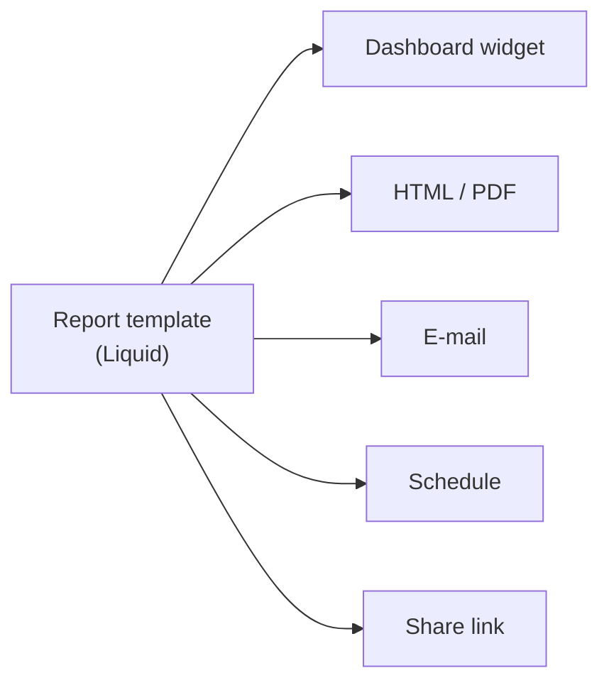

# Redmine Reporter Dashboards

Project dashboards and reporting for Redmine. Build a report once as a Liquid template,
then show it on a dashboard, open it as a web page or PDF, mail it, schedule it, or share
it behind an expiring link.

It installs on a plain Redmine and needs no other plugin.



## What you get

**Project dashboards.** Each project gets a dashboard page with tabs. Add widgets — issue
lists, reports, activity, calendar, news, documents, time log — and arrange them in rows
with up/down/left/right buttons. Each tab is configured per project.

**Report templates.** A Liquid document rendered against a project's issues or time
entries. Write it in the browser, preview it before saving, and export it as HTML or PDF.

**SQL aggregation tags.** ``, `` and the time-entry
tags do their counting in SQL instead of looping over issues in Liquid. A breakdown over
50 000 issues costs the same handful of queries as one over 50.

**Charts and diagrams.** `` draws bar, line, pie and progress charts; ``
draws flowcharts and sequence diagrams. Both libraries ship inside the plugin — nothing is
fetched from the internet when a report is drawn. In a PDF, charts become inline SVG and
diagrams become vector graphics: selectable, searchable and clickable.

**Delivery.** Mail a report once, schedule it daily to yearly, or publish a frozen snapshot
behind a link with an expiry, a use limit and an access log.

## Requirements

| | |
|---|---|
| Redmine | 5.1, 6.0, 6.1 or 7.0 |
| Database | PostgreSQL or MySQL/MariaDB. SQLite is not supported |
| PDF rendering | Headless Chromium on the Redmine host (default), or Gotenberg |

Every combination in that table runs in CI on every push. See
[`docs/engine-support-matrix.md`](docs/engine-support-matrix.md) for what each PDF engine
can do.

## Install

```bash
cd {REDMINE_ROOT}/plugins
git clone https://github.com/jcatrysse/redmine_reporter_dashboards.git
cd {REDMINE_ROOT}
bundle install
bundle exec rake redmine:plugins:migrate RAILS_ENV=production
```

Restart Redmine.

Then, per project: **Settings → Modules**, enable **Project dashboard** and **Reports**, and
grant the permissions your roles need. The [administrator guide](docs/admin-guide.md) walks
through both.

## First report

1. **Reports → Templates → New**, and pick a starter.
2. Press **Preview** to see it without saving.
3. Save, then open it. **Export as PDF** is on the same page.

A minimal template:

```liquid


<h1>Issues by status</h1>



  {{ bucket.label }}: {{ bucket.count }}

```

## Documentation

| Guide | For |
|---|---|
| [User guide](docs/user-guide.md) | Dashboards, reports, mailing, schedules and share links |
| [Administrator guide](docs/admin-guide.md) | Install, modules, permissions, PDF engines, assets, cron, retention |
| [Template authoring](docs/template-authoring.md) | Liquid, the aggregation tags, charts, diagrams |
| [Drop reference](docs/drop-reference.md) | Every object and accessor a template can read |
| [Engine support matrix](docs/engine-support-matrix.md) | What each PDF engine supports (generated from CI) |
| [Contributing](CONTRIBUTING.md) | Running the test suites, the quality gates |

## Coming from `redmine_reporter`

Both plugins can be installed side by side — every table here is prefixed
`reporter_dashboards_` and every class is namespaced, so nothing collides.

Survey what you have before changing anything:

```bash
bundle exec rake reporter_dashboards:migrate_from_reporter:plan RAILS_ENV=production
```

That writes nothing. It reports how many templates and schedules exist, which Liquid
accessors they use, and which ones contain something that needs changing.

One thing to know up front: **this plugin's tags do not work inside a template that
`redmine_reporter` renders.** They parse there but return zeros, because they need to know
whose visibility the report is for and the other plugin's renderer does not tell them. Move
the template into **Reports → Templates** and it works. See
[Migrating](docs/admin-guide.md#migrating-from-redmine_reporter).

## Known limitations

- SQLite and other adapters are not supported. The aggregation tags refuse to guess at date
  formatting and log one line instead.
- A template reports on issues **or** time entries, not both.
- On MariaDB, `group_by: age` with a `measure:` other than `count` needs three age
  boundaries or fewer. Plain counts are correct at any boundary count.
- The scheduler needs a cron entry. Installing the plugin does not start anything.
- Share links serve a frozen snapshot. Revoking stops future access; it cannot retract a
  copy somebody already downloaded.

## Questions or issues?

<https://github.com/jcatrysse/redmine_reporter_dashboards/issues>

## License

GPL v2. See [LICENSE](LICENSE).
