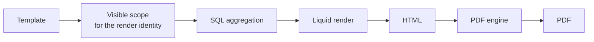

# Administrator guide

Installing, configuring and operating the plugin.

- [Install and upgrade](#install-and-upgrade)
- [Uninstalling](#uninstalling)
- [Modules and permissions](#modules-and-permissions)
- [PDF rendering](#pdf-rendering)
- [Where a report's images and stylesheets come from](#where-a-reports-images-and-stylesheets-come-from)
- [The scheduler needs cron](#the-scheduler-needs-cron)
- [Retention and cleanup](#retention-and-cleanup)
- [E-mail settings](#e-mail-settings)
- [Migrating from `redmine_reporter`](#migrating-from-redmine_reporter)
- [Rake tasks](#rake-tasks)
- [Troubleshooting](#troubleshooting)

## Install and upgrade

```bash
cd {REDMINE_ROOT}/plugins
git clone https://github.com/jcatrysse/redmine_reporter_dashboards.git
cd {REDMINE_ROOT}
bundle install
bundle exec rake redmine:plugins:migrate RAILS_ENV=production
```

Restart Redmine. Upgrading is the same: pull, `bundle install`, migrate, restart.

**Both plugins can be installed at once.** Every table this plugin adds is prefixed
`reporter_dashboards_` and every model is namespaced under `RedmineReporterDashboards::`, so
nothing collides with `redmine_reporter`'s tables or classes. Install this alongside your
existing setup and compare the two before committing to a migration.

### Supported versions

| Redmine | Rails | CI Ruby |
|---|---|---|
| 5.1 | 6.1 | 3.2 |
| 6.0 | 7.1 | 3.3 |
| 6.1 | 7.2 | 3.4 |
| 7.0 | 8.1 | 3.4 |

| Database | |
|---|---|
| PostgreSQL 16 | Tested against a real server in CI |
| MySQL 8.0 | Tested against a real server in CI |
| MariaDB 11 | Tested against a real server in CI, with one limitation below |
| Anything else | Not supported. The aggregation tags log one line and return empty rather than guessing at date formatting |

Supported means: exercised by `.github/workflows/ci.yml` on every push. `requires_redmine`
is set to 5.1 to match this table.

### MariaDB and `group_by: age`

Two things to know if you run MariaDB, both narrow:

- **A measured age axis needs three boundaries or fewer.** `group_by: age` with
  `measure: sum`, `avg` or `distinct` reads its result through a column alias, and MariaDB
  truncates column labels at 256 characters. Past roughly four age boundaries the buckets
  collapse into `(none)`. Plain counts are read by position instead and are correct at any
  boundary count.
- **`ONLY_FULL_GROUP_BY` rejects the age dimension.** It is not in MariaDB's default
  `sql_mode`, so this only bites where a DBA turned it on. The block renders empty with the
  error in the log; nothing returns a 500. Group on something else, or drop
  `ONLY_FULL_GROUP_BY` for that server.

PostgreSQL and MySQL 8 are unaffected by both.

## Uninstalling

```bash
bundle exec rake redmine:plugins:migrate NAME=redmine_reporter_dashboards VERSION=0 RAILS_ENV=production
```

That removes every table the reporting schema adds — templates, version history, schedules,
runs, recipients, stored documents, share links and their access logs — with their indexes,
and the plugin's row from `schema_migrations`.

**It leaves `reporter_project_tabs` in place.** That is where your project dashboards live:
their tabs, layout and widget settings. It has no export path, so a rollback that dropped it
would destroy something you could not get back. Reinstalling adopts it again with the
dashboards intact. If you genuinely want it gone, drop it by hand after taking a backup.

The up → down → up cycle is exercised in CI on all four Redmine branches and all three
databases.

## Modules and permissions

There are two modules, because "we want dashboards, not the reporting surface" is a real
answer.

### Project dashboard

**Project → Settings → Modules → Project dashboard.**

| Permission | Allows |
|---|---|
| `view_reporter_project_page` | View the dashboard |
| `manage_reporter_project_page` | Add and rearrange widgets |
| `manage_reporter_project_tabs` | Create, rename and reorder tabs |

The first visit creates a default tab.

### Reports

**Project → Settings → Modules → Reports.**

| Permission | Allows |
|---|---|
| `view_reporter_dashboards_reports` | See the templates a project offers, open one, download its PDF |
| `add_reporter_dashboards_templates` | Create a template |
| `edit_own_reporter_dashboards_templates` | Edit and delete the templates you authored |
| `edit_reporter_dashboards_templates` | Edit and delete any template in the project |
| `manage_public_reporter_dashboards_templates` | Give a template a visibility wider than yourself |
| `mail_reporter_dashboards_reports` | Send a report by e-mail |
| `view_reporter_dashboards_schedules` | See schedules and their run history |
| `manage_reporter_dashboards_schedules` | Create and edit schedules |
| `render_reporter_dashboards_reports_as_others` | Set a schedule's render identity to somebody else |
| `share_reporter_dashboards_reports` | Create share links |
| `publish_reporter_dashboards_reports` | Make a share link public |

### Two permissions that deserve a second look

**The four authoring permissions execute code.** A template is Liquid that runs on your
server: whoever can write one can make the application do what that template says. Treat
granting one the way you would treat giving somebody a shell. Redmine will not offer these
to the *Anonymous* or *Non-member* role, and they are not permitted in a closed project.

**`render_reporter_dashboards_reports_as_others` grants access to everything that user can
see.** It lets somebody schedule a report produced with a colleague's access rights and
mailed to themselves. Grant it deliberately.

### After a fresh install, check who can author

**Administration → Render preflight** opens with a table of every role holding a
template-authoring permission — this plugin's and `redmine_reporter`'s, side by side.

This plugin never grants a permission to a role. But **Administration → Settings → Load the
default configuration** creates a *Manager* role holding every permission it can give,
including a plugin's. On a fresh Redmine that already has this plugin installed, that means
*Manager* may have come out with code execution that nobody chose. The table is how you see
that.

A grant also outlives the plugin that registered it — nothing in Redmine prunes
`roles.permissions` when a plugin is removed — so a role can appear in the `redmine_reporter`
column on an installation where that plugin is long gone.

### Widget settings

Widget settings are validated before they are stored. A value that is not of the expected
shape is dropped rather than saved, with one line in the log naming the widget and the
setting. Widgets contributed by other plugins keep working; their setting names are accepted
as bounded values.

## PDF rendering

**Administration → Plugins → Redmine Reporter Dashboards** carries the engine selection, with
one generated line per engine saying what it needs and what it cannot do.



| Engine | Needs | Notes |
|---|---|---|
| **Chromium (CDP)** | A Chromium or Chrome binary on the Redmine host | The default. Started by the plugin, no service to run |
| **Gotenberg** | A container you deploy and maintain | Network-isolated rendering. Never selected automatically |
| **wkhtmltopdf** | The binary | Migration compatibility only. Cannot run modern JavaScript, so charts and diagrams degrade |

An engine that needs a service is never selected for you. If you want Gotenberg, deploy it,
give the plugin its endpoint, and select it.

### Check that rendering actually works

```bash
bundle exec rake reporter_dashboards:render:preflight RAILS_ENV=production
```

The same diagnostic is at **Administration → Render preflight** for anyone without a shell.

It does not look at the filesystem. It renders a real probe document through every installed
engine and reads the result back out of the PDF: does a page break produce a second page, is
the `Page 1 of 2` footer numbered, are backgrounds printed, does an inline image decode to
the colour it was, does JavaScript run, does the readiness shell load.

**The failure this catches is "the container is healthy but every PDF silently loses its
assets".** Nothing is down, the binary is present, the bytes come back, the file opens — and
the reports are missing their images. `File.exist?` answers yes to all of it, and nobody
notices until somebody reads a quarterly report a quarter later.

Three things about the output:

- **A Redmine-hosted image is reported as an expected failure.** Under the default asset
  policy the renderer has no network access, so `` cannot
  load. That is its own state and does not make the run red.
- **`poppler-utils` is optional, and its absence is a skip, not a pass.** Without
  `pdfinfo` / `pdftotext` / `pdftoppm` the preflight can only report that bytes came back —
  which is exactly the check that was already passing while every report lost its images. It
  names the package and reports the run as incomplete.
- **Exit codes**, so it can be a deploy step:

  | Code | Meaning |
  |---|---|
  | `0` | Everything that ran passed |
  | `1` | At least one check failed |
  | `2` | Nothing was verified — no engine registered, the id you named does not exist, or every engine needs a service and none is selected |

`RRD_ENGINE=<id>` limits it to one engine. `RRD_FORMAT=json` prints the report as JSON.

## Where a report's images and stylesheets come from

A PDF is produced by handing a document to a rendering engine. Something has to obtain the
images, stylesheets, fonts and scripts that document points at, and there are only three
ways: embed them, send them alongside, or let the engine fetch them. Only the third needs
network access, and by default the plugin does not use it.

| Asset policy | Local files | URLs on this Redmine | URLs anywhere else |
|---|---|---|---|
| **Bundled** (default) | Embedded | Mapped back to the file on disk and embedded | **Refused, naming the URL** |
| **Redmine** | Embedded | Fetched, from hosts you list | Refused |
| **External** | Embedded | As above | Fetched, from hosts you list |

Under **Bundled**, a report referencing something not on this server's disk is **not
rendered**. You get a failure naming the URL, a correlation ID and the reason — rather than a
report with a gap where a logo should be.

The renderer is never given credentials, so an image behind Redmine's own login cannot be
fetched under any policy. If a report needs an image, embed it in the template.

Chart.js and Mermaid ship inside the plugin, so charts and diagrams work under the default
policy with no configuration.

## The scheduler needs cron

**This is the one thing to get right at install time.** Nothing inside Redmine wakes the
scheduler: no daemon, no background worker, no timer that starts when the application boots.
A scheduled report is delivered exactly as often as something outside calls the rake task.

```cron
# every morning at 06:00
0 6 * * *  cd /path/to/redmine && RAILS_ENV=production bundle exec rake reporter_dashboards:schedules:run
```

It exits `0` when every schedule either delivered or had nothing to do, and `1` when at least
one failed, so it can be monitored like any other job. An unfinished draft schedule is
reported but does not make the run exit non-zero.

If you are not sure it is running:

```bash
bundle exec rake reporter_dashboards:schedules:status
```

That writes nothing. It reports how many schedules are enabled, when one was last attempted,
and warns when there is work that should already have happened — which is what a missing cron
entry looks like from the inside. Everything works, nothing is red, and no report is ever
sent.

### What a run does

- **A day is claimed before it is rendered.** The claim is an insert against a unique index,
  so two overlapping cron entries produce one delivery and one skip, not two e-mails.
- **A normal run does not backfill.** If the machine was off for three days, switching it
  back on does not mail three reports to everybody. `RRD_CATCH_UP=1` recovers missed days
  deliberately, bounded to the last 7 (`RRD_MAX_CATCHUP_DAYS=n`).
- **One render per occurrence**, not one per recipient. Twenty recipients get the same
  attachment from one render.
- **One failing schedule does not stop the others.** Its status becomes `failed`, its error
  is recorded, the run continues, and the task exits `1`.
- **A schedule whose render identity is locked or deleted fails** rather than falling back to
  somebody else. A report mailed as the wrong person is worse than one that did not arrive.

`RRD_SCHEDULE=<id>` runs a single schedule by hand; it still respects the enabled flag.

### Limits

- Attachments totalling more than **10 MB** are refused before anything is sent, with a
  notice to the schedule's owner.
- A schedule with no active recipient does not render at all; its owner is told.

## Retention and cleanup

Reports, mail audits, template versions and share-link access rows accumulate. Two things
need a cron entry.

Snapshots stop being served the moment they expire, but their bytes stay on disk until
collected:

```bash
# see what would go, and change nothing
RRD_DRY_RUN=1 bundle exec rake reporter_dashboards:documents:purge RAILS_ENV=production

# collect them
bundle exec rake reporter_dashboards:documents:purge RAILS_ENV=production
```

Run it alongside `redmine:attachments:prune`. The rows are kept and stamped, so you can still
answer "a document existed here and was collected on this date" — only the bytes go.

## E-mail settings

**Administration → Plugins → Redmine Reporter Dashboards.**

| Setting | Default | |
|---|---|---|
| External addresses | Off | Whether a report may be mailed outside Redmine's user list |
| Permitted domains | Empty | An empty list means no external address is accepted, whatever the checkbox says |
| Rate limit | 12 per hour | Per user. `0` switches ad-hoc mailing off for the whole installation |

Sender addresses are server-controlled. Schedules address Redmine users, and there is no
`from`, `to` or `bcc` field anywhere in the schema to forge.

## Migrating from `redmine_reporter`

Survey first. This writes nothing:

```bash
bundle exec rake reporter_dashboards:migrate_from_reporter:plan RAILS_ENV=production
```

It reads the other plugin's tables and reports how many templates you have by type, how many
schedules exist and how many are enabled, which Liquid accessors and filters your bodies
actually use, and which templates contain something that needs changing — with the line
number and the line.

It is useful before you upgrade, to see the blast radius: templates using Chart.js 2 idioms,
the old `window.status` handshake, wkhtmltopdf's `[page]` footer tokens, a library loaded
from a CDN, or `{{ … }}` inside a `<script>` that is not passed through a `json` filter. That
last one silently kills the whole script block — the chart just disappears.

If `redmine_reporter` is not installed in the database you point it at, it says so rather
than reporting an empty result as a clean bill of health.

Then copy:

```bash
RRD_DRY_RUN=1 bundle exec rake reporter_dashboards:migrate_from_reporter:run RAILS_ENV=production
bundle exec rake reporter_dashboards:migrate_from_reporter:run RAILS_ENV=production
```

`reporter_dashboards:migrate_from_reporter:status` afterwards reports which imported
templates have drifted from their source.

### One thing that will not work

**This plugin's tags do not resolve inside a template that `redmine_reporter` renders.** Tag
names are registered process-wide, so `` and friends *parse* there — and
then return zeros and empty lists, with a warning in the log.

That is on purpose. These tags need to know whose visibility the report is for before they
may count anything; issue counts, spent hours and custom-field values are all
visibility-scoped, and getting the viewer wrong is a data leak rather than a cosmetic bug.
This plugin's renderer names that viewer on every render. Another plugin's does not, and the
alternative — falling back to whoever's web request happens to be running — is exactly the
ambient guesswork this design exists to remove.

Move the template into **Reports → Templates** and it works.

## Rake tasks

| Task | Writes | |
|---|---|---|
| `reporter_dashboards:render:preflight` | no | Verify PDF rendering end to end |
| `reporter_dashboards:schedules:run` | yes | Deliver everything due today. **Needs a cron entry** |
| `reporter_dashboards:schedules:status` | no | Is the scheduler actually being invoked? |
| `reporter_dashboards:documents:purge` | yes | Collect expired snapshot bytes. `RRD_DRY_RUN=1` to preview |
| `reporter_dashboards:migrate_from_reporter:plan` | no | Survey the other plugin's data |
| `reporter_dashboards:migrate_from_reporter:run` | yes | Copy its templates in |
| `reporter_dashboards:migrate_from_reporter:status` | no | Which imports have drifted |
| `reporter_dashboards:exchange:bundle` | no | Write a template bundle to stdout or `RRD_OUT` |
| `reporter_dashboards:exchange:plan` | no | Say what importing `RRD_FILE` would do |
| `reporter_dashboards:exchange:run` | yes | Import it |
| `reporter_dashboards:lint_templates` | no | Lint every template in the installation |

## Troubleshooting

**Scheduled reports never arrive.** Run `reporter_dashboards:schedules:status`. The usual
cause is a missing cron entry — nothing is red, and nothing is sent.

**Every PDF is missing its images.** Run the preflight. Under the default asset policy a
report may only use assets on this server's disk; anything else is refused by design. Either
embed the asset or widen the policy and list the host.

**Charts and diagrams do not draw in PDFs.** Check which engine is selected. wkhtmltopdf
reports having JavaScript and cannot run any library written in the last several years;
`docs/engine-support-matrix.md` has a **modern JavaScript** row. The fix is to switch
engines, not to change the template.

**A report shows zeros for one person and numbers for another.** That is the visibility
model working. See [Two people, two sets of numbers](user-guide.md#two-people-two-sets-of-numbers).

**A permission appears twice on the roles screen.** Another installed plugin registered the
same permission name. The log says so at start-up and names it. Access checks behave
unpredictably in that state, so it is worth reporting to whichever plugin is newer.

**Something failed and I need to trace it.** Every failure carries a correlation ID. It
appears on screen, in the server log, in the mail audit row and in the schedule run row.
