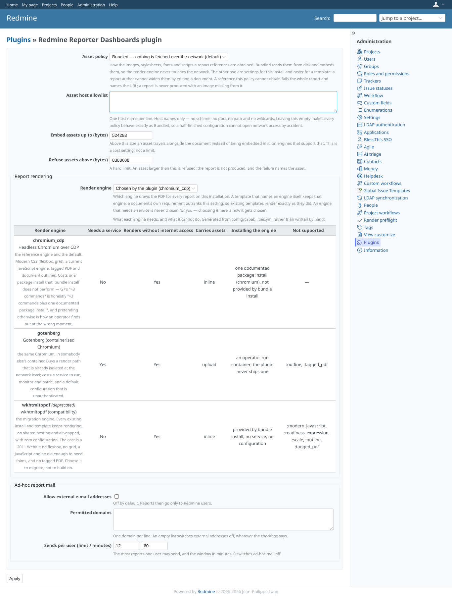
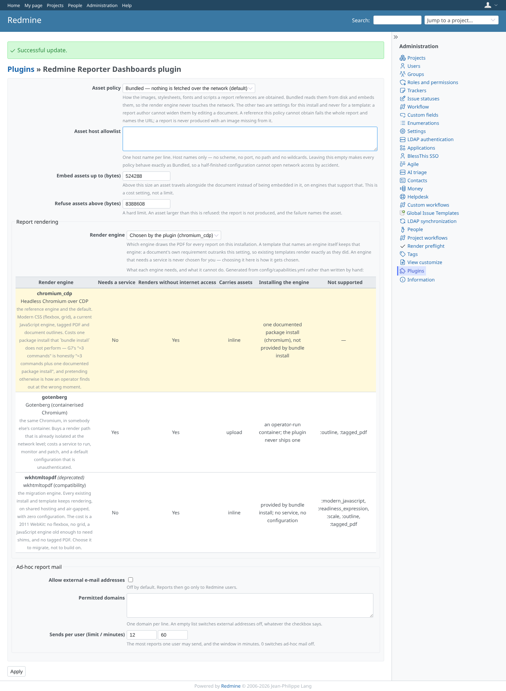
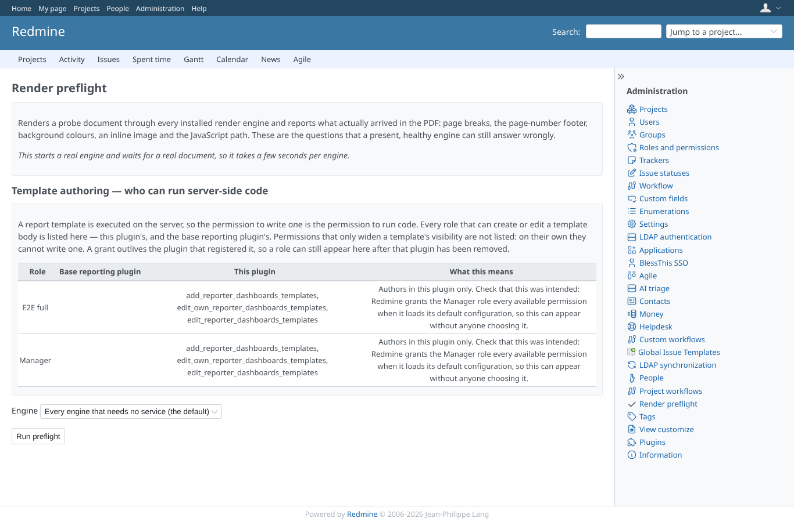
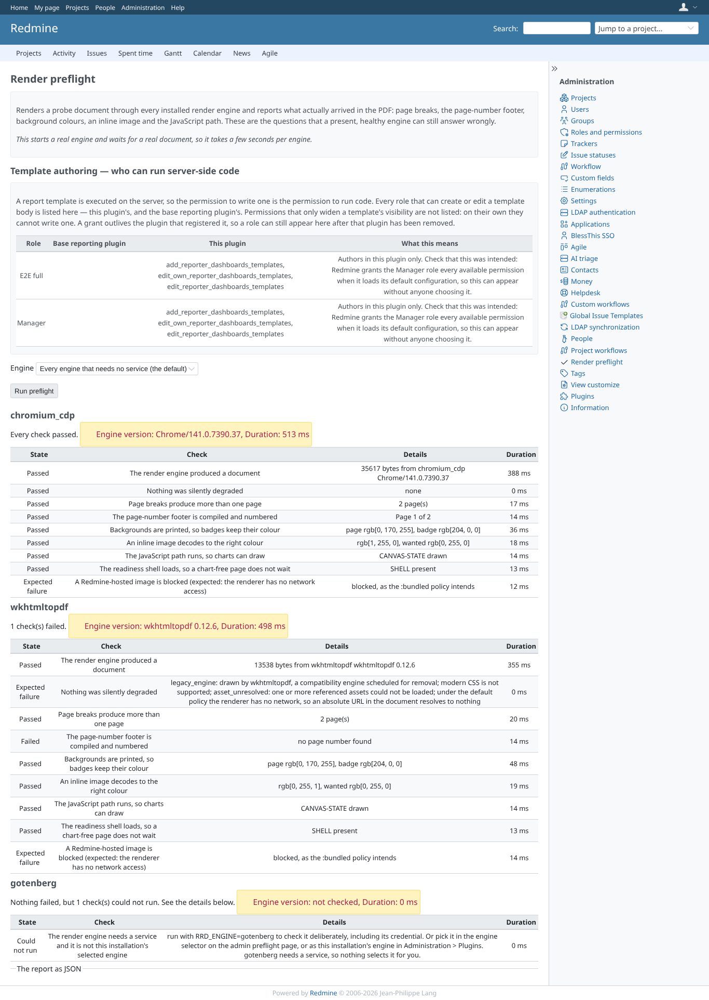
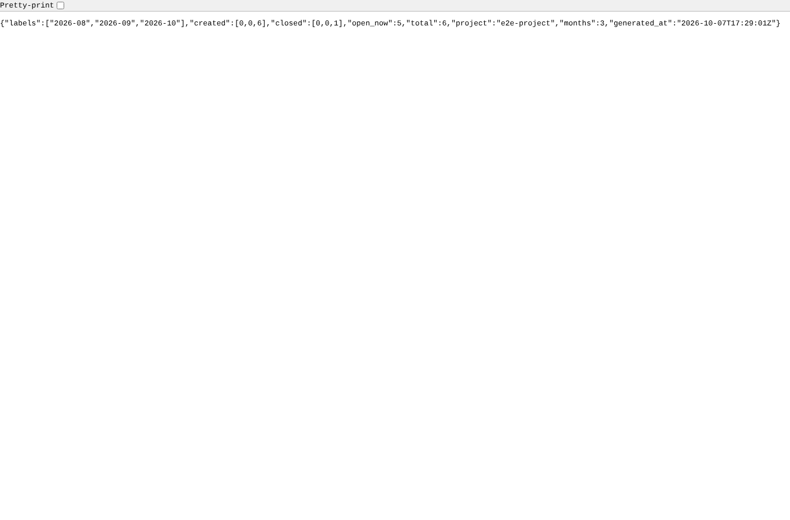
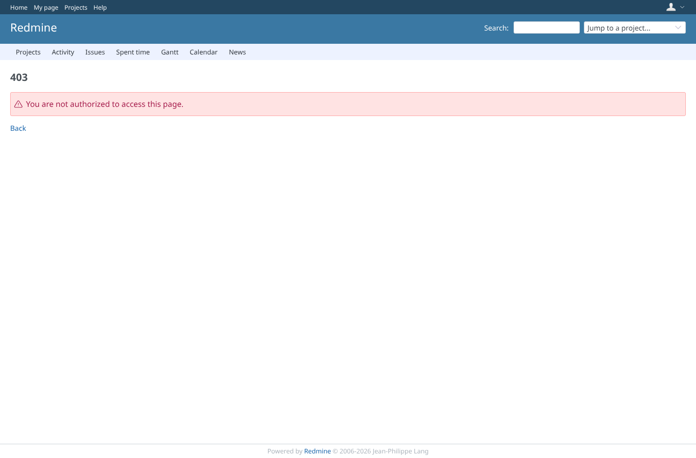

# admin

Run 2026-10-07T17:29:23.670Z against http://127.0.0.1:3000.

| screenshot | user | URL | shows |
|---|---|---|---|
|  | admin | `/settings/plugin/redmine_reporter_dashboards` | Plugin settings: asset policy, mail limits, external addresses and the PDF engine preference |
|  | admin | `/settings/plugin/redmine_reporter_dashboards` | Settings saved: Redmine's "Successful update" notice |
|  | admin | `/admin/reporter_dashboards/preflight` | Render preflight page: the engines this host offers and the run button |
|  | admin | `/admin/reporter_dashboards/preflight` | Preflight run: each engine renders a probe and reports what actually worked |
|  | admin | `/sql/stats/monthly_flow?project_id=e2e-project&months=3` | The monthly-flow statistics endpoint answers JSON for a visible project (months capped at 24) |
|  | outsider | `/admin/reporter_dashboards/preflight` | A non-admin: plugin settings and preflight refused (403); the private project's statistics answer 404 |
