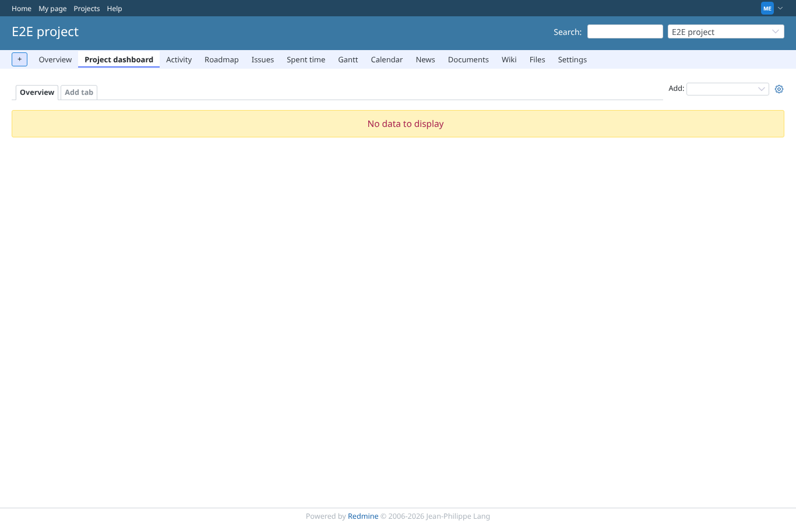
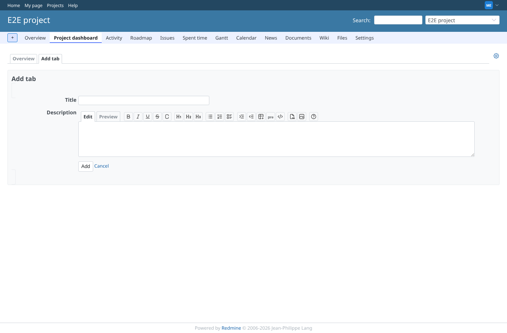
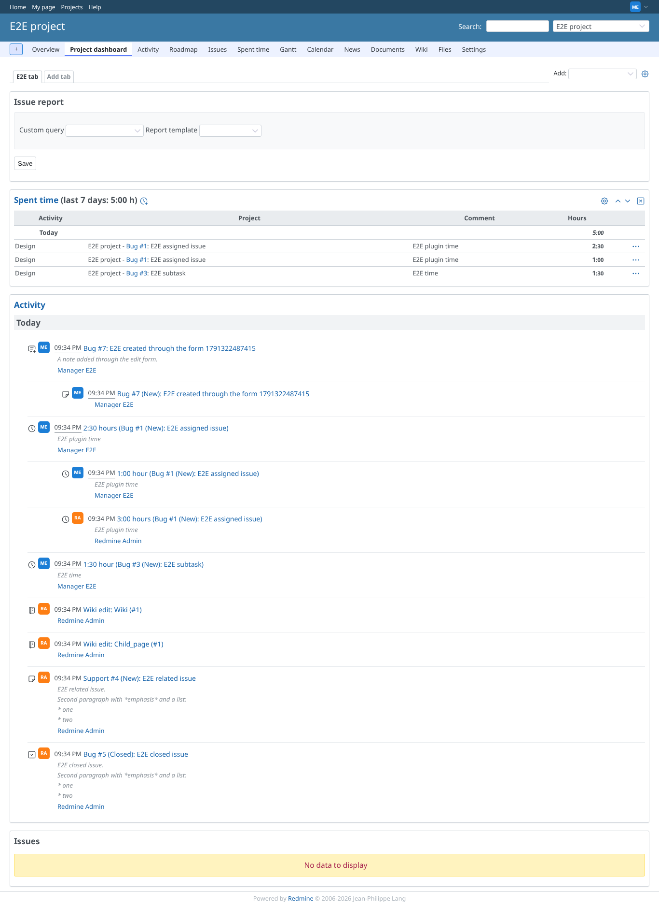
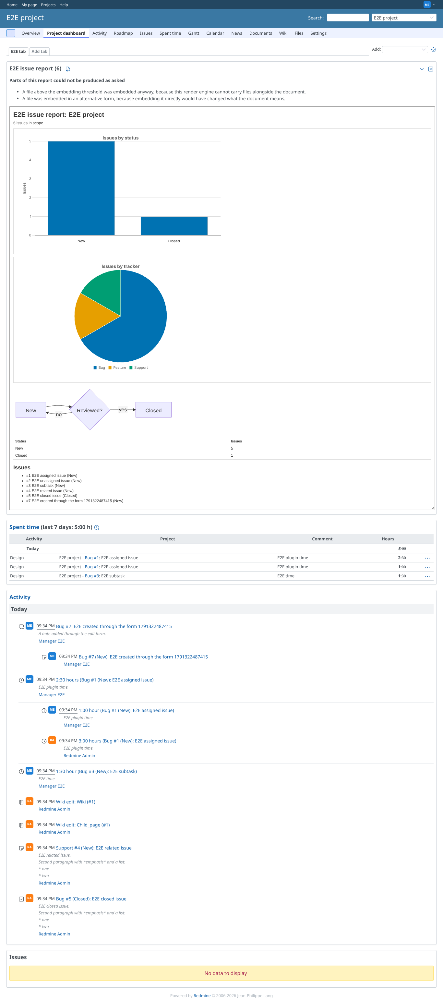
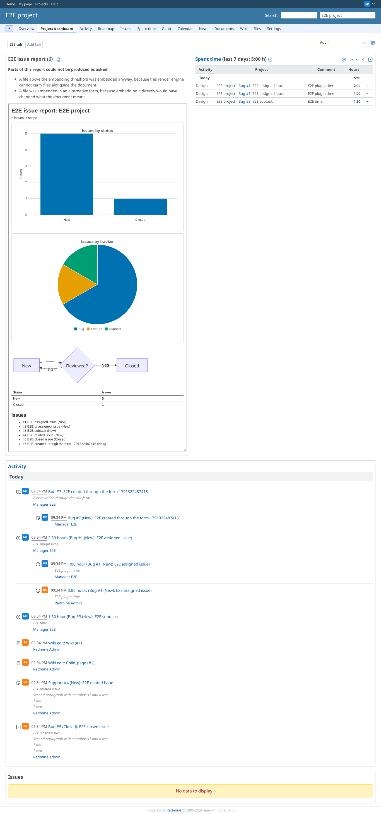
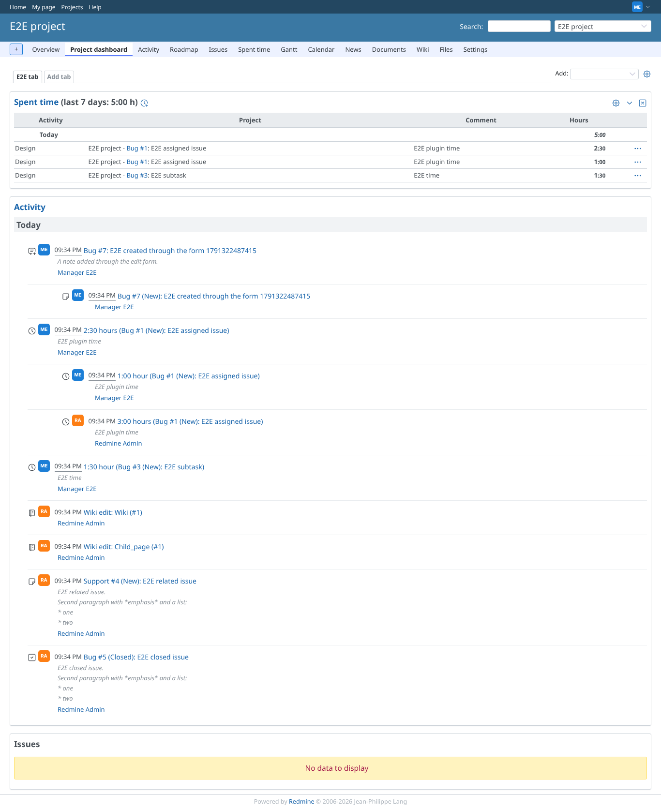

# dashboard

Run 2026-10-06T21:35:28.415Z against http://127.0.0.1:3000.

| screenshot | user | URL | shows |
|---|---|---|---|
|  | manager | `/projects/e2e-project/reporter` | Manager opens the project dashboard from the project menu: tab bar, widget picker and settings toggle are there |
|  | manager | `/projects/e2e-project/reporter?new_tab=1#reporter-dashboard-settings` | The "new tab" form in the dashboard settings box |
|  | manager | `/projects/e2e-project/reporter?tab=1` | The new tab "E2E tab" is created and selected |
|  | manager | `/projects/e2e-project/reporter?tab=1` | Four widgets added: issue query, activity, spent time and the issue report widget (asking for its template) |
|  | manager | `/projects/e2e-project/reporter?tab=1` | The report widget renders "E2E issue report" inside the dashboard, with its chart and diagram |
|  | manager | `/projects/e2e-project/reporter?tab=1` | After pressing a move arrow the widget order changed and the page reloads cleanly |
|  | manager | `/projects/e2e-project/reporter?tab=1` | A widget removed with its close control; the others stay |
|  | reporter | `/projects/e2e-project/reporter` | Reporter (no plugin permission): the dashboard is refused with 403 and the menu item is absent |
|  | outsider | `/projects/e2e-private/reporter` | Outsider on the private project dashboard: refused, nothing of the project is shown |
|  | anonymous | `/login?back_url=http%3A%2F%2F127.0.0.1%3A3000%2Fprojects%2Fe2e-project%2Freporter` | Anonymous on the dashboard is sent to the login page |
