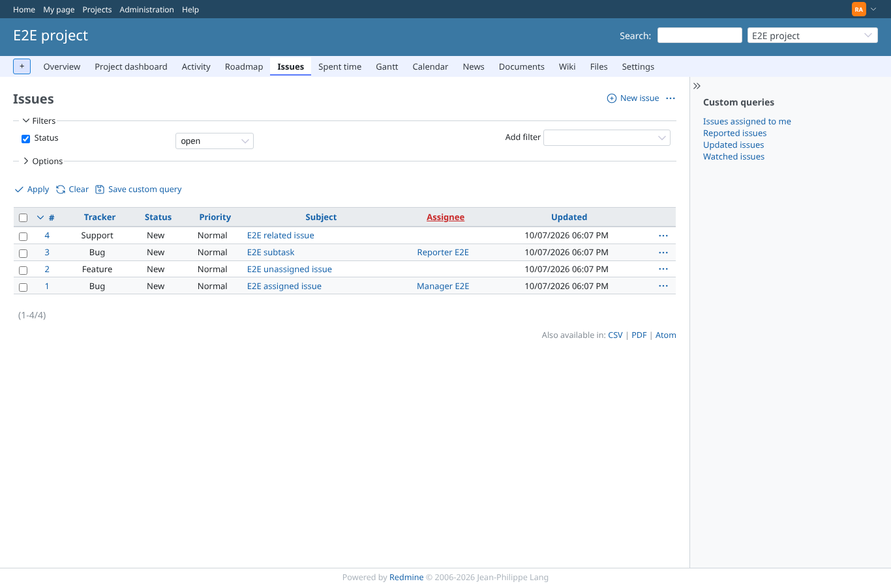
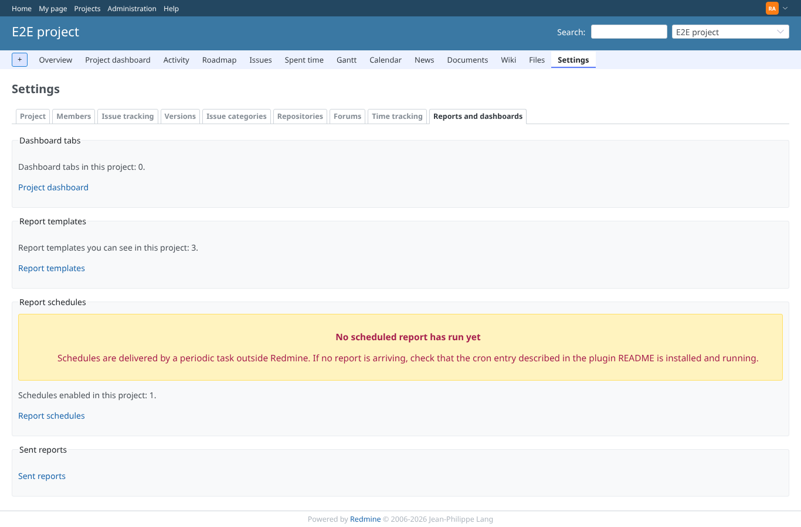
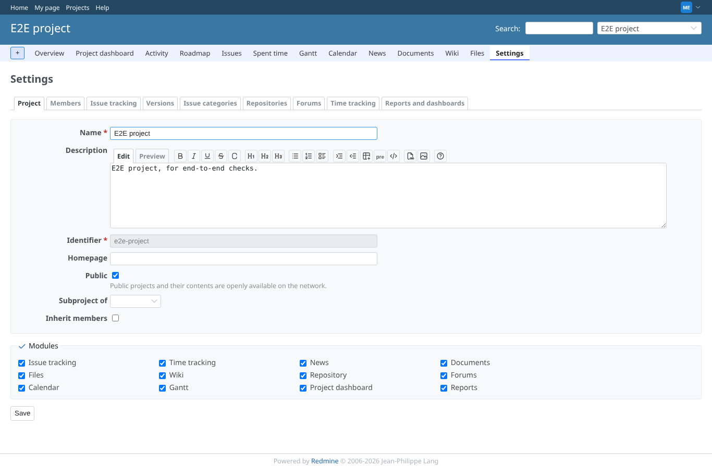
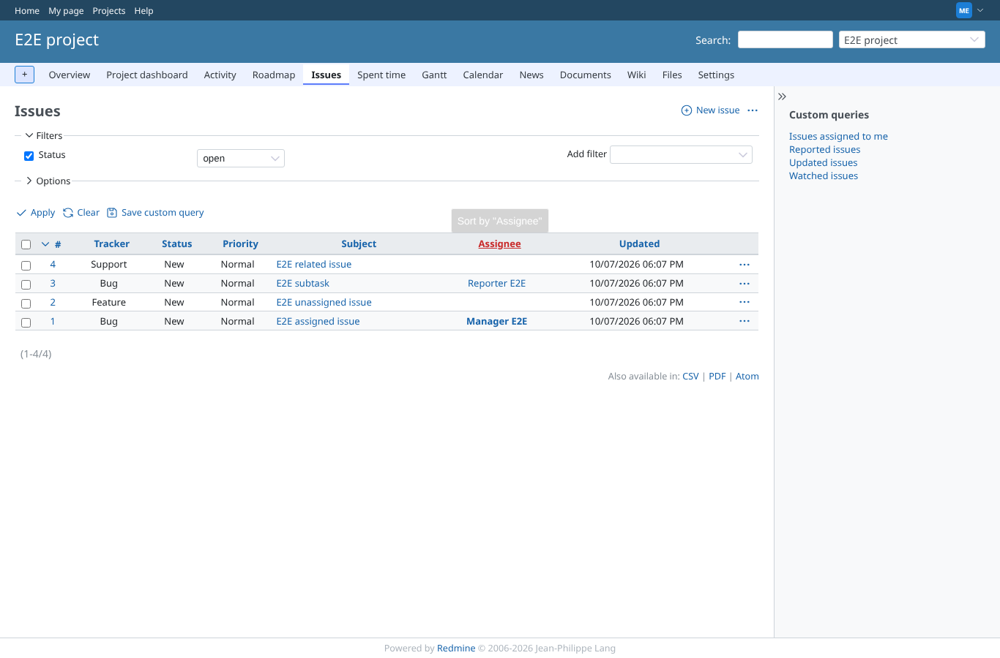
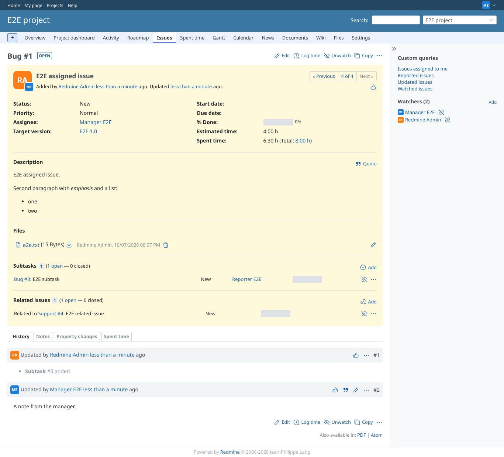
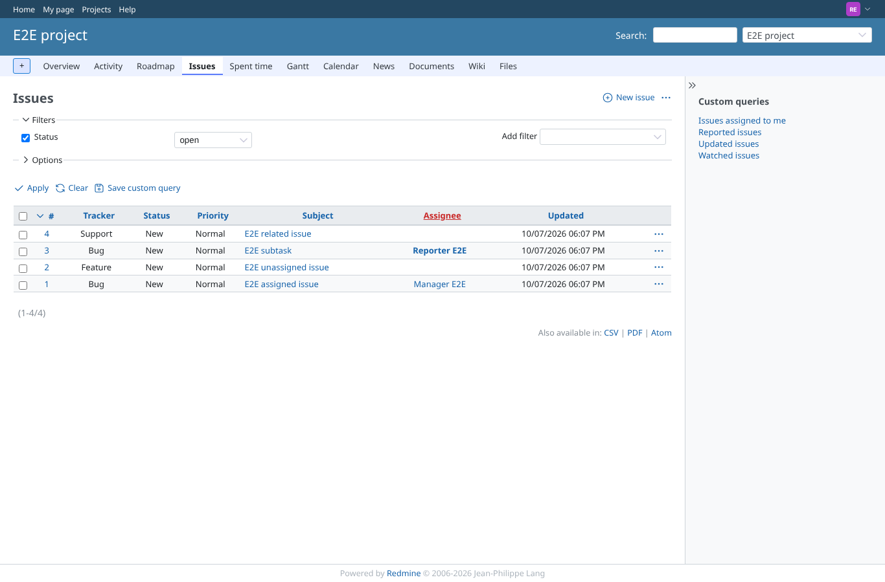
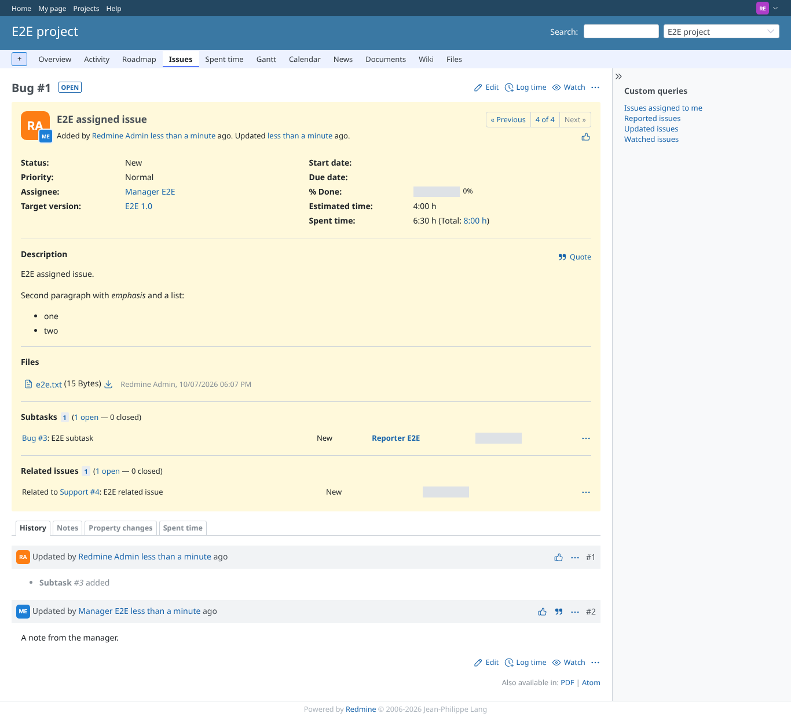
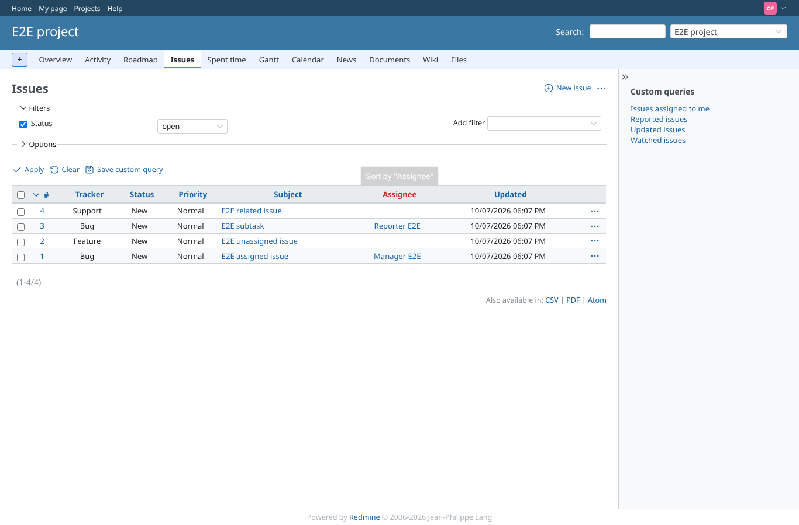

# core_pages

Run 2026-10-07T18:08:05.063Z against http://127.0.0.1:3000.

| screenshot | user | URL | shows |
|---|---|---|---|
|  | admin | `/projects/e2e-project/settings` | admin: Project > Settings answers 200, with this plugin's "Reports and dashboards" tab |
|  | admin | `/projects/e2e-project/issues` | admin: the issue list answers 200 |
|  | admin | `/issues/1` | admin: an issue page answers 200 |
|  | admin | `/projects/e2e-project/settings/reporter_dashboards` | admin: the "Reports and dashboards" settings tab itself renders |
|  | manager | `/projects/e2e-project/settings` | manager: Project > Settings answers 200, with this plugin's "Reports and dashboards" tab |
|  | manager | `/projects/e2e-project/issues` | manager: the issue list answers 200 |
|  | manager | `/issues/1` | manager: an issue page answers 200 |
|  | reporter | `/projects/e2e-project/settings` | reporter: Project > Settings answers 403 |
|  | reporter | `/projects/e2e-project/issues` | reporter: the issue list answers 200 |
|  | reporter | `/issues/1` | reporter: an issue page answers 200 |
|  | outsider | `/projects/e2e-project/settings` | outsider: Project > Settings of the public project is refused (403) |
|  | outsider | `/projects/e2e-project/issues` | outsider: the public project's issue list answers 200 |
|  | outsider | `/projects/e2e-private/issues` | outsider: the private project's issue list is refused (403) |
