# delivery

Run 2026-10-06T21:52:41.446Z against http://127.0.0.1:3000.

| screenshot | user | URL | shows |
|---|---|---|---|
| 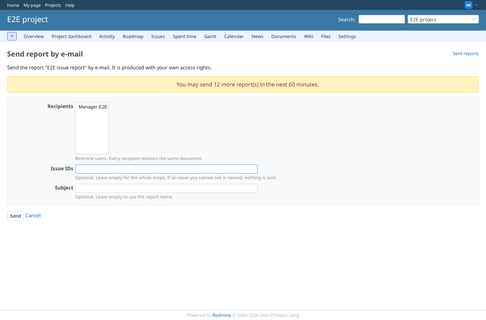 | manager | `/projects/e2e-project/reporter/mail/new?template_id=1` | The "send report by e-mail" form: recipients from the project, issues, subject |
| 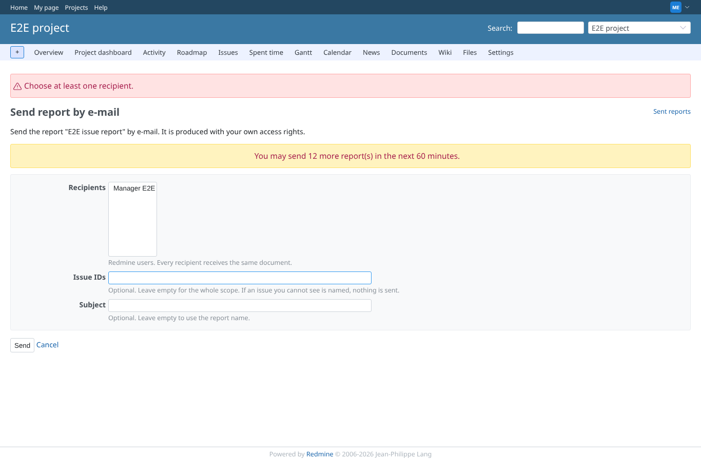 | manager | `/projects/e2e-project/reporter/mail` | Sending without a recipient: an error, and no mail is written |
| 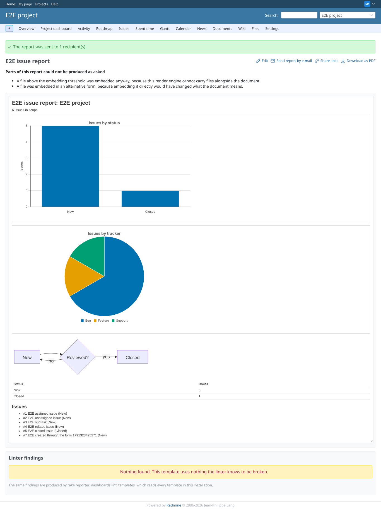 | manager | `/projects/e2e-project/reporter/templates/1` | After sending: the mail log lists the send with its recipients and status |
| 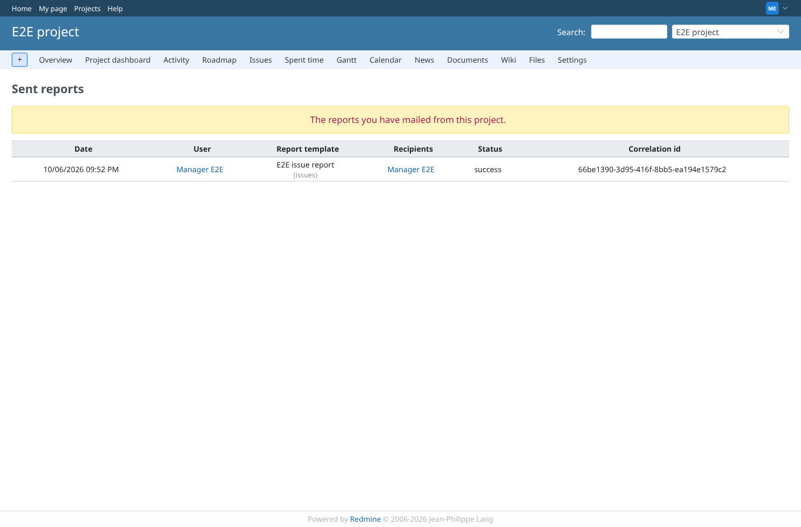 | manager | `/projects/e2e-project/reporter/mail` | The mail log of the project |
| 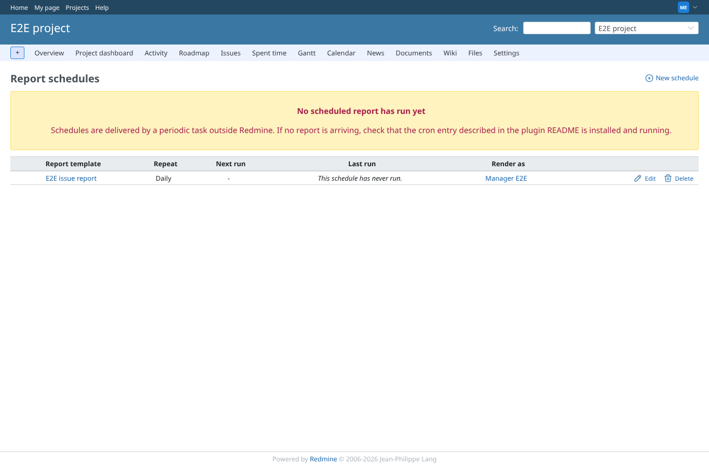 | manager | `/projects/e2e-project/reporter/schedules` | Report schedules of the project: the seeded daily schedule with its next run |
| 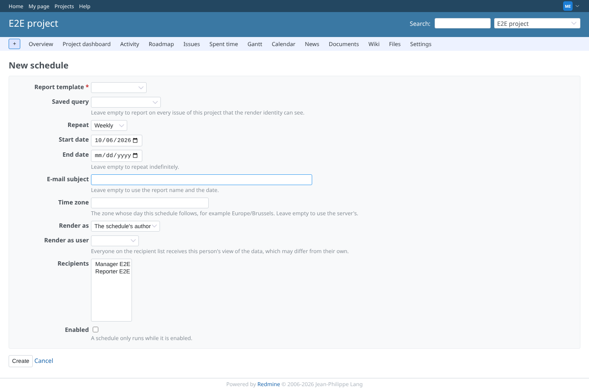 | manager | `/projects/e2e-project/reporter/schedules/new` | New schedule form: template, query, repeat, dates, subject, render-as, recipients |
| 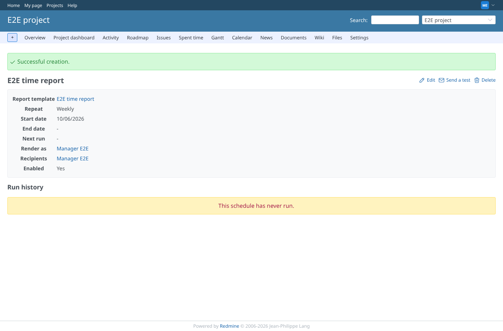 | manager | `/projects/e2e-project/reporter/schedules/2` | The new weekly schedule is saved |
| 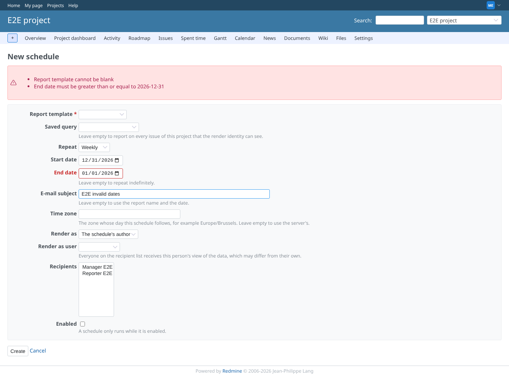 | manager | `/projects/e2e-project/reporter/schedules` | End date before start date: rejected with an error message |
| 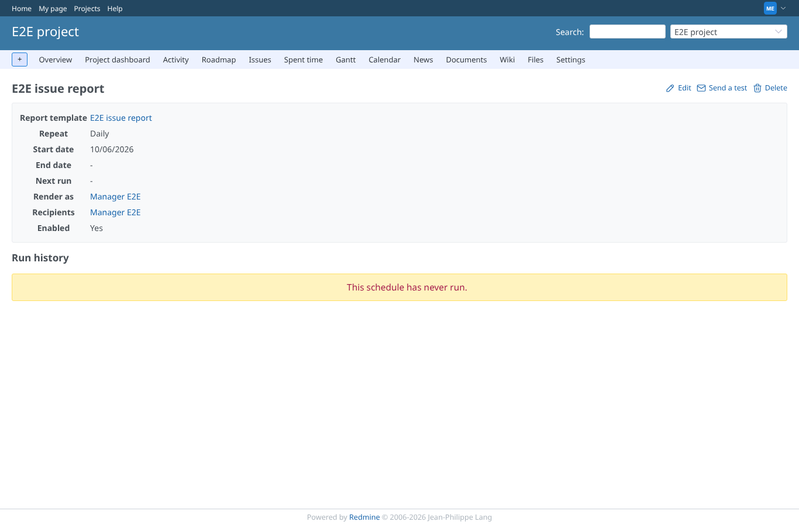 | manager | `/projects/e2e-project/reporter/schedules/1` | The seeded schedule: template, repeat, recipients, run history |
| 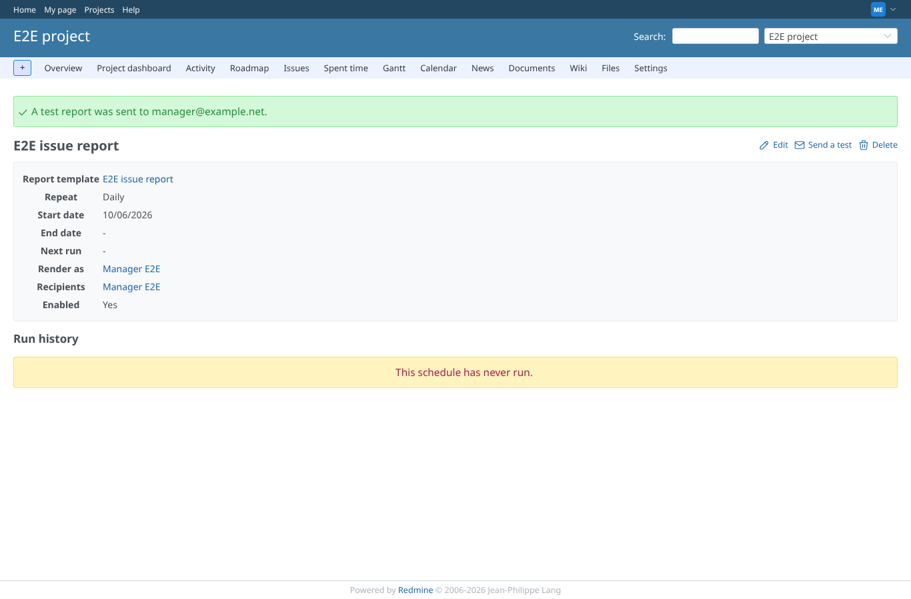 | manager | `/projects/e2e-project/reporter/schedules/1` | After "Send a test": the flash confirms and a mail is written |
| 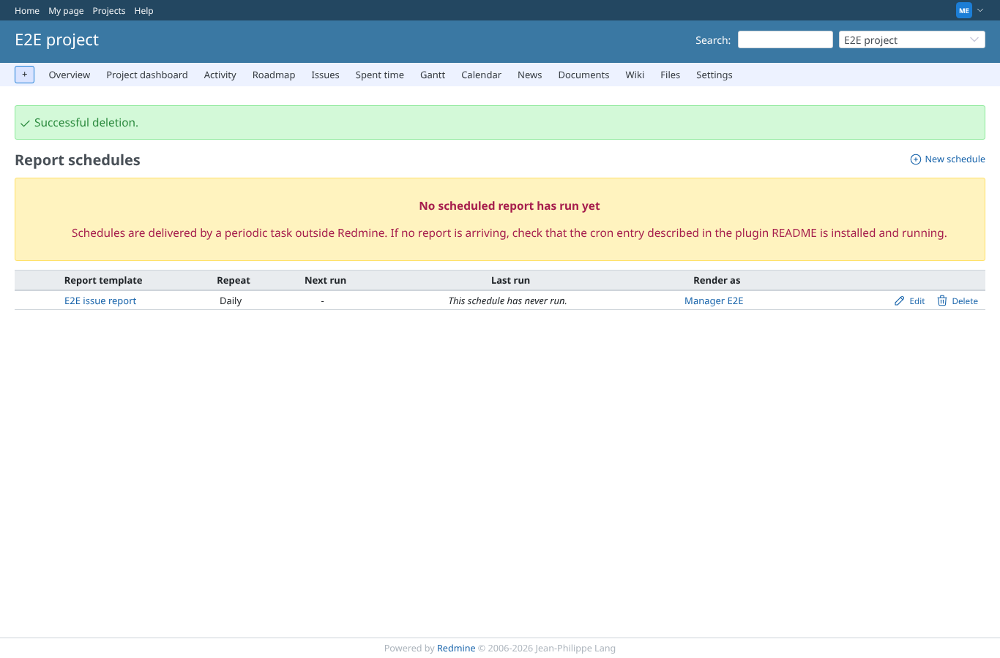 | manager | `/projects/e2e-project/reporter/schedules` | After deleting the weekly schedule: the deletion notice and the list without it |
|  | reporter | `/projects/e2e-project/reporter/mail/new?template_id=1` | Reporter: schedules and ad hoc mail are refused (403) |
|  | outsider | `/projects/e2e-private/reporter/schedules` | Outsider: schedules of the private project are refused (403) |
