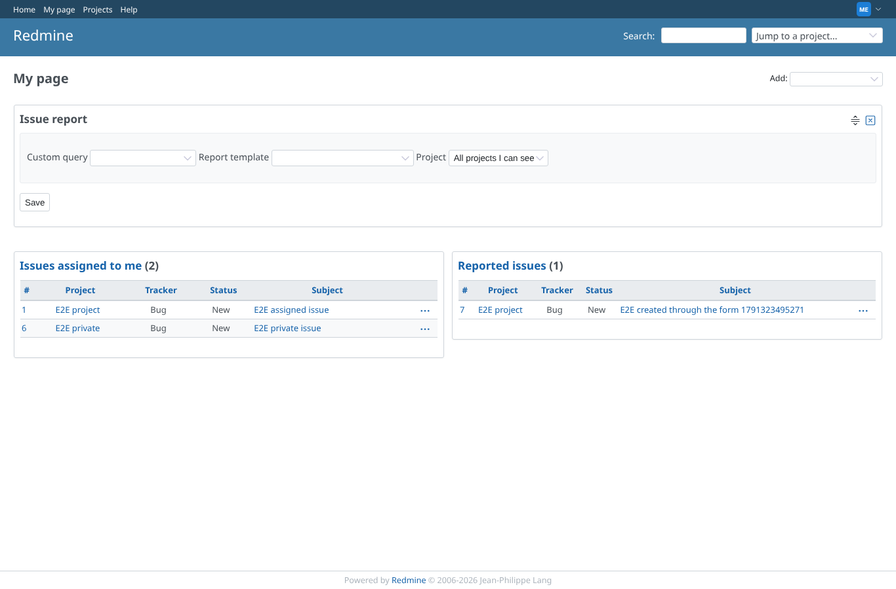
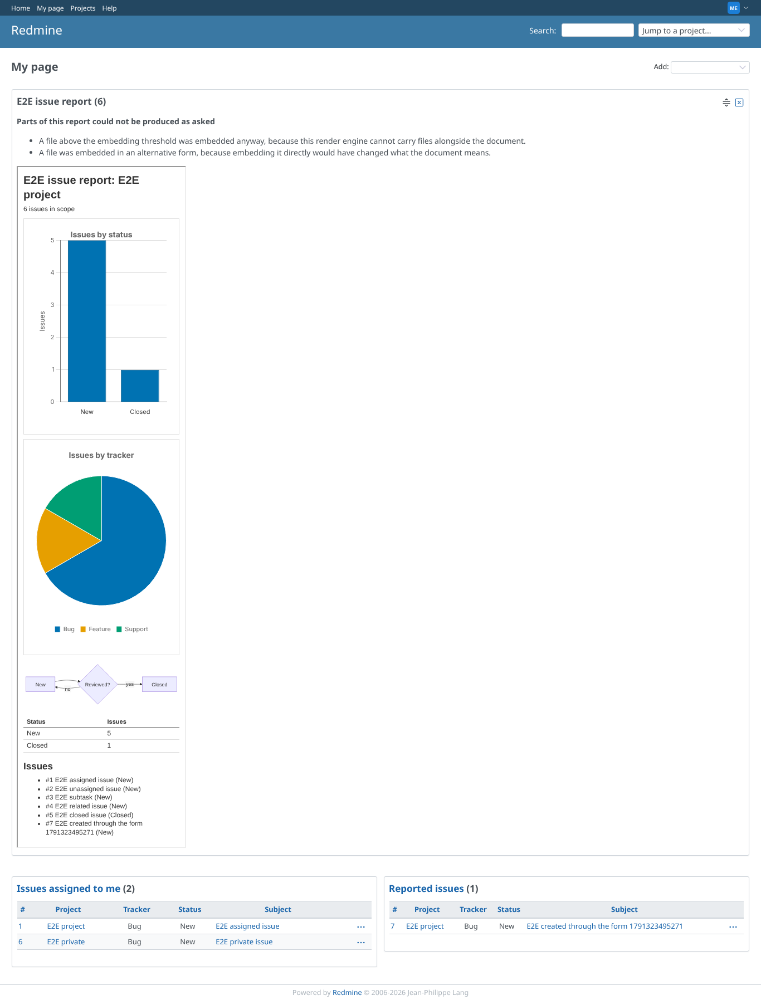
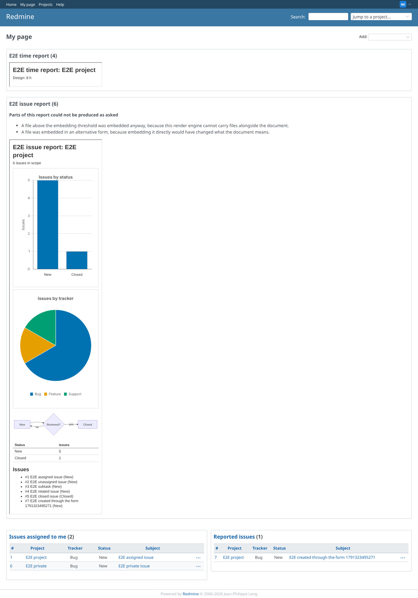
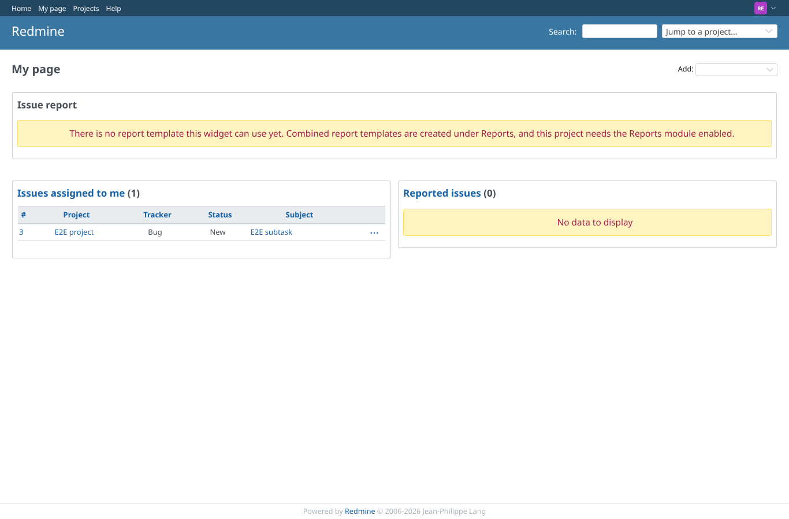

# my_page

Run 2026-10-06T21:53:02.431Z against http://127.0.0.1:3000.

| screenshot | user | URL | shows |
|---|---|---|---|
|  | manager | `/my/page` | My page, block "Issue report" added: it asks for a project and a template |
|  | manager | `/my/page` | The "Issue report" block renders the chosen report for the chosen project |
|  | manager | `/my/page` | The "Spent time report" block renders the hours per activity |
|  | reporter | `/my/page` | Reporter adds the block: no project or template is offered, so nothing is rendered (fails closed) |
