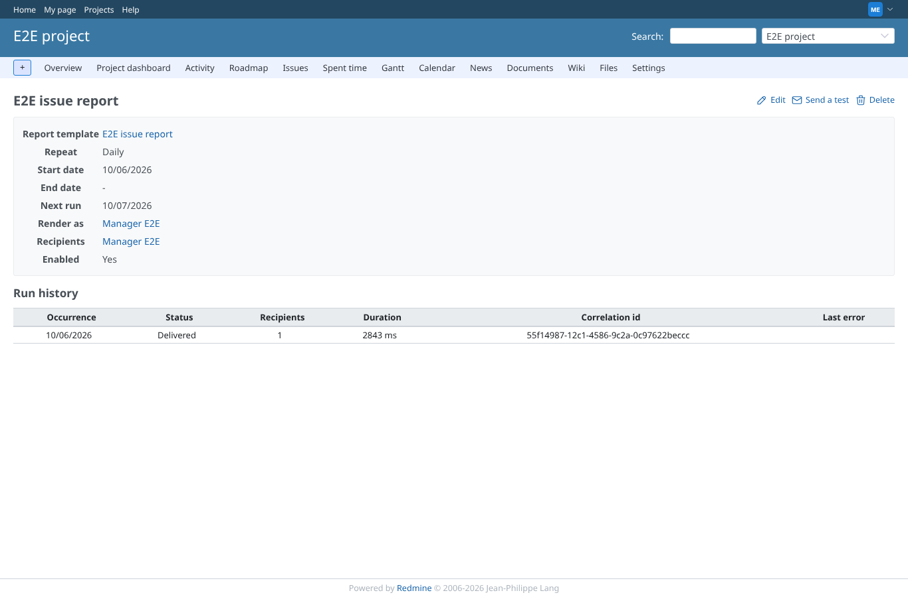

# rake_tasks

Run 2026-10-06T21:53:55.427Z against http://127.0.0.1:3000.

| screenshot | user | URL | shows |
|---|---|---|---|
|  | manager | `/projects/e2e-project/reporter/schedules/1` | The schedule after `rake reporter_dashboards:schedules:run`: the run is recorded as delivered, the next run moved on |
