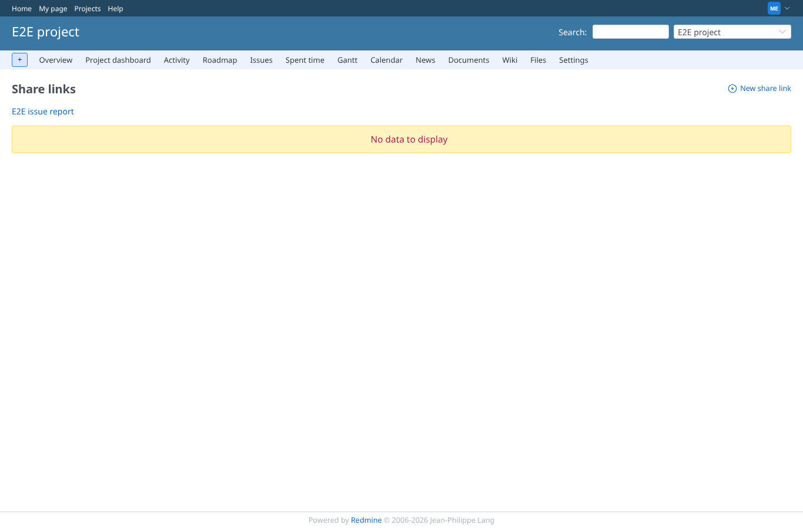
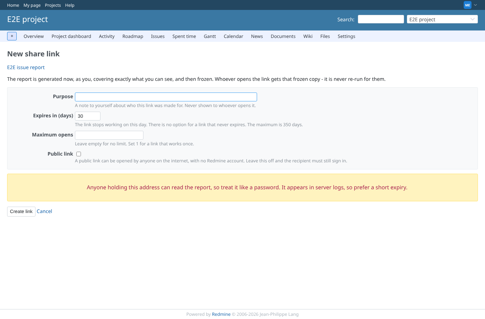
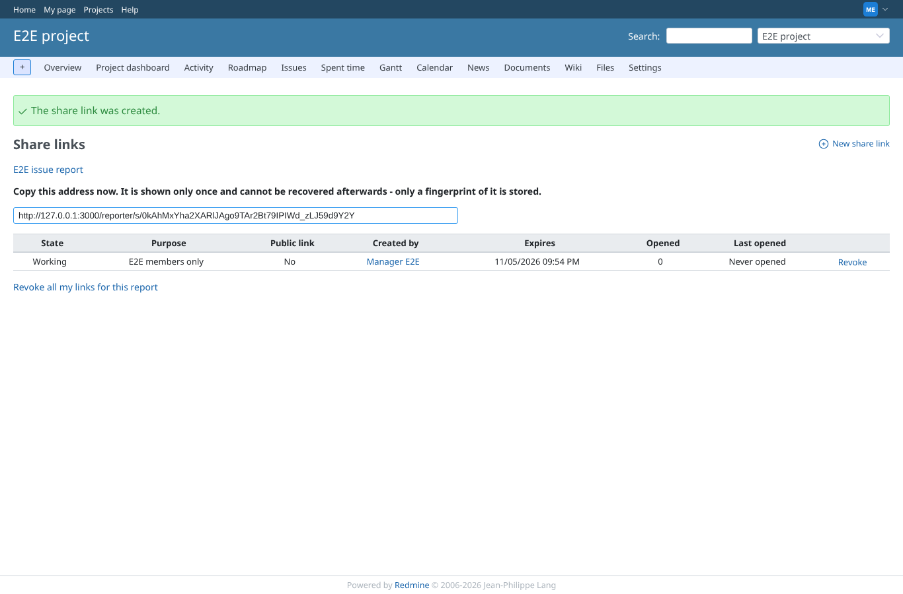
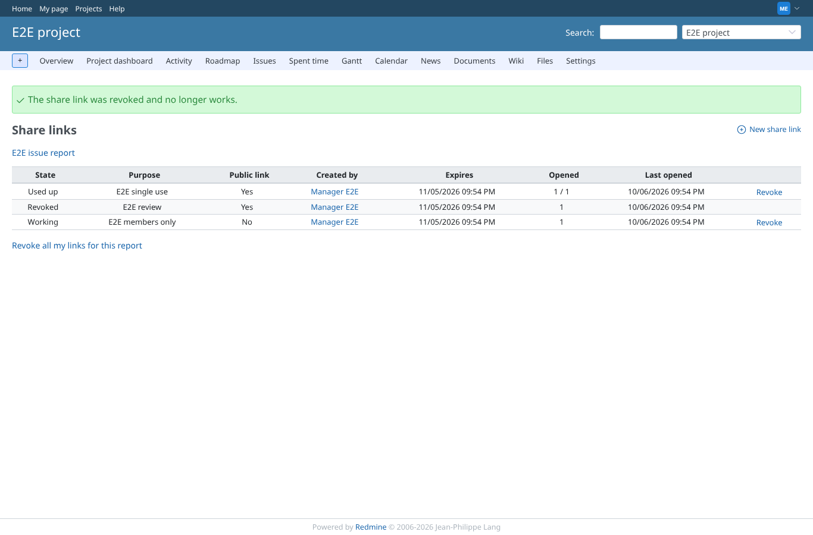

# share_links

Run 2026-10-06T21:54:22.658Z against http://127.0.0.1:3000.

| screenshot | user | URL | shows |
|---|---|---|---|
|  | manager | `/projects/e2e-project/reporter/templates/1/shares` | Share links of "E2E issue report" before any link exists: the empty state and the create action |
|  | manager | `/projects/e2e-project/reporter/templates/1/shares/new` | The new share link form: purpose, expiry, use limit, public flag |
|  | manager | `/projects/e2e-project/reporter/templates/1/shares` | Link created: the URL is shown once, the list shows expiry, uses and the revoke action |
|  | anonymous | `/login?back_url=http%3A%2F%2F127.0.0.1%3A3000%2Freporter%2Fs%2F0kAhMxYha2XARlJAgo9TAr2Bt79IPIWd_zLJ59d9Y2Y` | A non-public share link opened anonymously: Redmine asks for a login first |
|  | anonymous | `/reporter/s/thisIsNotAToken123` | An unknown token: refused with 404 and nothing about the report |
|  | anonymous | `/reporter/s/Du1VTp4gpME2WVWlSSGYj253Nddt-I3Bv6haPRIMAGo` | A single-use link opened a second time is refused (HTTP 410) |
|  | manager | `/projects/e2e-project/reporter/templates/1/shares` | After revoking, the list marks the link revoked |
|  | anonymous | `/reporter/s/0PXLw0lXG6QNinxC3nuszH-HFXe4Mwsu2Zx51ucgFqU` | The revoked link is refused (HTTP 410) with the refusal page |
|  | reporter | `/projects/e2e-project/reporter/templates/1/shares` | Reporter without share permission: the share link list is refused (403) |
