# templates

Run 2026-10-06T21:54:47.612Z against http://127.0.0.1:3000.

| screenshot | user | URL | shows |
|---|---|---|---|
| 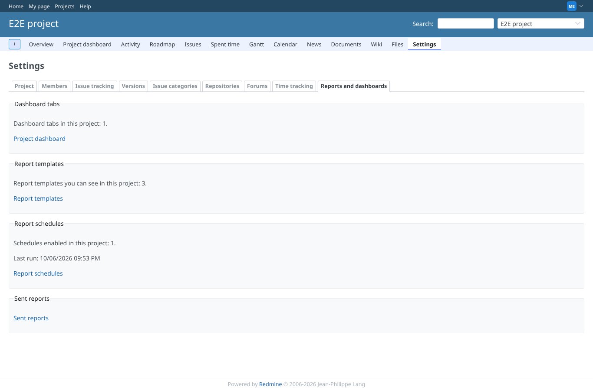 | manager | `/projects/e2e-project/settings/reporter_dashboards` | Project settings, tab "Reports and dashboards": links to templates, schedules and mail log |
| 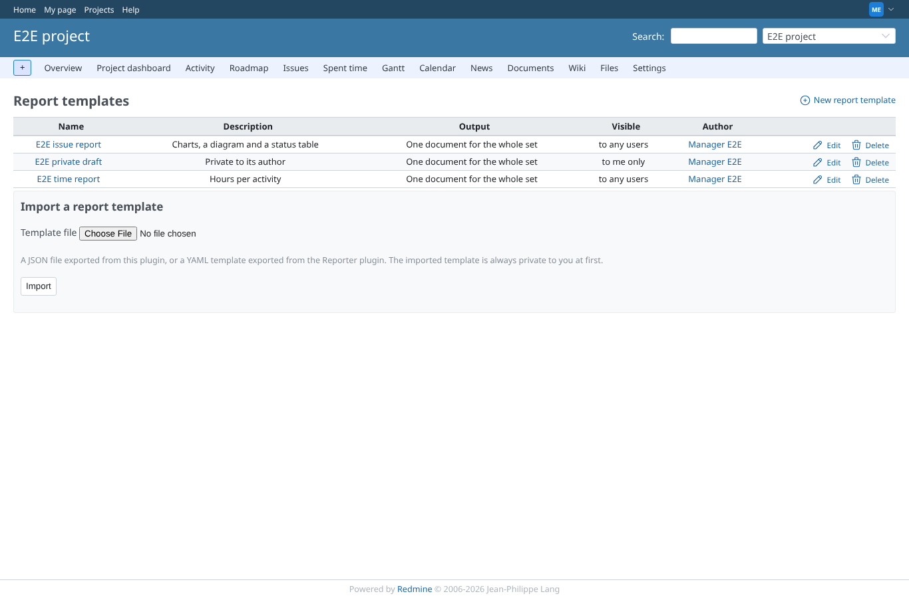 | manager | `/projects/e2e-project/reporter/templates` | Template list for the manager: the seeded templates, visibility, author, edit and delete |
| 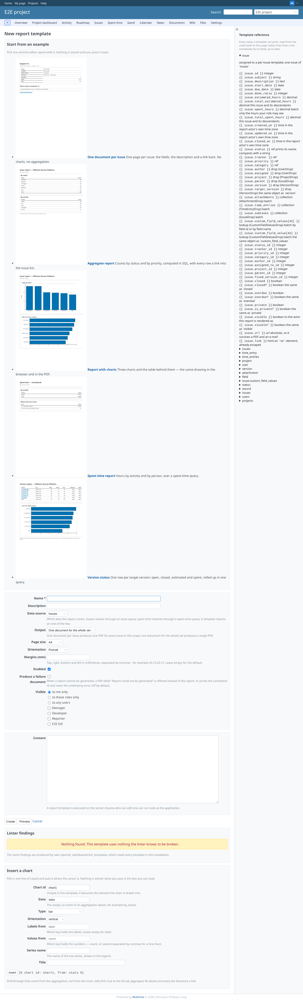 | manager | `/projects/e2e-project/reporter/templates/new` | New template form with the starter gallery, the editor and the lint panel |
| 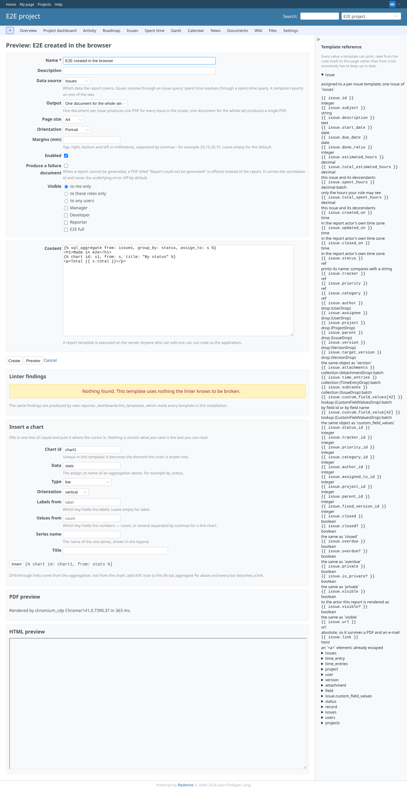 | manager | `/projects/e2e-project/reporter/templates/preview` | Preview of the unsaved template: the render shows the heading, the chart and the total; nothing is stored yet |
| 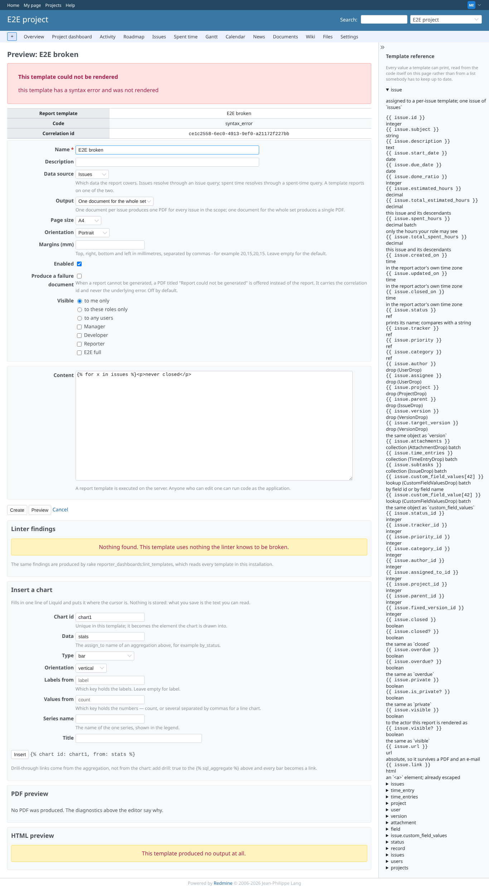 | manager | `/projects/e2e-project/reporter/templates/preview` | Preview of a template with an unclosed : a readable syntax error, no server error |
| 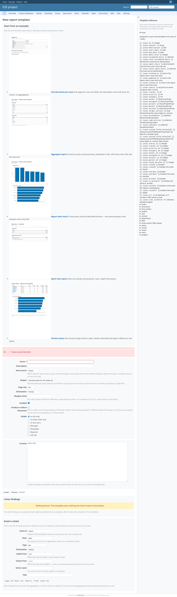 | manager | `/projects/e2e-project/reporter/templates` | Create without a name: Redmine's error box, nothing saved |
| 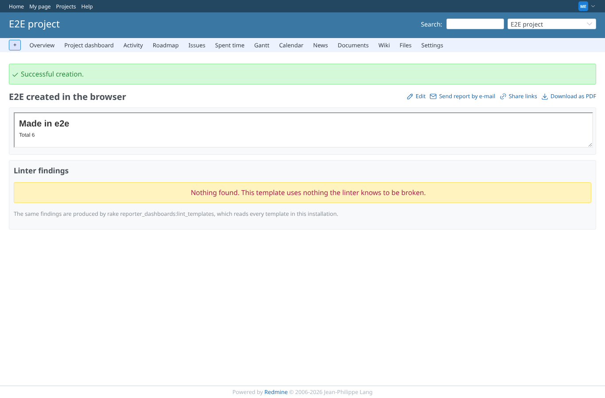 | manager | `/projects/e2e-project/reporter/templates/8` | The created template's page: rendered report and the export, mail and share actions |
| 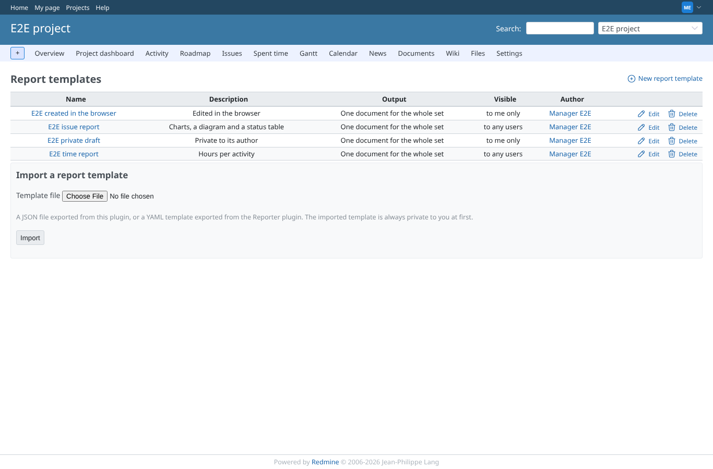 | manager | `/projects/e2e-project/reporter/templates` | Template list after editing: the new description is shown |
| 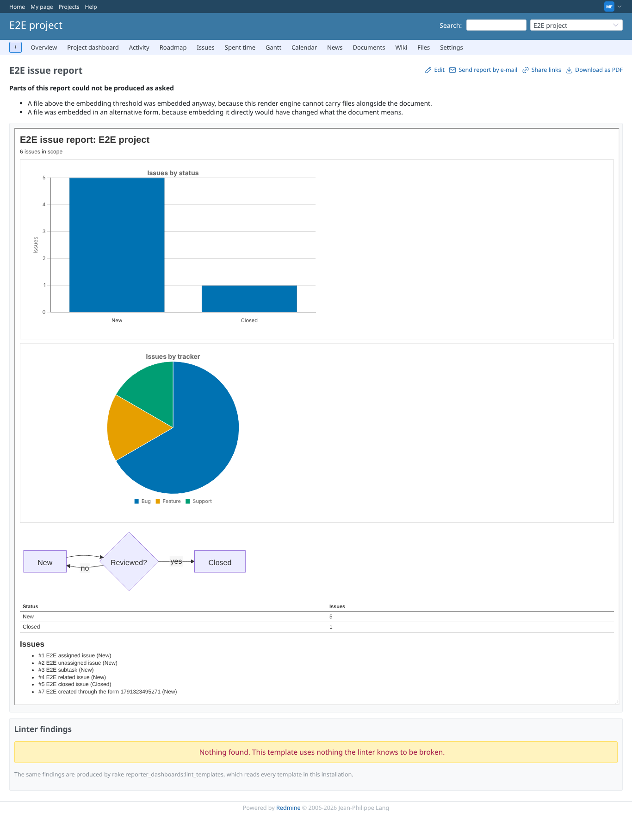 | manager | `/projects/e2e-project/reporter/templates/1` | The seeded issue report: bar and pie chart (bundled Chart.js) and the Mermaid diagram drawn in the sandboxed frame |
| 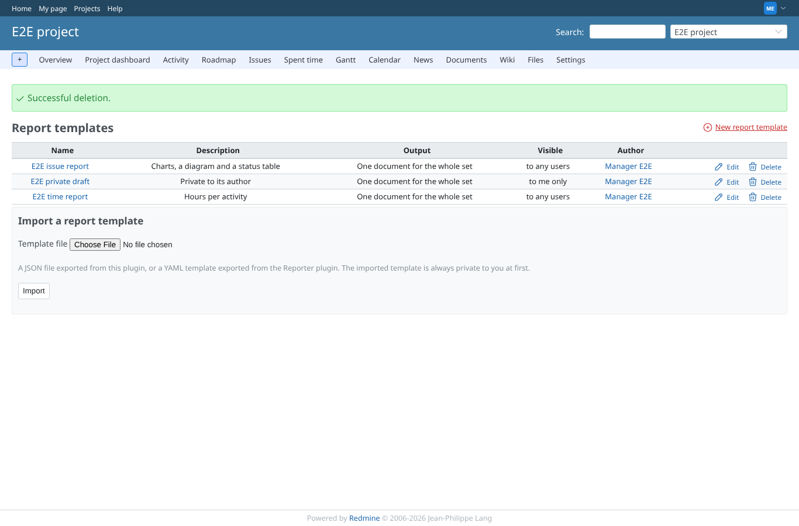 | manager | `/projects/e2e-project/reporter/templates` | After delete the template is gone from the list, with Redmine's flash notice |
|  | reporter | `/projects/e2e-project/reporter/templates` | Reporter without the report permissions: the template list is refused (403) |
|  | outsider | `/projects/e2e-private/reporter/templates` | Outsider: the private project's templates are refused (403) |
| 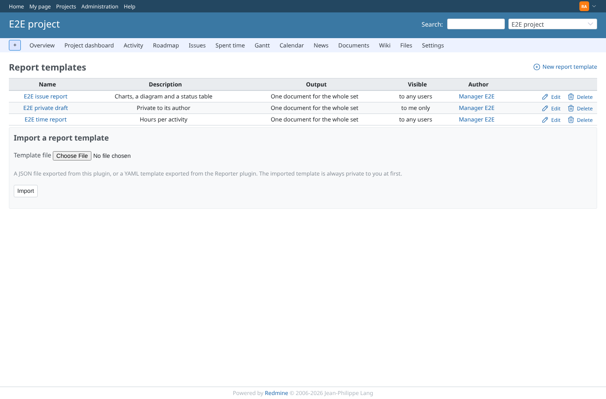 | admin | `/projects/e2e-project/reporter/templates` | Admin's view of the template list |
