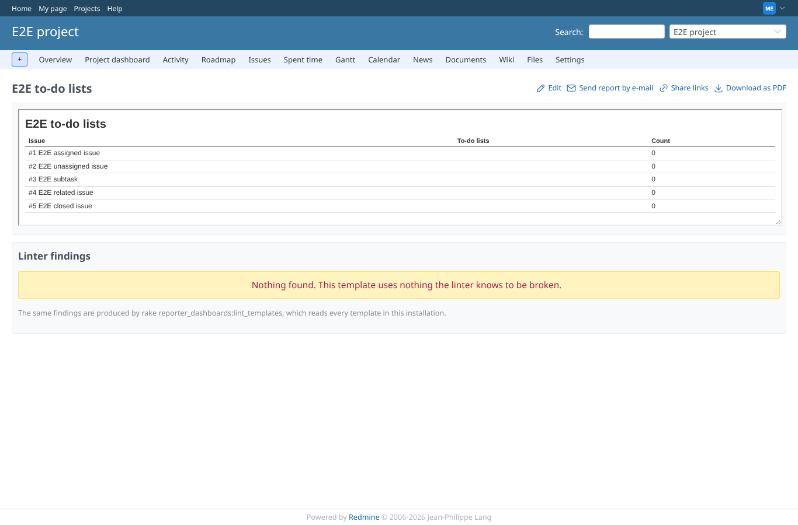

# todo_lists

Run 2026-10-07T19:56:15.843Z against http://127.0.0.1:3000.
Without redmine_issue_todo_lists2, PostgreSQL 16, Redmine 7.0-stable-GEOxyz, production mode.

| screenshot | user | URL | shows |
|---|---|---|---|
|  | manager | `/projects/e2e-project/reporter/templates/5` | Without redmine_issue_todo_lists2: the same template renders, every count 0, no error |
|  | reporter | `/projects/e2e-project/reporter/templates/5` | Reporter without the report permissions: the template is refused (403) |
