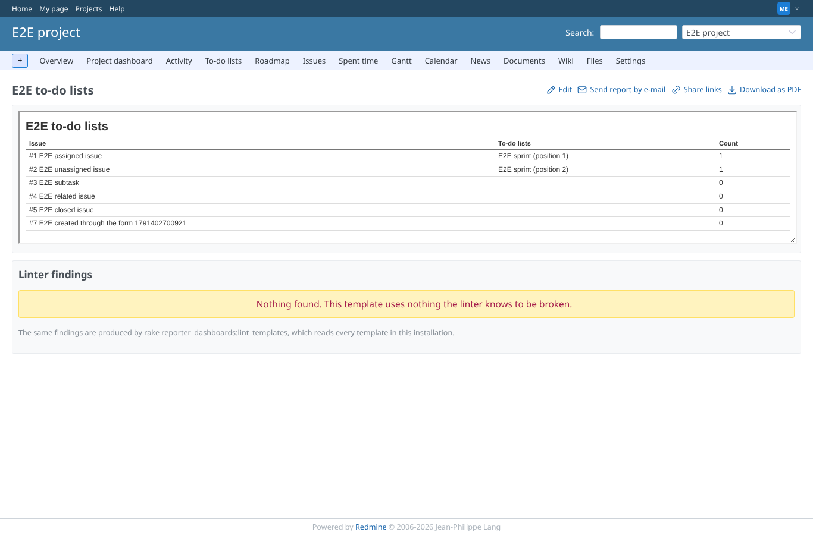
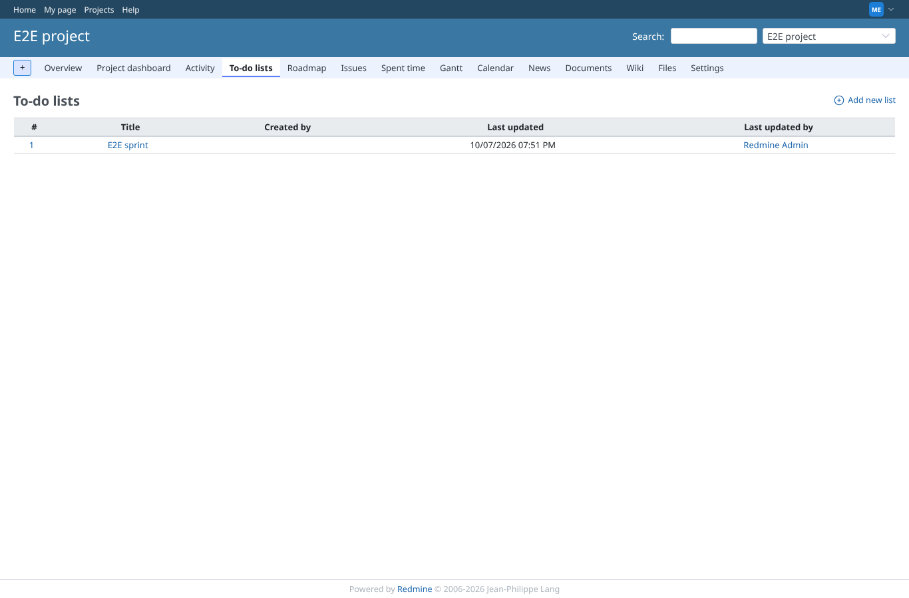
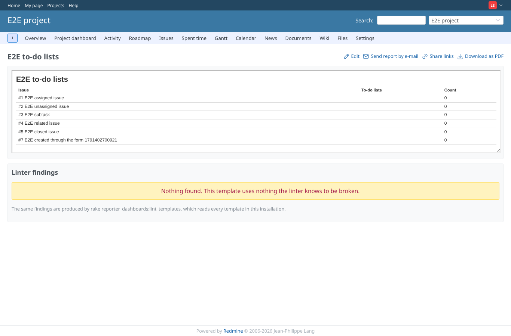
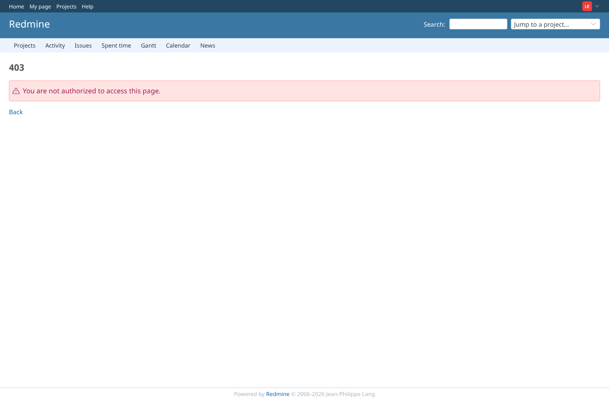

# todo_lists

Run 2026-10-07T19:55:18.487Z against http://127.0.0.1:3000.
With redmine_issue_todo_lists2 installed, PostgreSQL 16, Redmine 7.0-stable-GEOxyz, production mode, server as an unprivileged user.

| screenshot | user | URL | shows |
|---|---|---|---|
|  | manager | `/projects/e2e-project/reporter/templates/5` | Manager (may view to-do lists): each issue shows the "E2E sprint" list with its position, and the count |
|  | manager | `/projects/e2e-project/issue_todo_lists` | Manager: the todo plugin's own list page, the same "E2E sprint" list |
|  | listless | `/projects/e2e-project/reporter/templates/5` | Member without "View to-do lists": the same report, the same issues, no list and count 0 |
|  | listless | `/projects/e2e-project/issue_todo_lists` | The same member: the todo plugin itself refuses its list page (403), consistent with the report |
|  | reporter | `/projects/e2e-project/reporter/templates/5` | Reporter without the report permissions: the template is refused (403) |
