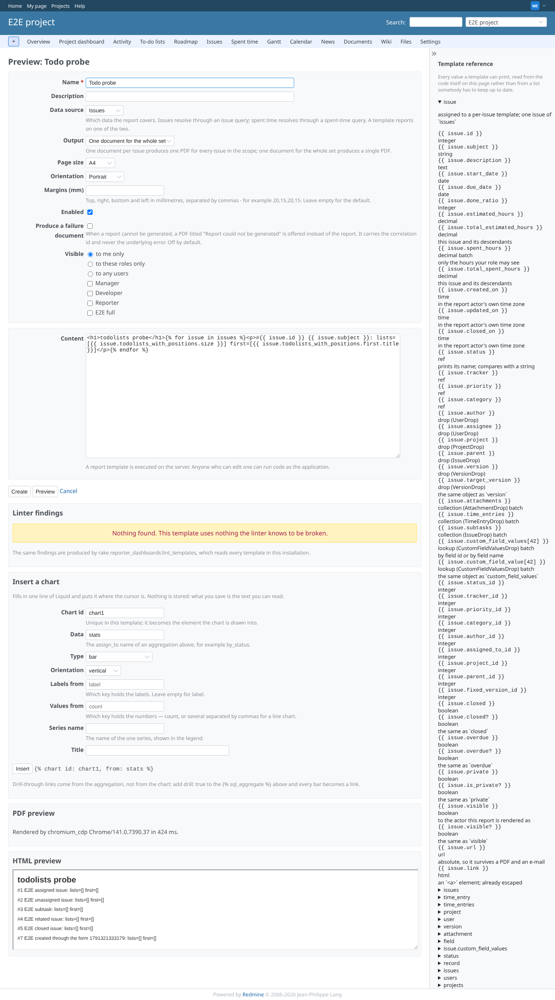

# todolists-with-positions

Run 2026-10-06T21:19:23.104Z against http://127.0.0.1:3000.

| screenshot | user | URL | shows |
|---|---|---|---|
|  | manager | `/projects/e2e-project/reporter/templates/preview` | redmine_issue_todo_lists2 installed, issue #1 on the list "E2E todo": issue.todolists_with_positions prints nothing in this plugin's templates (no error, no lint finding) - work item 7, open question for Jan |
