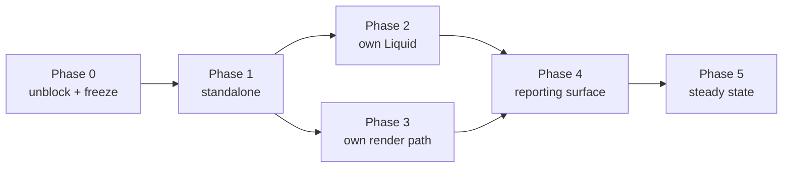

# 07 — Phasing (phased delivery plan)

> The bridge from the **full-picture analysis** to a sequenced build. Written by
> `/plan-phasing` **after** the analysis is complete. The analysis stays target-only;
> *sequencing* lives here. This is planning, **not code**.

- **Decision:** [05-decision.md](./05-decision.md) (**ADR-004**, accepted 2026-08-04)
- **Analysis inputs:** `02-analysis.md`, `03-options.md`, `04-risks.md`, `model.json`
  (INV-1…INV-9). No separate architecture deep-dive file exists; its role is played by `02`'s
  technical section plus `reference/*`.

## Target recap

One standalone Redmine plugin, installable and fully testable with **no external plugin
dependency**, running on the Redmine versions its CI actually exercises; keeping Liquid as the
template language but on an **owned** drop layer; rendering the same reports and dashboards on
HTML and PDF through a **pluggable engine behind a document-request interface**; and carrying
forward every visibility, containment and failure-contract invariant the current addon earned
(INV-1…INV-9). Success is `01-context.md`'s G1–G7.

## Phasing axes

Sequencing moves along five independent dimensions. Naming them separately is what keeps the
phases from collapsing into "do everything, slowly":

| Axis | From → to |
|---|---|
| **A. Dependency** | requires `redmine_reporter` → zero references to it |
| **B. Liquid ownership** | gem drops + gem filters → own drops, own filters, own execution policy |
| **C. Render path** | wkhtmltopdf hard-wired via reporter's `Report#to_pdf` → document-request interface, ≥1 CI-verified engine |
| **D. Reporting surface** | dashboards + aggregation only → template CRUD, template types, scheduling, my-page |
| **E. Assurance** | 989 addon tests, no PDF ever asserted → G1–G7 provable, multi-actor visibility suite, engine conformance |

**The axes are deliberately not advanced in lockstep.** Axis A goes first, because it is what
makes everything else installable and testable in the open. Axis E moves *with* every phase,
never after it.

## Phases

| Phase | Capabilities added | Deliberately omits | Value | Operational burden |
|-------|--------------------|--------------------|-------|--------------------|
| **0 — zero** *unblock & freeze* | Nothing. Two actions only: the one-line `enum :orientation, {...}` fix, and **freezing the 0.5.0 aggregation golden corpus** on all three DB engines | Every feature | Redmine 7 unblocked today; the oracle for "the same numbers" (G4) captured while it still exists | None |
| **1 — MVP** *standalone* (axis A) | Dashboards, tabs, row layout, the 8 core widgets with no reporter dependency, ``, ``, drill-through, `/sql_stats` — **installable and runnable alone**. `scope_resolution.rb` (303 lines) deleted; aggregation kernel ported; tag re-seamed | All reporting: template CRUD, PDF, scheduling, my-page report widgets | **The release that matters most.** Anyone can install it; the full suite runs on a fork PR (G1); the token secret, probe job and conditional gate all disappear | Low — no new services |
| **2 — lean** *own the Liquid layer* (axis B) | Own drops exposing **ids, not just names** (which makes `` and the compensating `VersionDrop` unnecessary by design); own filter set incl. **`\| json`**; explicit execution policy (resource limits, wall-clock timeout, output safety, filter allowlist); Liquid 5 | An owned render path — PDF still goes through whatever exists | Vendor gem gone (R6); drop vocabulary documented and deliberately smaller; INV-9 becomes an enforced boundary; the escaping class behind the denial-of-rendering finding closed at source | Low. One migration risk: templates referencing removed accessors — mitigated by a **template linter** reporting unknown drop paths rather than rendering blank |
| **3 — complex** *own the render path* (axis C) | Document-request interface; **one CI-verified reference engine**; the plugin's own footer model compiled per engine; the readiness protocol replacing the dead `window.status` handshake and the flat 3-second delay; **preflight/diagnostics page + rake task**; typed failure contract (INV-5); render cap, per-render timeout, concurrency limit; streamed ZIP | **Revised 2026-08-04:** the *third* adapter no longer ships unverified — an external renderer service is a **CI-verified option** here (T-34), because OQ-3 was answered *"as one of the options, documented and safe"* and INV-7 forbids claiming an untested configuration. Also lands here: the **three asset models + `asset_policy`** (T-33) and **Mermaid** (T-35). Still omits: server-side SVG charts if conformance says the browser path meets G3 | **The recurring per-template tax ends** (G3): flexbox, current Chart.js, no polyfills, no hand-rolled handshake. The render path finally gets the containment discipline the aggregation half already has | **Highest of any phase** — an engine binary or container enters the picture; R9 is won or lost here; the preflight page earns its place |
| **4 — final** *absorb the reporting surface* (axis D, bounded subset) | Template CRUD + preview + import/export; issue-list and per-issue template types; scheduled e-mail reports **with the run state that does not exist today** (`last_run_on`, status, error, duration + a unique guard on `(schedule_id, occurrence_date)`), per-schedule isolation, a re-run task; my-page widgets; 9 locales | Nothing of the reporting surface. **Revised 2026-08-04: the former Tier-3 exclusions are withdrawn** — share links, template exchange, failure reports, time-entry reporting, ad-hoc mail and public links are all **in scope in improved form** (`technical-spec.md` §7b, FR-51…FR-62, tasks T-28…T-32). What is still not reproduced is the three *defects*: unexpiring MD5 tokens, `YAML.load_file` + `constantize`, and error-as-document — each replaced by a better mechanism rather than removed | **R1 met** — one plugin, reporter uninstallable. **Reversible migrations (T-36) ship WITH the tables, not after them** — a plugin that cannot be uninstalled cleanly cannot honestly be offered for the trial install that the whole copy-not-adopt argument rests on | The scheduler's operator contract becomes real: the cron requirement must be **documented** (today it is documented nowhere) and preflight must warn when the task has never run |
| **5 — steady state** | The **authoring experience** completes here if Phase 4 shipped only its editor-and-preview core (T-37/T-38: starter gallery thumbnails, the chart form, the generated drop reference, one stylesheet for both outputs) — with the caveat that the *gallery and the generated reference* are the parts C-015's discriminator says to test **first**, so shipping them late is a decision to find out late; a further engine promoted to CI-verified if demand justifies the matrix cost; server-side SVG if Phase 3 deferred it; migration tooling for stored templates/schedules; nightly perceptual diff; support matrix **generated** from the conformance run | — | The full target | Steady-state: per-engine limitation docs become a permanent, growing artefact — honest toil to budget for, not a defect |

### Why Phase 0 exists at all — with the reason stated more precisely than the ADR did

The straightforward version: the current aggregator is the oracle for G4, Phase 1 re-seams it,
so freeze first or the differential compares new against an already-modified baseline. That is
`04-risks.md`'s month-7 failure.

**But that reason is weaker than it looks, and the QA pass falsified it — usefully.** The
kernel signature `aggregate(scope, params)` is *unchanged* by the re-seam, the kernel is ported
verbatim, and **0.5.0 stays in git forever**. So the numbers corpus is in principle
*regenerable* by checking out the tag and re-running the generator.

**What is genuinely irrecoverable is the *scope*, not the numbers.** Once
`scope_resolution.rb` is deleted, nobody can reconstruct "the ActiveRecord scope 0.5.0's
`resolve_scope` produced for template T, query Q, actor U" without resurrecting that file *and*
a booted reporter *and* the gem. The minimal time-critical artefact is therefore a small
**scope fixture** — roughly 40 `(template, query, actor)` triples recording the resulting
`to_sql` **and** the sorted issue-id set — plus the generator itself and the tag-level corpus
(the tag corpus is destroyed by the re-seam, so freezing it afterwards would be a tautology:
the oracle would be the re-seamed code agreeing with itself).

**The practical instruction is unchanged — freeze all of it in Phase 0** — because the marginal
cost is one CI run and the regeneration path depends on a private repository staying reachable
and on a *known present* defect (reporter's `enum` blocking boot) not blocking the generator.
But the honest reason is "the recovery path is fragile and the scope is unrecoverable", not
"the oracle disappears". `[GAP]` recorded so the stronger claim is not repeated downstream.

**One concrete blocker to clear before freezing.** The existing adapter fixture is deliberately
relative to `Time.zone.today` (a 400-day sweep, so ISO-week turns are always exercised). That
is excellent for a self-consistent spec and **fatal for a golden corpus**: every expected value
changes daily. The generator must pin a reference date and the verifier must refuse to run
without it — otherwise the differential goes red daily for the wrong reason and gets switched
off within a week, which is the realistic way this mitigation actually fails.

## Gates between phases

| Gate | Evidence required to advance |
|---|---|
| **0 → 1** | Golden corpus captured on PostgreSQL, MySQL and MariaDB from **unmodified** 0.5.0 |
| **1 → 2** | **G1** (full suite green on a fork PR, no secret); **G4** (same numbers, three engines, differential old-vs-new); **G5** (multi-actor visibility suite exists and passes); zero-`redmine_reporter`-reference check green in CI with reporter uninstalled |
| **2 → 3** | Reference templates render equivalently after the drop swap (modulo deliberate fixes); template linter reports zero unknown drop paths on the reference set; Liquid resource limits + wall-clock timeout have tests |
| **3 → 4** | Engine conformance corpus green for every **declared** capability; **F-07 passes** (a template signalling readiness late must not be truncated — an implementation using a fixed delay fails this *by construction*); **F-09 passes** with the engine in a different network namespace; **G6** (typed failure, never a `.pdf` containing an exception message); **G7** (executable install test renders a probe PDF from a clean image following only the README) |
| **4 → 5** | The four production SQL queries have run and the Tier-3 keep/drop decisions are recorded; scheduling idempotency and per-schedule isolation have tests |

**Two ADR-004 conditions are gates here, not follow-ups:** the golden-corpus freeze (0 → 1)
and the production queries (4 → 5). The remaining ADR-004 follow-ups stay advisory.

## Dependencies & critical path

**Critical path:** P0 → P1 → P2 → P4 → P5.

**Phase 3 hangs off Phase 1 and can run in parallel with Phase 2** — the document-request
interface does not care whether the drops are owned yet. That is the only real schedule
compression available, and it is worth taking, because Phase 3 carries the most uncertainty:
starting it early converts unknowns into measurements sooner.

**What must precede what, and why:**

- Golden corpus **before** any re-seam of the aggregator (the oracle argument above).
- Explicit `IssueQuery` in the render context **before** `scope_resolution.rb` is deleted —
  that is also what kills the thread-local in `reporter_list_patch.rb`.
- Own drops **before** absorbing template CRUD, or the new CRUD is built against a drop
  vocabulary that is about to change.
- Readiness protocol **before** any engine is declared supported: an engine cannot be
  conformance-tested against a contract that does not exist.
- Multi-actor visibility suite **before** Phase 2 touches the drop layer — the drops are where
  per-viewer scoping is easiest to lose silently.

## Risks & off-ramps

| Where it stalls | Symptom | Off-ramp |
|---|---|---|
| **Phase 1** | The two report widgets are harder to degrade than expected | Ship Phase 1 with the reporting widgets **hidden** rather than degraded — smaller surface, same unlock |
| **Phase 2** | The drop surface turns out to be load-bearing in production templates (A5 refuted) | Ship a **compatibility drop shim** exposing the old accessor names over the new implementation, with a stated sunset. Cost, not a dead end |
| **Phase 3** | No engine passes F-07/F-09 acceptably in the target deployments | **Keep wkhtmltopdf as the reference engine behind the new interface.** The interface is the deliverable; the engine is replaceable. This off-ramp preserves every other gain, and it is precisely why the interface is specified *before* the engine is chosen |
| **Phase 3** | Chart fidelity cannot be met in-browser across engines | Switch that path to **server-side SVG** (already the analysis's preferred hybrid): deterministic, vector, no readiness problem |
| **Phase 4** | Scope grows because the production queries contradict the subset | Absorb the extra surface as **Phase 4b**. ADR-004 records this as a supersession trigger, so it is a planned branch rather than a surprise |
| **Any phase** | Effort exceeds available time — R-02 (20) and R-09 (16), the top-scored risks | **Every phase from 1 onward is independently shippable and independently valuable.** Stopping after Phase 1 leaves a standalone, publicly testable plugin — a genuinely better world than today. Stopping after Phase 3 leaves that plus a modern render path |

**The honest statement of the stall risk.** The mitigation is *sequencing*, not certainty.
`04-risks.md`'s failure scenario has the project stalling at ~70% with two systems in
production, and notes that "the new plugin is useful alone" guarantees the *new* plugin is
coherent — not that the *old* one can be retired. **Phase 4 is the phase that retires reporter,
and it is the phase most likely to be reached last.** A plan that ends at Phase 3 should
therefore be treated as a success, not a failure. That framing is deliberate: it is what keeps
the project from being all-or-nothing, and it is the main reason the sequence is
axis-A-then-B/C rather than one pass.

## What this plan does not sequence

- **Effort estimates.** Every author-week figure in `02`/`03` is an **upper bound** — none were
  re-costed after the clean-room burden was removed `[GAP]`. Phases are ordered by dependency
  and risk, not duration; attaching durations here would launder stale numbers into a schedule.
- **The R5 (Liquid) and R1 (one plugin) questions** — `[OQ-11]`, `[OQ-12]`, claims C-011 and
  C-012. ADR-004 proceeds with both as given; they stay open in `claims.json` `review_due` and
  belong in the technical spec, not in the sequencing.
