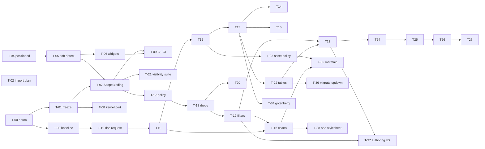

# Implementation plan — standalone `redmine_reporter_dashboards`

- **Idea:** 004-redmine-reporter-modern · **Decision:** **ADR-004**
- **Specs:** [`functional-spec.md`](./functional-spec.md) · [`technical-spec.md`](./technical-spec.md) · **Phasing:** [`07-phasing.md`](./07-phasing.md)
- **This is the handoff point.** Writing the code is a separate, explicit step outside this
  workflow. Everything below is a task breakdown, not an implementation.

## How to use this document

Tasks are `T-nn`, grouped by the phase they belong to, ordered so that **every task leaves the
plugin releasable**. Each carries: goal, components touched, dependencies, and **acceptance
criteria that can fail**. Task-level Definition of Done in §5 applies to all of them.

**Read `technical-spec.md` §0 first.** The coupling inventory found 18 sites, not 6, and two of
them — `up_acts_as_list` (C3) and the *second* tag including `ScopeResolution` (C16) — are
load-bearing for the first release and were missing from earlier lists.

**Before starting: five readiness items.** Not bureaucracy — each one is a thing that becomes
impossible or much more expensive later.

> **Who does these, restated 2026-08-04 because it was unclear and that was a drafting failure, not
> a reader's.** Nothing here is homework the curator must finish before work may begin. **DoR-1, 2
> and 3 *are* tasks T-02, T-01 and T-03** — the first three things Claude Code does. They appear as
> readiness items only because of their *ordering*: each one measures something that stops being
> measurable once later code lands, so they must be **first**, not **prior**. **DoR-4 is answered**
> (OQ-3/OQ-4 closed by curator decision 2026-08-04 — `technical-spec.md` §5.1/§5.2). **DoR-5 is now
> specified** in §5's capability vocabulary plus §5.1's three models, so it is a schema to write in
> T-12, not a decision to take. **Net: zero open human prerequisites.** The one thing still worth a
> human minute is the *tolerance* on the p95 comparison (a curator decision, labelled as such in
> `functional-spec.md`), and it is not needed until T-03 has produced a number to set it against.

| # | Item | Why it must precede code |
|---|---|---|
| DoR-1 | Run the four production queries (`SELECT type, count(*) FROM report_templates GROUP BY type`; active `report_schedules` count; a `content LIKE` sweep per drop accessor; a log grep for `/issue_mails` and `?token=`) | Three claims (A5, C-002, C-007) discriminate on this **one** measurement. The subset scope is provisional until it runs. Ships as T-02's `import:plan`, so it is repeatable rather than a one-off |
| DoR-2 | Freeze the goldens + the scope fixture (T-01) | The scope is unrecoverable once `scope_resolution.rb` is deleted |
| DoR-3 | Measure the performance baseline on v0.5.0 | Cannot be measured after the aggregator changes |
| ~~DoR-4~~ | ~~Answer OQ-3/OQ-4~~ — **ANSWERED 2026-08-04.** External container: yes, *as one option*, documented and safe → third CI-verified adapter, default unchanged (T-34). Assets: fetch external references, ship local ones with the request → three models + `asset_policy`, `:bundled` default, allowlist-only above (T-33) | it determined what the asset-resolution test expects; it now does |
| ~~DoR-5~~ | ~~Agree the engine `capabilities.yml` schema~~ — **SPECIFIED**: the closed capability vocabulary in `technical-spec.md` §5 plus the three asset models in §5.1. Written as a file in T-12, no longer a decision | the three-state conformance rule now has something to read |

## Status — what has landed

Kept here so a fresh session can read it rather than reconstruct it. `git log --oneline` is still
the authority; this is a summary, and CLAUDE.md §1 says to verify it.

**Read [`HANDOVER.md`](./HANDOVER.md) alongside this table.** It carries what this table cannot: the
traps that produce a green run meaning nothing, the code that looks like a violation and must be left
alone, and — most importantly — **which configurations have actually been executed**, including the
fact that CI has not yet run on this work at all.

| Task | State |
|---|---|
| T-00 | **VOID** — the fork is out of scope (curator, 2026-08-05). See below. |
| T-01 | **done** — reference date, canonicaliser, baseline commit, the 176-case value corpus, the per-adapter overlay, the 46-triple scope fixture and the `corpus` CI job. **It found defect D-1 on the way in** — see §Findings |
| T-02 | **done** — `rake reporter_dashboards:import:plan`, read-only (proven by a no-writes assertion, not by a comment), plus the template linter's first 13 rules. Three of R-15's four queries answered; the fourth is a log grep and is reported as unanswerable **with the command**. It found the G8 tension in §Findings F-3 |
| T-03 | **partly done** — the aggregation baseline is measured and committed (9 workloads × 3 issue counts, 20 warm runs, provenance-stamped) and R7's three *absolute* criteria are now hard assertions on every engine. **The HTML\|PDF half is blocked and recorded as blocked** — see §Findings P-2 |
| T-04 | **done** — `RedmineReporterDashboards::Positioned` replaces `up_acts_as_list` |
| T-05 | **done** — reporter optional; `ReporterPresence`, memoised at `after_plugins_loaded` |
| T-06 | **done** — widgets leave the picker, degrade in place, `report_pdf` 404s |
| T-07 | **done** — `Liquid::ScopeBinding` (two sources) + `Liquid::RenderContext` (an actor is required to construct one); `ScopeResolution` and the thread-local's owner demoted to `glue/legacy/`; new `no_thread_local` gate. **The scope fixture and all 176 corpus cases are byte-identical** |
| T-08 | **done** — both kernel files moved to `aggregation/`, plus the 4-line namespace assignment; `drill_through.rb` is byte-identical to its v0.5.0 blob and `query_aggregator.rb` is that blob **plus exactly ONE declared hunk**, which is D-1's fix. G7 gained the mechanism that can say so (`spec/golden/kernel_exception.rb`, `RATCHET = 1`); the per-adapter overlay is **empty again, `RATCHET = 0`**. **Verified on all three engines by CI run 31036305443 — 17/17 green**, `adapter (MariaDB 11)` included |
| T-09 | **done** — the secret, the probe job and the private checkout were removed earlier (which is what let 5.1 run at all and exposed D-2/D-3); this session added the two gates its `Accept:` list still named, `layer_purity.sh` (E3) and `compat_size.sh` (E4), and moved the one scattered version check into `Compat`. **One item is a human artefact and is NOT done: the dated fork-PR run per release** — see §Findings F-5 |
| T-21 | **done** — `test/unit/multi_actor_visibility_test.rb`: five actors (`all`/`default`/`own`, an outsider, anonymous) over a private project with a private issue, a role-restricted custom field and a private `IssueQuery`; exact totals AND strict inequality; the restricted field's NAME asserted absent from every entry point, not just its values; the two fail-closed `1=0` branches as DB-less unit tests; ordering in both directions plus A/B/A; the monotonicity property with both its limits written into the file. **Mutation-tested**: dropping `Issue.visible` from the scope fails 4 of its 13 tests |
| T-10 | **done** — `render/{capabilities,page_furniture,failure,result,document_request,registry,renderer}.rb`: a frozen `DocumentRequest` with **no field a credential could travel in** (asserted against the constructor's signature, so a future `headers:` has to be argued), `print_backgrounds` defaulting to `true` rather than to Chromium's `false`, `PageFurniture` as slots plus a closed token set, `Result = Success \| Failure` with closed code sets, and `Renderer` enforcing the `%PDF-`/`%%EOF` and minimum-size post-conditions **above every adapter**. 29 DB-less examples; `layer_purity` flipped to **strict** in the same PR, as its own comment asked |
| T-11 | **partly done** — `render/readiness.rb` and `assets/javascripts/chart_shell.js`: one DOM contract (`window.__rd` with `pending/ready/begin/end/fail`, plus `data-rd-ready` and `window.status`, all set at the same instant), an in-page watchdog firing BEFORE the engine timeout, `Degradation(:readiness_timeout, pending: n)` unless `strict`, and `begin`/`end` owned by the shell. The JS is **executed in node**, not mocked. **The three-fixture timing falsifier is NOT done — it needs an engine and is F-7** |
| T-12 onward | not started |

**Phase 1's promise is met and measured**: the plugin installs and runs with neither
`redmine_reporter` nor the `redmineup` gem. Verified on Redmine 6.1-stable with and without
reporter, and on 7.0-stable standalone, against real PostgreSQL. Not yet verified anywhere: Redmine
5.1 and 6.0, and MySQL/MariaDB — CI covers those, a local run has not.

**This paragraph used to say the workflow still checked out the private reporter plugin with a
secret. It has not since T-09** — `no_secrets.sh` runs on every PR and fails on any `secrets.`
reference but `GITHUB_TOKEN`, and the full-app suite runs standalone on all four Redmine branches.
The plan contradicted itself on this: §Findings D-2 already described T-09 in the past tense. Both
now agree, and the correction is recorded rather than quietly applied, because a status line that
was wrong for a whole phase is the kind of thing that gets believed twice.

**What is genuinely still owed for INV-7** is smaller and is F-5: one dated fork-PR run per release.
A workflow cannot fork itself without reintroducing the very credential G1 removes, so that proof is
a human artefact, and the grep is what keeps it true between artefacts.

## Findings — what the work has turned up, and who owns the fix

**D-1 · `group_by: age` reported everything as `(none)` on MariaDB — FIXED 2026-08-05, in T-08.**
Found by T-01's corpus on MariaDB 10.11, confirmed by the first CI run on MariaDB 11, and **measured
absent on MySQL 8.0.46 and PostgreSQL 16**. The age dimension grouped on a generated `CASE`;
ActiveRecord reads the group key back out of the row **by the expression's own text**, and MariaDB
truncates a returned column label at 256 characters (measured: 261 works, 262 does not). Past it
every key came back `NULL`, the chart collapsed into the empty bucket, and the total was taken from
whichever group the server returned last — so an issue could vanish from the count as well. **Four
boundaries cross the limit and `DEFAULT_AGE_BUCKETS` is four**, so this was the DEFAULT behaviour on
MariaDB, in production. Every existing adapter example used three boundaries or fewer, which is the
only reason CI had been green.

*First written up as affecting "the whole MySQL family" — an inference from one engine, and the
first CI run refuted it.* MySQL 8.0 answers correctly, so the overlay has a **`mariadb` family of
its own**, separate from `mysql`; the adapter name cannot tell them apart (mysql2 reports "Mysql2"
for both), so the family is asked of the server version. That distinction outlives the defect and is
kept.

**The mechanism, measured 2026-08-05 — and it corrected this entry's own original prescription**
("alias the group expression or group on a short one"). Two facts, both probed against the running
stack rather than read off the source:

1. **The alias is already truncated on the engine that WORKS.** ActiveRecord derives the result-column
   name from the group expression's text (`calculations.rb#execute_grouped_calculation` →
   `ColumnAliasTracker#column_alias_for` → `table_alias_for`, which slices at `table_alias_length`).
   On PostgreSQL that limit is **63**, so the age CASE's alias is cut at 63 for three, four and five
   boundaries alike — measured expression lengths 242 / 305 / 368, aliases 218 / 274 / 330 — and
   PostgreSQL answers correctly at every one of them, because AR asks for the same truncated name it
   sent. The mysql2 adapter hardcodes **256** (`mysql/schema_statements.rb:130`), so AR emits a
   256-character alias there and MariaDB hands back a shorter one; MySQL 8 does not. So "the alias is
   too long" was never the defect — *the two ends disagreeing about the truncation* is — and
   shortening the expression only moves the cliff. `MAX_AGE_BUCKETS` is 24, and 24 branches cannot fit
   in 256 characters at ~60 characters a branch.
2. **A select alias cannot be introduced without leaving AR's grouped-calculation path.**
   `execute_grouped_calculation` does `select_values += self.select_values` **`unless
   having_clause.empty?`** — with no HAVING it *overwrites* the relation's select list. Measured:
   `.select("CASE … AS rrd_short").group("rrd_short").count(…)` raises
   `PG::UndefinedColumn: column "rrd_short" does not exist`, because the SELECT that defined the alias
   was discarded.

**So the fix does not change the SQL at all — it changes how the result is READ.**
`SELECT <group expression>, COUNT(DISTINCT issues.id) … GROUP BY <same expression>`, taken back
**by position** with `pluck`, carries no alias for the two ends to disagree about. Same statement,
same GROUP BY, same query count; one method, `measure_groups`, dispatches to `grouped_counts` for
the counting measures. It covers every dimension and crosstabs too, not just `age` — any long
group expression was exposed to the same truncation.

**The first attempt was different, was pushed, and was MEASURED WORSE — this is the finding that
matters most here.** It gave the age dimension `bucket_conditions` and dropped the GROUP BY
entirely, counting each bucket with its own `COUNT(DISTINCT CASE WHEN … THEN issues.id END)` —
the shape `completeness` uses. That is correct, and it is *the plan's own prescription above*.
It is also **dramatically slower on MariaDB, the engine the defect is on**: in the same CI job,
`completeness.seven` (seven conditional aggregates) costs **25-50 s per call** at 10 000 issues
where the grouped age read costs **0.02 s** — and the `adapter (MariaDB 11)` cell went from 5 m 39 s
to over 35 minutes without finishing. The plan checked query COUNT, which is unchanged either way,
and R7 sets no timing gate, so **nothing in the acceptance criteria could have caught this**. It was
found by reading the CI cell rather than by a red test. Recorded here because the same trap is
waiting for anyone who reaches for conditional aggregates to avoid a GROUP BY.

*Deliberately NOT covered, and documented in the README rather than left silent:* an age axis with
a **measure** (`sum`, `avg`, `distinct`) still goes through `.sum` / `.average` / `.count`, each of
which keys its result by the same alias, so it stays exposed on MariaDB past ~4 boundaries. A
**crosstab in count mode IS covered** — it groups on two expressions and is read positionally like
any other counted axis, which the first attempt did not manage. No corpus case and no surveyed
production template reaches a measured age axis (every real template is count mode, and the non-cap
age cases use three boundaries). Covering it means reimplementing three more grouped calculations —
a bigger change than the defect justifies today.

**Verification — and D-1 is now measured fixed on the engine it lives on.** All 176 recorded corpus
values are byte-identical on PostgreSQL with the fix in place (217 corpus examples, 0 failures), the
DB-less kernel suite is green (1 127 examples), and `spec/golden` run from the plugin checkout — where
gate G7 has its git history — is 166 examples, 0 failures, **0 pending**. MariaDB cannot be run in this
container, so **CI run 31036305443 is the measurement: 17 of 17 jobs green**, including
`adapter (MariaDB 11)` and `corpus (MariaDB 11)` with the overlay EMPTY and its exhaustiveness
assertion live.

**The wall clock is part of that measurement, and it is the half a green tick does not show.** The
MariaDB adapter specs ran in **4 m 16 s**, against **5 m 39 s** before the fix — no regression, a small
improvement. That is the number the first attempt failed: the same cell ran over 35 minutes without
finishing. Read it, not just the colour, on any change to how the kernel reads a grouped result.

**Two things a later session should not have to rediscover.** `measure.nil?` alone is the WRONG guard
and it fails SILENTLY — `resolve_measure(nil, nil)` returns `Measure.new(kind: :count)`, not nil, so a
dispatch written that way never fires while every number still agrees. The guard is `measure.nil? ||
measure.kind == :count`. And **no assertion about the numbers can see this fix at all**: on a stub, and
on PostgreSQL, the alias-keyed read answers correctly too. Only assertions about HOW the answer is
fetched can — "reads its groups positionally, never through a column alias", "still groups, in a single
query", and at the adapter level "selects the group expression with no alias, and still groups".
**Write those first.** Note also what did NOT have to change: the kernel still folds whatever keys the
database returned, so the defensive example *"keeps counts for a value outside the expected bucket list
rather than dropping them"* survives untouched. The first attempt had to delete it, which was a signal
about that attempt rather than about the assertion.

**It is also evidence on C-003** (`claims.json`, updated 2026-08-05): the defect was fixed *inside the
ported kernel* under a declared exception, not by the rewrite that claim's `evidence_against`
supposed would be needed. Status and confidence left for the curator.

**A note for T-03's artefact.** The performance baseline was measured against the pre-fix aggregator,
which is exactly why §1's ordering guard put D-1 after it. The R7 *invariants* are hard assertions and
they still pass, query counts included; the *timings* in the recorded artefact now describe an
aggregator one hunk older. No timing is a gate (finding P-3), so nothing is red — but the artefact is
not re-measured, and that is deliberate rather than overlooked.

**D-2 · the plugin could not run on Redmine 5.1 at all — FIXED 2026-08-05.**
`app/models/reporter_project_tab.rb:3` read `class ReporterProjectTab < ApplicationRecord`, and
Redmine 5.1 has no `ApplicationRecord`: that class arrived in 6.0. Every dashboard page and every
plugin test on 5.1 raised `NameError: uninitialized constant ApplicationRecord`. The line shipped in
v0.5.0; the README listed 5.1 as tested. Nothing caught it because the full-application suite could
not run in CI until T-09 removed the private-plugin secret — **its first 5.1 run reported 92 errors,
all this one line.** That is INV-7's failure mode exactly, and the sharpest possible argument for
T-09 having been worth doing.

Fixed here rather than deferred: `app/models` is not the frozen kernel and no ordering guard covers
it. `RedmineReporterDashboards::Compat.base_record` returns `ApplicationRecord` where it exists and
`ActiveRecord::Base` where it does not — the two are behaviourally equivalent for a plugin model,
verified against 5.1-stable's `config/initializers/10-patches.rb`, which monkey-patches the identical
`human_attribute_name` body onto `ActiveRecord::Base` that 6.x moved into `ApplicationRecord`. This
is the **first entry in `compat/`**, and it lives in `lib/redmine_reporter_dashboards/compat.rb`
rather than `compat/base_record.rb` because Redmine puts a plugin's `lib/` on the autoload paths and
Zeitwerk requires the path to match the constant.

**D-3 · `sprite_icon` does not exist on Redmine 5.1 either — FIXED 2026-08-05.** With D-2 fixed, the
same 5.1 job went from 92 errors to 27, all of them
`ActionView::Template::Error: undefined method 'sprite_icon'`. `IconsHelper` arrived in Redmine 6.0;
13 call sites in 9 files called it unguarded. The interesting part is that the *design* was already
right — every one of those links already carries Redmine 5's CSS icon classes
(`class: 'icon icon-settings'`) and `_report.html.erb` even documents "on Redmine 5 it renders no
`<svg>`, so the label gives the link a body". Only the belief underneath was wrong: on 5.1 the method
does not render nothing, it does not exist. So the fix is one helper —
`ReporterProjectPagesHelper#reporter_dashboard_icon`, branching on the `reporter_dashboard_svg_icons?`
predicate that was already there for the move controls — and no icon-name mapping at all, because the
class on each link already IS the 5.1 icon. Both branches are asserted by stubbing the predicate, so
the 5.1 path is testable on a machine that cannot run 5.1.

**The corpus had a gap, and T-02's data found it.** The production survey showed every template
writes `age_buckets: "30;60;90;180"` — the STRING form. `normalize_age_buckets` accepts a string or an
Array, and the corpus only ever asked for the Array, so the branch every real caller goes through was
unfrozen. Two cases added (`;` and `,` separated), plus an assertion that the string and Array
spellings answer identically. Three boundaries, not production's four: four was defect D-1's trigger
and belongs in `cap/age.*`, not in a parser case. That reasoning is spent now D-1 is fixed, but the
case stays where it is — a parser case should test the parser, and `cap/age.*` is where boundary
counts are exercised.

**E-1 · an environment fact worth not rediscovering: MySQL 8 ignores a `projects`-keyed subquery in a
LEFT JOIN's ON clause.** Measured on 8.0.46 while fixing the above: `projects.id IN (SELECT …)`
inside a `LEFT OUTER JOIN … ON` is evaluated as TRUE — an entitlement check written that way passes
for everyone. `issues.project_id IN (SELECT …)` and a literal `projects.id IN (1,2,3)` are both
correct, and PostgreSQL and MariaDB get all three right. **No production path is affected**, and that
is checked rather than assumed: `TimeEntry.visible_condition` reaches `projects` but emits literal id
lists (`Project.allowed_to_condition`), and `IssueCustomField#visibility_by_project_condition` does
emit a subquery but keys it on `issues.project_id` (`custom_field.rb:262`). The adapter harness had
invented the one shape Redmine never produces, so MySQL made the *harness* lie about visibility —
caught by the first CI run, and now the stub emits what Redmine emits.

**P-1 · the query-count control was a guess, and the measurement said so.** T-03's first draft
asserted one global ceiling — "no workload issues more than 12 queries" — and `version_rollup` issues
**18**. The interesting part is which of the two possible explanations it was. It issues 18 at 100
issues and 18 at 10 000: eleven grouped aggregates, the closed-status lookup, the cost-field
resolution and one grouped sum per cost field, none of which scale with rows *or* with the number of
versions. So the finding was the ceiling, not an N+1 — and a guessed ceiling cannot tell you that,
which is the whole argument for T-03 existing. The control is now
`PerformanceCases::QUERY_BUDGET`: one **measured** figure per workload, asserted as a ratchet
(`<=`), so a kernel that gets tighter passes and a kernel that adds a query fails with the workload
named. Every figure is also carried per cell in the artefact, so a later reader can see what was
true when.

*The same measurement caught a second thing, and this one was mine.* `completeness.seven` asked for
`assigned_to` and `done_ratio`. Neither is a completeness field — `assignee` is the alias and
`done_ratio` is not offered — so the kernel warned, dropped both, and the cell measured a **five**
field panel under a seven-field name. Every entry point logs-and-degrades on an unusable argument,
which is right for a template author and silent for a benchmark. `EXPECTED_RESULT_SIZE` now pins
what each workload must give back, asserted on every engine: a workload that quietly answers a
smaller question gets faster and reads as an improvement.

**P-2 · T-03's HTML|PDF half cannot be measured here, and the artefact says so rather than omitting
it.** The Accept list's axis is (reference template × issue count × **HTML|PDF**). The aggregation
axis is measured — 9 workloads × 3 issue counts, 20 warm runs after 3 discarded, provenance-stamped.
The render axis is not, for two reasons that are facts about the tree rather than decisions: **the only
Liquid renderer today is `redmine_reporter`'s**, a separate private plugin (T-10…T-15 build the
owned one), and **there is no PDF engine reachable from this session** — the curator has said a
running Gotenberg is not something they can provide. So all 12 render cells are written into
`spec/golden/performance/baseline.json` as `blocked`, each naming **T-10** as the task that owes it,
and a DB-less spec asserts they are all still declared blocked. An unmeasured cell written down as
unmeasured is a pause point; an unmeasured cell that is simply absent is a baseline quietly claiming
coverage it does not have — INV-7's rule applied to performance instead of to versions.

**P-2's premise is now HALF FALSE, measured 2026-08-05 — and it changes what T-11…T-13 can attempt.**
P-2 gives two reasons the render axis is unmeasurable here. The first still holds: the only Liquid
renderer today is `redmine_reporter`'s. **The second does not.** "There is no PDF engine reachable
from this session" is true of Gotenberg, which the curator said they cannot provide — but
**Chromium 141.0.7390.37 is installed in this container** (`/opt/pw-browsers/chromium`, with
Playwright configured to find it), and `:chromium_cdp` is the plan's own *reference, CI-verified,
default* adapter. So the engine half of T-13 is attemptable locally, and the 12 `blocked` render
cells are blocked on the RENDERER, not on the absence of an engine.

Two things follow, and neither is a licence to declare the axis measured. **A local Chromium is not
a CI-verified engine** — INV-7 forbids claiming an untested configuration, and CI runners would need
their own install step, which is T-12's `render-smoke` job rather than a footnote here. And a
measurement taken against a browser this container happens to ship is not a measurement of the
engine a deployment will use. What it does mean: T-11's readiness protocol and T-13's Chromium
adapter can be **developed and exercised** rather than written blind, which is a different position
from the one P-2 describes.

**P-3 · the timings are noisier than any tolerance anyone would set, measured.** Two consecutive runs
of the identical matrix on the identical machine, minutes apart, moved p95 by up to **×1.26** — and
`version_rollup.costs@100000` came back **invalid** (dispersion 0.417) in the first and valid (0.090)
in the second. The committed artefact therefore has zero invalid cells and that is an accident of when
it was measured, not a property of the kernel. This is the concrete argument for the `[GAP]` in
`functional-spec.md` §R7 being real: a relative p95 gate with any tolerance under ~30% would be red on
a quiet machine's bad minute. So the drift report is labelled **ADVISORY — non-deterministic — not a
correctness guarantee** (`CLAUDE.md` §7), and what carries the weight is the three *absolute* criteria,
which are exact integers and cannot be noisy. **DECIDED by the curator, 2026-08-05: no timing ever fails the build.** The drift report stays
informational. What carries the weight is the three *absolute* criteria, which are exact integers,
cannot be noisy, and already fail on a real regression. A tolerance would need a dedicated runner to
mean anything; the artefact records the CPU model, core count and image digest so that remains
possible if performance ever becomes a real problem, but it is not being set now. **Do not add a
timing assertion without re-opening this.**

*One deliberate widening, labelled as such:* the two reference templates between them reach exactly
two of the kernel's six entry points (`.breakdown` and `.version_rollup`). T-07 and T-08 re-seam all
six, and a baseline over two of them would go stale the moment the re-seam touched the other four —
with no way back to it, which is the reason this task precedes them. So a third pseudo-template,
`production-shapes`, carries seven more workloads drawn from **T-02's survey of the 26 real
templates**, each naming the survey line it comes from. It measures more than the Accept list's axis,
never less.

**D-1's fix as built — the entry above is the current record; this is what the attempt cost.**
The design was written, run, and backed out once on 2026-08-05 before landing. Three measurements came
out of that and all three are folded into the entry above: the fix is behaviour-preserving on
PostgreSQL (all 217 corpus examples passed with it in place), `measure.nil?` is the wrong guard and
fails silently, and the remaining work was 11 named unit examples of which one was a decision about
defensive behaviour rather than a mechanical edit. It was reverted rather than pushed with 11 red
examples because they sit in the *frozen kernel's* unit suite, and rewriting 11 assertions in a
2 800-line file at the end of a session is how a suite starts lying — see §1b: local red is fixed or
reverted, only an engine that cannot be run here is left to CI.

**F-7 · T-11's falsifier cannot be run until an engine exists, and that is the honest half of
"partly done".** T-11's `Accept:` ends with a deliberately hard test: three fixtures — 0 charts,
3 charts that finish, 1 chart that never calls `end()` — with expected durations <1 s / <3 s /
≈timeout, "a fixture signalling at ~6 s must produce a document containing the post-readiness
marker, and the harness's own monotonic measurement must be ≥5.9 s and ≤12 s", run 3/3 attempts.
That is a statement about WALL CLOCK THROUGH A REAL ENGINE. It exists to falsify exactly the
implementation this task replaces — "an implementation using today's fixed 3-second delay fails
this by construction; one that just waits out the timeout fails the upper bound."

What landed is the protocol and its logic, with the JS **executed in node** rather than described:
the chart-free case, the pending/ready arithmetic, all three signals set together, a failed chart
still counting as finished, and a late chart reopening readiness. What did not land is the timing,
because there is no engine to time it through — `Render::Registry` has no adapter registered, and
building one is T-13.

**Do not mark T-11 done without it.** The three durations are the whole point: every one of the
logic assertions above passes on an implementation that sleeps for three seconds and ignores the
contract entirely. Chromium 141 is in this container (see P-2's correction), so the fixture is
runnable the moment T-13's adapter exists — it is blocked on the adapter, not on the engine.

**One thing the protocol work already found**, which the falsifier's first fixture would have
caught later and more expensively: the shell as first written never signalled ready for a
CHART-FREE document. Nothing called `end()`, so `pending` never reached zero from above it, and a
page with nothing to draw would have been the slowest to render — waiting out the watchdog. Fixed
by `settle()` on `DOMContentLoaded`, and asserted.

**F-6 · FR-23 and FR-24 are owned by no task, and T-21's `Accept:` list depends on one of them.**
Found 2026-08-05 while building T-21. `functional-spec.md` FR-23 says "Every aggregation result
carries a `degraded` flag with reasons; a refusal is distinguishable from a true zero", and FR-24
says a cap that truncates or refuses must set the same flag. The spec itself marks this as **new** —
"today's contract is" the older one — and **no task in this plan mentions FR-23 or FR-24 at all**
(`grep -n 'FR-23\|FR-24' implementation-plan.md` returns nothing). So an aggregation result has no
`degraded` field today and nothing is scheduled to give it one.

T-21's `Accept:` line asks for "a zero-with-`degraded: false` case (a correctly-applied filter
yielding zero is *not* a refusal)". The DISTINCTION is testable today and is tested: a refusal
answers `nil`, a filter that legitimately matches nothing answers a result whose numbers are zero.
The FLAG is not, because it does not exist. Both halves are written into the test with a pointer
here, so the day FR-23 lands the test says what it should become rather than quietly passing on a
weaker contract.

For the curator: FR-23 wants an owning task. It is not a small one — "every result" spans all six
aggregator entry points plus the render path's `Failure`, and the aggregator today signals refusal
by returning `nil` from six different methods, which is exactly the shape FR-23 exists to replace.

**F-4 · `CLAUDE.md` and `technical-spec.md` disagree about the `compat/` budget, and the number is
a curator decision.** CLAUDE.md §4 says "There is a committed LOC budget on that directory and a gate
that enforces it." There is not, and there never was: **no number is committed anywhere in
`docs/plan/`**, and technical-spec E4 — the specification, which is the contract — says the job
**prints** the LOC, not that it caps it. T-09's `Accept:` line agrees with the spec.

So `compat_size.sh` implements the spec: it PRINTS the number on every PR, and it hard-fails on the
half E4 does specify as a rule — `Rails::VERSION` / `Redmine::VERSION` may appear only under compat.
It reads `COMPAT_LOC_BUDGET` and becomes a ratchet the moment one is set, so adopting a cap is a
one-line change once someone has argued for the number.

**Why the number was not invented here.** Picking it IS the decision: too high and it is decoration,
too low and the next legitimate divergence is refused by a threshold nobody argued for. Today compat
is **10 code lines** in one file (`base_record`, `svg_icons?`). Two divergences the plan already
anticipates — `compat/serialize.rb` and `compat/enum.rb` — are not written yet. A recommendation, for
whatever it is worth: set it after those land, not before, and set it at what they actually cost plus
one method's headroom. Either way, CLAUDE.md §4's sentence should be corrected to match whichever
answer is taken, because it currently describes a gate that did not exist.

**F-5 · INV-7's last unproved claim is a human artefact: the dated fork-PR run.** T-09's `Accept:`
list ends with "**G1**, plus one dated fork-PR run recorded per release — *a workflow cannot fork
itself without reintroducing the very credential G1 removes, so that end-to-end proof is a human
artefact and the grep is what keeps it true between artefacts.*" Everything mechanical is in place:
`no_secrets.sh` fails on any `secrets.` but `GITHUB_TOKEN` and runs on every PR, and the full-app
suite runs standalone on 5.1 / 6.0 / 6.1 / 7.0. What no job can do is prove that an **outside
contributor's** fork PR gets the same run, because arranging one requires a second account.

It is recorded as owed rather than quietly counted as done. Concretely: before tagging 0.6.0, open a
pull request from a fork of this repository, let CI run, and record the date and the run id here. If
it goes red for want of a credential, that is G1 failing and the release does not ship.

**F-3 · gate G8's "empty allowlist at 1.0" target cannot survive shipping an importer, and that
is a curator question.** `script/gates/zero_reporter.allowlist` opens with "At 1.0 it should be
empty: the goal is a plugin that names neither upstream anywhere in `app/`, `lib/`, `db/`, `config/`
or `init.rb`." T-02 adds four files that name `redmine_reporter` **because reading reporter's data is
what they are for** — and that is the opposite of coupling: the survey reads *tables*, never
reporter's classes, and `spec/adapter/import_survey_spec.rb` runs it against bare tables with no
reporter code loaded at all. So the gate is matching a string here, not a dependency.

Removing the mentions would make the tool worse rather than purer: `rake -T` has to say whose data
`import:plan` surveys, the report has to name the tables it looked for, and the usage groups have to
say that six of the accessors come from *paid* RedmineUP plugins — which is precisely the fact an
operator needs in order to decide what can be dropped. So the four files are on the allowlist, in
their own section, with that reason.

**DECIDED by the curator, 2026-08-05: the importer ships permanently, and G8's 1.0 target becomes
"empty except the importer."** The reasoning was that a migration path is worth having for anyone who
installs this plugin next to the base one, not only for the curator's own one-time migration. So the
four importer files stay on the allowlist for good and the allowlist header now says so; every other
entry must still reach zero. The gate itself is unchanged.

**F-2's decision is taken, 2026-08-05: close it by construction in the owned path, and leave the
legacy module alone.** T-07 owns this decision and the argument is in `HANDOVER.md` §6, with the
design. In short: the owned path has no registers source at all — both of `ScopeBinding`'s two
sources start from `Issue.visible` — so the leak is closed by design rather than by a patch, and the
legacy module keeps its behaviour, which means **the frozen scope-fixture triple does not move.**
That last point is the reason to prefer this over patching the legacy path: the scope fixture is the
one artefact in this repository that cannot be regenerated.

**F-2 · the registers relation path is not visibility-scoped.** `resolve_scope` returns
`registers[:container]` as-is when it is an AR relation, intersecting only the DROP path with
`Issue.visible`. The documented grounds are that every registers path is `IssueQuery#base_scope` and
therefore already visible — true of what reporter passes today, not true of the type. Not reachable
from a template (only the host plugin writes registers), so it is a finding rather than an
emergency, and the scope fixture **freezes the leak explicitly** (a triple in which every actor
resolves an issue from a project they are not a member of). **T-07 owns the decision**; when
`ScopeBinding` closes it, that triple changes and the change has to be argued for rather than
noticed later.

## 1. Work breakdown

### Phase 0 — unblock and freeze

**~~T-00~~ · VOID — the fork is out of scope** *(closed 2026-08-05 by curator decision)*

The task was "fix `enum orientation: [...]` in `redmine_reporter/app/models/report_template.rb:26`".
The curator has ruled that **`redmine_reporter` is not to be modified**: the goal is to merge and
improve its capabilities *into this plugin*, not to maintain the fork. T-00 therefore has no
deliverable and **must not be attempted**.

What replaced it, and why nothing is lost:

- **Redmine 7 was unblocked from the other end.** Since T-05 made reporter optional, the enum
  defect stops the two report widgets instead of the whole plugin. Redmine 7.0-stable was then run
  standalone and is green — 900 specs, 86 adapter specs, 114 full-application tests, 0 failures.
  The blocker was never in this plugin.
- **The `skip_unless_reporter_report_templates_load` helper stays.** T-00 would have deleted it;
  it is now load-bearing for a supported configuration, so it remains, with its message corrected
  to distinguish "reporter absent" (normal) from "reporter installed but broken" (a defect).
- **The tooling half of T-00 is done** and was mostly a false premise — see `CLAUDE.md` §4.
  `.codex/ruby_version.sh` fixes the real gap; `redmine_clone.sh` and `test_setup.sh` were also
  fixed so the standalone configuration can be set up and switched to at all.
- **The enum divergence is still owed to `compat/enum.rb`** for this plugin's own models, if any
  ever need an enum. Measured: `enum :name, {...}` raises `ArgumentError` on Rails 6.1, and
  `enum name: [...]` raises on Rails 8.1, so neither form spans 5.1→7.0 alone. Stored integers are
  identical either way.

*If reporter is ever fixed upstream*, the four skipping tests begin asserting on their own; nothing
here needs changing to allow that.

**T-01 · Freeze the oracle** *(the only time-sensitive task)*
*Goal:* capture what "the same numbers" means, before anything moves.
*Touches:* new `spec/golden/**` (`reference_date.rb`, `corpus_canonicaliser.rb`, `baseline.rb` and
the `aggregation/` fixtures) and a generator extending `spec/adapter/adapter_helper.rb` —
**extend, do not write a parallel harness**. **Corrected 2026-08-05:** the value corpus can be
generated from that harness, but **the scope fixture cannot** — `ScopeResolution#resolve_scope`
reaches `Issue.visible`, `IssueQuery.visible` and a thread-local, none of which exist in a harness
whose whole point is not booting Redmine. The scope fixture therefore also touches `test/` (the
full-app suite), where real roles and a real `IssueQuery` exist. Budget it as two pieces, not one.
*Deps:* none. **Corrected 2026-08-05:** was `T-00 (the generator must be able to boot)`. T-00 is
void, and the premise was wrong anyway — the generator boots on any Redmine whose Rails accepts
reporter's enum, and standalone it does not need reporter at all.
*Accept:*
- Generated against the **`v0.5.0` tag**, not a working tree.
- **A pinned reference date** is required and the verifier **refuses to run without it**. The
  existing fixture is `Time.zone.today`-relative (a 400-day sweep), so an unpinned corpus changes
  daily, goes red for the wrong reason, and gets switched off within a week.
- Canonicalisation per `technical-spec.md` §2: keys sorted recursively, **array order preserved**,
  floats as `(v*10_000).round` **plus** a `%.4f` string (4 dp is the declared contract — PostgreSQL
  `numeric` and MySQL `DECIMAL(20,4)` disagree beyond it), per-adapter overlay **with a written
  reason** instead of a tolerance.
- Covers: `.aggregate`, `.breakdown` (legacy), `.dimension_breakdown`, `.completeness`, `.flags`,
  `.version_rollup`; cap boundaries at 200 / 24 / 12 / 5 000; **and ≥3 actors with different roles
  including one role-restricted custom field** — absent from the fixture today, and the thing that
  makes INV-1/INV-2 testable at value level.
- **A scope fixture:** ~40 `(template, query, actor)` triples recording `to_sql` **and** the sorted
  issue-id set. *This is the genuinely irrecoverable artefact* — the numbers are regenerable from
  the tag; the scope is not, once `scope_resolution.rb` is gone.
- SQL strings in a **sibling** tree, not the value corpus (SQL is expected to change at the
  re-seam; the numbers are not, and a differential that fails for the wrong reason gets disabled).
- **Bit-reproducible across two independent runs** on all three engines. A corpus that is not
  reproducible is not an oracle.
- New CI job `corpus`, green, and **it stays green through every later task**.

*Done (2026-08-05).* What landed, and where to read it: `spec/golden/README.md` is the page for
anyone touching these artefacts.

- **Reference date** — `spec/golden/reference_date.rb`, default `2025-12-29`; the verifier refuses
  to run unpinned. Pinning the fixture is not enough on its own: the **clock must be frozen to the
  same date** or every period window comes back empty. The aggregator's only clock read is
  Ruby-side, so freezing Ruby is sufficient.
- **Canonicaliser** — `spec/golden/corpus_canonicaliser.rb`, per §2 Step 0.
- **Baseline** — `spec/golden/baseline.rb`: commit `eddb8fa`, not a tag, because this repository has
  none. See that file for the one way the reference can still be lost (a squash merge).
- **The value corpus** — `spec/golden/corpus_cases.rb` declares **176 cases** over the six entry
  points; `spec/golden/aggregation/values.jsonl` holds the answers with a manifest carrying the
  baseline commit, the pin, the zone and two digests (the file's, and the CASE LIST's, so a matrix
  that has moved on from its answers fails rather than passes). Caps covered **at** the boundary and
  **one past** it: 200 dimension keys, 24 age buckets, 24 periods, 12 completeness fields, 5 000
  crosstab cells. **Four actors, three roles, one role-restricted custom field** — the value-level
  INV-1/INV-2 evidence: the same call is refused for two actors, answers with values for a third,
  and hides the values while keeping the issues for the fourth.
- **The per-adapter overlay** — `spec/golden/adapter_overlay.rb`, file-backed, ratcheted, and
  **exhaustive by assertion**: the cases that differ on an engine must be exactly the cases it
  names. It held two entries, both defect D-1 below; **both are gone and `RATCHET` is 0** now that
  D-1 is fixed, which is the mechanism working as specified rather than the entries being wrong.
- **The scope fixture** — `test/unit/golden_scope_fixture_test.rb` + `spec/golden/scope/scope.jsonl`,
  **46 (template, query, actor) triples** over all eleven documented resolution paths, four actors
  with three `issues_visibility` rules, private issues, an archived project and a project with no
  membership. `resolve_query`'s answer is recorded beside `resolve_scope`'s: the drill-through half
  is lost with the same file. SQL in the sibling tree `spec/golden/sql/`.
- **The `corpus` CI job** — all three engines, twice each, with the pinned date, and it runs the
  baseline checks **from the plugin checkout** (the mirror has no `.git`, so there they would skip
  and report green). It also fails if a run modified the corpus it was verifying.

*Two deviations from the wording above, both deliberate and both to serve it:* the scope fixture
records the issue set **by a stable per-issue key as well as by id**, because a fixture created
inside a rolled-back transaction has no stable ids and Redmine's own fixture sets differ between
5.1 and 7.0 — recording keys is what lets the fixture be verified on all four branches instead of
one pinned branch (ids are recorded too; the test assigns them explicitly from a reserved range).
And the 5 000-cell boundary is built from a `period` split rather than an `age` split, because a
24-boundary age CASE was exactly the shape defect D-1 broke, and a cell-count boundary built on a
broken dimension would have measured the defect instead of the cap. It stays a `period` split now
that D-1 is fixed: a crosstab still groups on the age CASE, so an age split is still the wrong
substrate for that boundary — for a smaller reason than before, but the same one.

*One constraint on that job, found the hard way:* `redmine_clone.sh` rsyncs the plugin into
`redmine/plugins/<name>/` with `--exclude .git/`, so the copy the suite normally runs from has no
history. `spec/golden/baseline_spec.rb` therefore **skips** there — correctly, but a skipped guard
reads exactly like a passing one. The `corpus` job must run the baseline checks **from the plugin
checkout**, not from inside the Redmine clone, or G7 has no reference check and stays green forever.

**T-02 · `import:plan` — the read-only survey**
*Goal:* make DoR-1 repeatable, and give the operator the blast radius before anything lands.
*Touches:* new rake task; the template linter's first rules.
*Deps:* none (can run in parallel with T-01).
*Accept:* writes nothing; reports counts by template type, active schedules and recipients, and
per-template lint findings (Chart.js 2 idioms, `window.status`, `geoChartBegin`,
`GEO_CHARTJS_SRC`, `setLineDash`, `[page]`, un-`json`-ed `{{ }}` inside `<script>`, gem-only drop
accessors, `new Chart(` occurrences and their `type:` values); exits 0 with a summary table.

**T-03 · Measure the performance baseline**
*Goal:* convert R7 from unfalsifiable to relative.
*Deps:* none *(corrected 2026-08-05: was T-00, which is void)*. *Must precede T-10.*
*Accept:* p50/p95/max/stddev over ≥20 warm runs (3 discarded) per (reference template × issue
count 1 000/10 000/100 000 × HTML|PDF), with a **recorded seed**, the runner image digest and the
CPU model captured; committed as a provenance-stamped artefact; a cell with `stddev/p50 > 0.35`
reported **invalid**, not averaged away.

### Phase 1 — standalone *(ships 0.6.0; delivers G1)*

**T-04 · Own the list behaviour — replace `up_acts_as_list`**
*Goal:* remove the plugin's own core-model dependency on the vendor gem.
*Touches:* new `glue/positioned.rb`; `app/models/reporter_project_tab.rb:7`.
*Deps:* none. **This is the first code task and it must not be reordered.**
*Accept:* `position` defaults to `max+1` scoped to `project_id`; `move_higher`/`move_lower`/`<=>`;
`before_destroy` reflow; the model has **zero** vendor-gem references; existing tab-ordering tests
pass unchanged. **Rationale: without this the plugin boots and then 500s on
`ReporterProjectTab` — verified, `up_acts_as_list` is defined only in the gem.**

**T-05 · Soft dependency detection**
*Touches:* `init.rb:12-16`, `:33`; a memoised `ReporterDashboards.reporter_present?`.
*Deps:* T-04.
*Accept:* the `raise` becomes a soft detect; `requires_redmine_plugin` deleted; the flag is
computed **once** at `after_plugins_loaded`; a boot spec passes with
`Redmine::Plugin.installed?` stubbed false. **Do not use `rescue NameError` for detection** —
`redmine_reporter_dashboards.rb:135` already swallows `NameError` silently, which is exactly why
C3 went unnoticed for a release line.

**T-06 · Report widgets leave the picker; already-placed widgets degrade**
*Touches:* move the two report partials to `blocks/optional/`; `project_page.rb:55-62`;
`show.html.erb`; `reporter_project_pages_controller.rb:85-91`.
*Deps:* T-05.
*Accept:* with reporter absent the two widgets are **absent from the picker**; a dashboard that
**already has one placed** returns 200 with an inline "widget unavailable" cell carrying
`degraded: true` and one log line — **not a 500**; `report_pdf` returns **404** (not 500) when
reporter is absent, both branches asserted. *A 500 in a monitored install is an alert about a
broken thing; a 404 is a correct statement about an uninstalled capability.*

**T-07 · `ScopeBinding` replaces `ScopeResolution`; re-seam **both** tags**
*Goal:* the render context carries the `IssueQuery` explicitly.
*Touches:* new `liquid/scope_binding.rb` (~60 lines) + `liquid/render_context.rb`;
`liquid_aggregate_tag.rb:106` **and `liquid_version_rollup_tag.rb:38`** — **there are two, not
one**; `scope_resolution.rb` demoted to `glue/legacy/`.
*Deps:* T-05. **T-01 is complete** — the scope fixture in `test/unit/golden_scope_fixture_test.rb`
is the oracle this task is measured against, and finding **F-2** (§Findings) is the decision it has
to take deliberately rather than by accident.
*Accept:* two resolution sources only (`IssueQuery.visible(actor).find_by(id:)` → `base_scope`;
`RenderContext#scope`); the `drop.instance_variables` walk, the `:container`/`:controller` ivar
archaeology, the `Issue.where(id: ids)` reconstruction, the thread-local **and the fail-open
`enforce_visibility` rescue** are all gone from the owned path; a gate asserts `Thread.current` is
absent from `lib/`/`app/` outside `glue/legacy/`; **`corpus` still green** — *this is the single
most important assertion in the whole plan*; drill-through still works for installs that still
have reporter (via `glue/legacy/`).

**T-08 · Port the aggregation kernel, byte-identically**
*Touches:* `aggregation/query_aggregator.rb`, `aggregation/drill_through.rb`, plus a 4-line
namespace assignment.
*Deps:* T-01 (complete). **This task owns the fix for defect D-1** (§Findings) — the only place the
kernel may legitimately change a byte. Fixing it deletes the overlay's two entries and lowers its
ratchet in the same commit. **Both halves are done.**
*Accept:* both files are **byte-identical** to their `v0.5.0` blobs — `git diff --no-index` output
**empty**, not "ignoring whitespace"; they still open `module SqlAggregation`; namespacing is a
separate assignment file; the `corpus` job enforces this on every PR. *As built, "byte-identical"
reads "byte-identical to the blob with every DECLARED hunk applied" — three of them, all D-1's,
each with a written reason and a ratchet (`spec/golden/kernel_exception.rb`). `drill_through.rb`
carries none and is held to the plain form. That is the exception this `Deps:` line grants, made
mechanical: a fourth hunk fails the gate as loudly as an undeclared byte does.* *Re-indentation is a separate
mechanical commit, only after `corpus` has been green a full release cycle, and reverted rather
than fixed if it goes red.*

**T-09 · The G1 CI change**
*Touches:* `.github/workflows/ci.yml`; `test/test_helper.rb:45-54`; `script/gates/*`.
*Deps:* T-06, T-07.
*Accept:* the `reporter-secret` probe job, the `needs:`/`if:` gate and the private checkout step are
**deleted**; a new `minitest-standalone` job runs the full-app suite on 4 Redmine branches **with
no secret**; a `lint` check fails on any `secrets.` reference other than `GITHUB_TOKEN`;
`zero_reporter.sh` runs in **warn** mode with a committed allowlist that may only shrink;
`layer_purity.sh` green; the `compat/` LOC is printed on every PR. **G1**, plus one dated fork-PR
run recorded per release — *a workflow cannot fork itself without reintroducing the very credential
G1 removes, so that end-to-end proof is a human artefact and the grep is what keeps it true
between artefacts.*

*As built.* The secret, probe job and private checkout went in the earlier CI rewrite — which is what
let 5.1 run at all, and immediately exposed D-2 and D-3. `no_secrets.sh`, `zero_reporter.sh` (warn,
shrinking allowlist) and the standalone `minitest` matrix on all four branches followed. **The two
gates this line names by filename were still missing and landed 2026-08-05:** `layer_purity.sh` (E3)
and `compat_size.sh` (E4). `layer_purity` runs in **warn** mode and reports `render/` as ABSENT on its
own line, because T-10 creates that directory — **T-10 should switch it to
`LAYER_PURITY_MODE=strict` in the same PR**, at which point an absent layer means the layout moved.
`compat_size` hard-fails on a version constant outside compat, and PRINTS the LOC rather than capping
it, which is what E4 specifies; the disagreement with CLAUDE.md §4 about a "committed budget" is
**F-4** and the number is the curator's. Building it found one real violation — a bare
`Redmine::VERSION::MAJOR >= 6` in `ReporterProjectPagesHelper`, from D-3's fix — now
`Compat.svg_icons?`, with the helper predicate kept as the name both icon branches are stubbed
through. **The fork-PR artefact is NOT done and is F-5.**

### Phase 3 — own the render path *(ships 0.7.0; runs in parallel with Phase 2)*

**T-10 · The document-request interface**
*Touches:* `render/{document_request,page_furniture,result,failure,capabilities,registry,renderer}.rb`.
*Deps:* T-03 (baseline first). Independent of Phase 2.
*Accept:* `DocumentRequest` carries page geometry, orientation, margins, `PageFurniture`, media,
**`print_backgrounds` defaulting to `true`** (not to the engine's default — Chromium's is `false`
and a naive swap silently loses every badge colour), page breaks, readiness, timeout, metadata,
correlation id; **it has no field a credential could travel in** — no `cookies:`, `headers:`,
`auth:`, so cookie-passing is *unrepresentable*, not merely discouraged; `PageFurniture` slots take
literal text plus a **closed token set**; `Result` is a `Success | Failure` sum type with a closed
failure-code set; `Renderer` enforces the `%PDF-`/`%%EOF` and minimum-size post-conditions **above
every adapter**, so no adapter can violate INV-5 by accident; `layer_purity.sh` proves `render/**`
contains no `Rails.`, `ActiveRecord`, `Liquid`, `Issue`, `Net::HTTP`, `cookie` or `session`.

**T-11 · Readiness protocol + chart shell**
*Touches:* `render/readiness.rb`; `assets/javascripts/chart_shell.js`.
*Deps:* T-10.
*Accept:* one DOM contract (`window.__rd` with `pending/ready/begin/end/fail`, plus
`data-rd-ready` and `window.status`) emitted by the plugin's own shell, mapped per engine; an
in-page watchdog; on timeout the engine **still renders** and returns `Success` with
`Degradation(:readiness_timeout, pending: n)` unless `strict` — *a chart-less-but-correct document
beats no document*; **`begin`/`end` are never the template author's job.**
**The falsifier:** three fixtures — 0 charts, 3 charts that finish, 1 chart that never calls
`end()` — with expected durations <1 s / <3 s / ≈timeout. **A fixture signalling at ~6 s must
produce a document containing the post-readiness marker, and the harness's own monotonic
measurement must be ≥5.9 s and ≤12 s.** An implementation using today's fixed 3-second delay fails
this *by construction*; one that just waits out the timeout fails the upper bound. Run 3/3 attempts
on the gate with deliberately generous bounds — a tight wall-clock bound gets loosened after the
first flake and then proves nothing.

**T-12 · Engine conformance corpus + `render-smoke`**
*Touches:* `spec/conformance/F-nn-*/`; a new CI job.
*Deps:* T-10, T-11, DoR-5.
*Accept:* fixtures for page geometry, orientation+margins, per-page footer with page numbers,
page breaks, **background printing** (fails if `printBackground` defaults false), flexbox layout,
readiness (T-11's three), readiness timeout, **asset resolution with the engine in a different
network namespace**, failure semantics (typed error, zero bytes, no attachment, no journal),
resource envelope, egress denial, fonts, pathological input, and the escaping payload set under
**this engine's** JS parser. Three-state rule: an **undeclared** capability **skips with a reason**;
a **declared** capability that fails is a **hard failure**; and the support matrix is **generated
from the run**, with a lint check failing if the committed file differs.

**T-13 · Two adapters**
*Touches:* `render/engines/{chromium_cdp,wkhtmltopdf}.rb`; `pdf_polyfills.rb` → `glue/legacy/wk_legacy_shims.rb`.
*Deps:* T-12.
*Accept:* Chromium in a **separate process, never inside a Puma worker**, inline-only assets, name
resolution denied, non-root, `--no-sandbox` **not** set, a **process pool of size 1 by default**
with a bounded queue returning `Failure(:engine_unavailable)` rather than hanging;
wkhtmltopdf retained as a CI-verified **compatibility** engine with
`no_stop_slow_scripts` set back to **`false`** (today it is `true`, i.e. the engine's own
runaway-script guard is off with nothing replacing it), carrying the relocated shims plus a
`Degradation(:legacy_engine)` stamped into metadata, and **declared deprecated on arrival** with an
INV-7-shaped removal condition. Both pass T-12.
**Note the correction to ADR-004's consequence list:** the 61 polyfill lines are *not* deleted
here — they move, and are only recoverable when wkhtmltopdf is dropped.

**T-14 · Preflight / diagnostics**
*Deps:* T-13.
*Accept:* a **round trip, never `File.exist?`** — renders a probe document with a canvas, an inline
image, a Redmine-hosted image, a `{{page}}/{{pages}}` footer and a coloured background, and reports
per-check pass/fail/skip with timings; available as an admin page **and** a rake task exiting
non-zero; **it reports the renderer's actual fetch back to the Redmine host**, which is what
catches the "container is healthy but every PDF silently loses its assets" failure *at install
time* instead of in a quarterly report; output is structured (JSON) so it is asserted on rather
than log-scraped.

**T-15 · Render-path containment**
*Deps:* T-13.
*Accept:* a hard cap with **refusal before any render happens** (422, message naming the cap and
the actual count, and the render adapter double received **zero** calls — a refusal that first
renders 200 PDFs is not a refusal); a boundary test at exactly the cap; per-render timeout with a
bounded monotonic measurement **and the engine child process gone afterwards** (a timeout that
returns while the browser keeps burning CPU is the 504-with-a-burning-worker failure); a batch
timeout; concurrency observably bounded; archives **streamed** (no `Content-Length`); INV-5 asserted
— no `.pdf` containing an exception, `assert_no_difference` on **both** `Attachment.count` and
`Journal.count`.

**T-16 · Hybrid charts**
*Touches:* `render/charts/*`; `liquid/tags/chart_tag.rb`; vendored Chart.js 4.
*Deps:* T-11; needs T-19 for the tag itself.
*Accept:* `` emits **no markup** — it records a `ChartSpec` and a placeholder, and the
**output binding** decides: HTML → `<canvas>` plus a `<script type="application/json">` data block
(**never** a string-concatenated JS array literal, which is the entire class of the escaping
defect); PDF → server-side inline `<svg>`, vector and deterministic, with `<a xlink:href>` for
drill-through. **One shared `ChartLayout` computed server-side in Ruby for both paths**, and
Chart.js is handed explicit bounds and ticks and **not allowed to auto-scale** — that is what makes
"identical in HTML and PDF" a construction rather than an aspiration. Chart.js **vendored with a
recorded sha256, no CDN, ever**. `responsive: false` is emitted from the **engine's capabilities**,
not the author's choice — the concrete mechanism for G3. Six chart types; anything else degrades to
the JS path with a reason.
*Verify:* SVG goldens are **deterministic text**; the Chart.js visual diff is **advisory, never a
gate**. Plus the falsifier for the shared-layout claim: render a horizontal bar with 12 long labels
in both paths and compare plot-area bounding boxes — **>2% and "by construction" collapses to "by
careful tuning"**, with server-side SVG for *both* outputs as the fallback.

### Phase 2 — own the Liquid layer *(ships 0.8.0)*

**T-17 · Execution policy + the single parse entry point**
*Touches:* `liquid/{execution_policy,template_renderer}.rb`.
*Deps:* T-07.
*Accept:* **no `Liquid::Template.parse` anywhere outside `liquid/`** (gated); resource limits per
output class; a **cooperative wall-clock deadline** checked at every own tag's `render`, every
collection batch boundary and every prefetch — because resource limits bound *work units*, not
time, and a 90-second query costs one render-score point; `Timeout.timeout` **not** used
(interrupting ActiveRecord mid-statement trades a slow render for a poisoned pool); per-parse
`:strict` error mode; `strict_filters: true`, `strict_variables: false`; **errors never enter the
document** — they go to the diagnostics channel with correlation id, template id, project id, actor
and duration. *Both mechanisms are required; neither alone suffices, and the spec says so.*

**T-18 · Own drops**
*Touches:* `liquid/drops/*`, `liquid/batch.rb`.
*Deps:* T-17.
*Accept:* the disposition table in `technical-spec.md` §3.2 implemented exactly — field names kept
identical where they are just field names (the cheapest possible compatibility decision);
`closed_on` timezone-converted like its two siblings (today it is not); reference objects are
`NamedRefDrop` **plus** `*_id` accessors; `url` **always absolute**, which is what makes the base
plugin's 38-line Nokogiri-or-regexp URL rewriting unnecessary; the six other-plugin `respond_to?`
probes dropped; `all` **not implemented** on collections.
**Required spec before this task is done:** each of `to_s`, `==`, `eql?`/`hash`, `include?`,
`to_liquid` on `NamedRefDrop` renders **byte-identically to the String it replaces** under
**both Liquid 4.x and 5.x**. *Every one of those five is a claim about Liquid's internals and must
be proven by test, not by reasoning.*
*Absolute performance criteria, gating:* **zero `Issue` instantiations** for an aggregate-only
template, and **identical query count** at 10 vs 10 000 issues.

**T-19 · Own filters, incl. `| json`, + the lint**
*Deps:* T-18.
*Accept:* ~28 filters; **registration is per-render, never global** (the gem registers four modules
globally at require time and monkey-patches `Liquid::StandardFilters` unconditionally — never do
this, other plugins share the process); `call_method`, template-supplied regexes, `md5` and
`file_url` **removed, each for a stated security reason**; `| json` escapes `< > &` and
U+2028/2029; a lint rejects `{{ }}` inside `<script>` without `| json`/`| js`, **parses rather than
regexes** the HTML, and runs over the shipped examples **and the README's own snippets** — the
examples are the spec, and today the copy-paste surface carries the defective idiom. A regression
table from the escaping experiment including a **backslash-terminated** value, asserting the
assembled `<script>` block **parses** — because the actual finding was *denial of rendering via
`SyntaxError`*, so a test asserting only "no execution" would have passed the buggy code.
Plus a `StandardFilters` enumeration spec so a Liquid upgrade adding a filter is a **CI failure**
rather than a silent capability grant.

**T-20 · Retire the two compensating tags**
*Deps:* T-18.
*Accept:* `` (144), the addon's `VersionDrop` (108) and `issue_drop_patch.rb`
(43) deleted — **295 lines on top of the ~600 ADR-004 counts**; the tag **name** retained one minor
version as a deprecation shim that logs once and builds its map from **`Version.visible`, never
`Version.all`** (that was one of the five 0.5.0 visibility leaks); `lint_templates` flags templates
using it.

**T-21 · The multi-actor visibility suite** *(can start any time after T-07; do not defer)*
*Deps:* T-07.
*Accept:* a shared fixture with actors at `all`/`default`/`own` visibility, one without the
restricted-CF role, one without time-entry permission, an outsider and anonymous; a private issue;
a role-restricted custom field; a private saved query. Tests asserting **exact** per-actor totals
**and** strict inequality; that a restricted CF's **name appears nowhere** in the output for an
unentitled viewer (values-only assertions pass a leaky implementation); the fail-closed `'1=0'`
branch as a unit test; a zero-with-`degraded: false` case (a correctly-applied filter yielding zero
is *not* a refusal); **and an ordering test running two actors in one process in both orders, plus
an A/B/A** — a memoised `User.current` or a cached visibility condition passes one order and fails
the other, and the aggregator already memoises adapter family on the class, so this is not
paranoia.
Plus the **monotonicity property**: for actors u1 ⊆ u2, every count for u1 ≤ u2. ~40 lines, no
expected values to maintain, and it constrains every parameter combination — but **one-sided**
(a both-see-too-much regression passes by equality, so it must be paired with the strict case) and
**not applicable to `avg`/`distinct`** (removing rows can raise an average). Both limits written
into the file, or it produces false failures and gets deleted.

### Phase 4 — absorb the reporting surface *(ships 1.0.0)*

**T-22 · Own tables** — per `technical-spec.md` §7. *Accept:* namespaced classes and new table
names so **both plugins can be installed simultaneously** (which turns the riskiest event in the
project from a leap of faith into a comparison); schedule dates as `date` not `datetime`; run-state
columns; **a unique index on `(schedule_id, occurrence_date)`**; recipients are `user_id` only —
no free-text `to`/`cc`/`bcc`/`from`, a security-motivated schema decision; an append-only
template-versions table.

**T-23 · Template model, CRUD, preview.** *Accept:* template types by `source` field (T-31), not a subclass tree; the
template resolves through the same scope its picker offers; import uses a **closed type map** and
`safe_load` — never `YAML.load_file` + `constantize`, and never `rescue Exception`; export is a
plain Hash.

**T-24 · `import:run` / `import:verify`.** *Accept:* copy-only, forward-only, **never writes to
reporter's tables**, idempotent, stamping `source_template_id` + digest; `import_status` reports
divergence so drift is **visible rather than silent**; `import:verify` diffs **aggregation result
hashes**, not HTML — the corpus discipline applied to user data.
**Adopt is rejected**: an operator following Redmine's documented uninstall
(`migrate NAME=redmine_reporter VERSION=0`) would run reporter's own down-migrations and **drop the
tables the new plugin is live on**. Nothing inside the new plugin can prevent that.

**T-25 · Scheduler.** *Accept:* the runner **claims the occurrence first** by inserting the run row,
so a duplicate is caught by the unique index and skipped; **one render per occurrence, not per
recipient**; per-schedule rescue so one failure does not embargo later schedules, and the task exits
non-zero; bounded catch-up (`max_catchup_days` default 7 — a schedule dormant for a year must not
emit 365 e-mails), and a **plain run does not silently backfill**; a failure notifies the owner
**with no attachment**; the render identity is explicit, stored and auditable, and a test send uses
the **same** identity as the real run; the cron requirement is **documented** and preflight warns
when the task has never run.

**T-28 · Share links** *(deps: T-22, T-23)*
*Accept:* two tables (links + access log); **only the token digest stored**, constant-time
comparison; **mandatory expiry**, individually revocable, optional max-uses; **snapshot mode serves
frozen bytes so no visibility decision happens at request time**; live-query mode opt-in per template
and recording `render_as_user_id`; attachment URLs scoped to the link and revoked with it; owner/admin
UI listing active links with revoke and revoke-all. Tests: an expired link is refused; a revoked link
is refused; a link over `max_uses` is refused; a snapshot link returns identical bytes regardless of
who opens it; **a database dump contains no usable token**; every access appears in the log.

**T-29 · Template exchange bundle** *(deps: T-23)*
*Accept:* canonical **JSON** export with `format_version`; YAML accepted for reading via `safe_load`
with `permitted_classes` and `aliases: false`; type resolved through a **closed map** —
`constantize` appears nowhere; `import:plan` writes nothing and reports per-template new/updated/
skipped plus lint findings; `import:run` is transactional **per template** so one bad template does
not abort the bundle, each failure reported with a reason; `--on-conflict skip|rename|overwrite`;
**export → import → export is byte-identical** (a test).

**T-30 · Failure reports** *(deps: T-13, T-15)*
*Accept:* a diagnostics view naming template, Liquid line where applicable, engine + version,
duration and a **correlation id**; an **optional** failure document that is a real valid PDF titled as
a failure, filename `report-FAILED-<id>.pdf`, carrying the correlation id and a **safe** summary —
tests assert it contains **no** exception class name, no SQL fragment, no role/member/project ids;
default off; never persisted as an attachment unless requested; scheduled failure notifies the owner
with the correlation id and **no attachment**.

**T-31 · Time-entry reporting as a `source` field** *(deps: T-23; replaces a third template type)*
*Accept:* `source` ∈ `issues | time_entries` on the template model; **one** controller, CRUD and
preview serve both; a `TimeEntryQuery`-backed scope feeds the same aggregation core;
`` works with every applicable dimension; a test puts issue data
and time data **in one template** — which the old two-branch design could not do; `spent_hours`
measures stop being a special case.

**T-32 · Ad-hoc report mail, controlled** *(deps: T-23, T-30)*
*Accept:* issues resolved through **`Issue.visible(User.current)`** — a test asserts an issue the
requester cannot see is refused, not silently included; **`From` is server-controlled** with the
requester in `Reply-To`; recipients are Redmine users unless an admin enables external addresses,
then against a **domain allowlist**; every send audited (who, when, template, issues, recipients) and
visible to admins; rate-limited per user; a render failure produces a failure notice, never a mail
with a broken attachment.

**T-26 · My-page widgets, locales, and the final gate flip.** *Accept:* `zero_reporter.sh` flips
from warn to **hard gate**; `glue/legacy/` deleted; the secret-gated job deleted;
`scope_resolution.rb` deleted.

**T-33 · The asset-resolution triple + `asset_policy`** *(deps: T-12; blocks nothing after T-13)*
*Touches:* `render/asset_resolver.rb`; `render/engines/*` capability sets; settings.
*Accept:* one `AssetResolver` walk choosing the **most restrictive model the engine declares**;
`:bundled` default proves a correct PDF with the engine's name resolution denied; a third-party URL
under `:bundled` yields `Failure(:asset_unresolved)` **naming the URL**, not a blank image; an empty
`asset_allowlist` under `:external` behaves **identically** to `:bundled` (the fail-closed test, and
the one most likely to be got wrong); a fetch carries **no** cookie/session/API-key/`Authorization`
header — asserted by a request-recording double, not by reading the code; a DNS name resolving to
`127.0.0.1`/`169.254.0.0/16`/RFC1918 is refused **after** resolution; size, time and redirect caps
each have a boundary test; and `:asset_http` is proven **off** in `:external` mode wherever the
engine supports `:asset_upload` — the inversion that keeps INV-8 true. A test asserts an author
**cannot** widen egress from template content.

**T-34 · The Gotenberg adapter** *(deps: T-13; parallel with T-14/T-15)*
*Touches:* `render/engines/gotenberg.rb`; `docker-compose.gotenberg.yml`; a third `render-smoke` leg.
*Accept:* `convert/html` with `:asset_upload` only, and the boundary grep asserts
`forms/chromium/convert/url` **absent from the whole tree**; passes T-12's corpus unmodified — the
proof that the interface, not the adapter, is the contract; `#preflight` **fails with a named
remediation** when the endpoint answers without the configured credential, and a test stands up an
unauthenticated instance to prove the failure fires (a security check that is never observed failing
is not a check); the container is pinned **by digest** and the CVE scan runs nightly against that
digest; the example compose file carries `internal: true`, non-root and a read-only root filesystem.
**Default engine unchanged** — a test asserts auto-detect never selects `:gotenberg`.

**T-35 · Mermaid** *(deps: T-16, T-33)*
*Touches:* `liquid/tags/mermaid_tag.rb`; `render/svg_sanitizer.rb`; vendored Mermaid 11.x.
*Accept:* block tag, body **not** Liquid-interpolated unless `interpolate: true`; readiness covered
by the existing `begin()`/`end()` contract with **no new handshake**; **one sanitiser shared with
`SvgRenderer`** — asserted by both producers running the same allowlist test set, including
`<script>`, `<foreignObject>`, `on*` and a non-drill `xlink:href`; on an engine without `:javascript`
the source is emitted, labelled, with `Degradation(:mermaid_unsupported)` — and the test asserts the
output is **not blank**; `mermaid_max_bytes` boundary; wkhtmltopdf declares `:mermaid` **absent**
even though it declares `:javascript` (settles `[OQ-L]` by measurement).

**T-36 · Reversible migrations + the `migrate-updown` job** *(deps: T-22; must land in the same
release as T-22, not after it)*
*Accept:* no `up`/`down` pair and no `execute` in a `change` block anywhere — a grep gate; a new CI
job per Rails branch that migrates up from empty, dumps the schema, migrates `VERSION=0`, and
asserts the dump **equals the pre-install dump** including `plugin_schema_info` **and** that
`reporter_project_tabs` still exists (the mirror of the hazard this dossier criticised in the base
plugin); up again is idempotent; a `column_present?` guard test for the three post-0.6 columns; and a
test asserting **no migration touches template content**. Failing this job blocks a release —
a plugin that cannot be uninstalled cleanly cannot honestly be offered for a trial install, and the
trial install is the entire A/B argument for copy-not-adopt.

**T-37 · The authoring experience** *(deps: T-19 for the linter, T-23 for the editor host; the
starter gallery additionally needs T-16 and T-35 to render its thumbnails)*
*Touches:* `app/views/…/templates/`; vendored CodeMirror 6; `render/drop_reference.rb`.
*Accept:* the editor's findings panel is fed by **the same linter object** the rake task calls —
asserted by a test that runs both over one fixture and compares the finding lists, so the two can
never diverge; findings carry line and column and are shown in the gutter; the editor degrades to a
`<textarea>` with server-side lint intact when JS is off; preview renders **HTML and PDF**, is
bounded and says *"preview of N of M"* rather than truncating silently; a failed preview shows
FR-58's diagnostics **in the editor**; the drop reference is **generated from the declared
surfaces** with a `drop_reference_parity` gate asserting both directions; a starter gallery whose
every entry lints clean and renders on every engine in the matrix, thumbnails generated in CI; a
chart form that **inserts the tag** and stores no hidden state. `[OQ-M]` — verify the CodeMirror
bundle against §6's no-build-step rule on a real Redmine 7.0 **before** vendoring it; the fallback
if it fails is a plain textarea plus the server-side lint panel, which already satisfies FR-71.

**T-38 · One stylesheet, two outputs** *(deps: T-16; parallel with T-37)*
*Accept:* one print-first stylesheet and one type scale used by the HTML view and the PDF body;
`thead` repeats across pages in a ≥3-page table fixture; `break-inside: avoid` holds for cards and
chart blocks; the palette is **read from `ChartLayout`**, not duplicated in CSS — a test asserts a
single source; every `SvgRenderer` and Mermaid output carries `<title>`/`<desc>`; a chart whose
meaning rests on colour alone fails a lint; drill-through links in the PDF are real links, asserted
by extracting the link annotations from the produced PDF. Chrome uses Redmine's own classes and icon
set per branch — a grep gate forbids a plugin-local design token in chrome CSS.

**T-27 · INV-9 as an enforced boundary.** *Accept:* the permission label reads *"Author report
templates (executes server-side code)"* with an inline warning and a README section; a
`template_authoring` setting (`:project_managers` for **upgraded** installs — a silent break is the
failure mode this project keeps naming — `:admins_only` for **new** ones); the widget iframe carries
`sandbox="allow-scripts"` **without** `allow-same-origin` plus a restrictive CSP, so template
JavaScript can neither read the session cookie nor call the API as the viewer; **the named
regression handled rather than discovered** — the height-fit script reads
`frame.contentWindow.document` and **breaks** under an opaque origin, so the shell posts its height
via `postMessage` with an `event.source` check and a numeric-range guard; `no_html_safe` gate allows
`raw(` in ≤2 files.

## 2. Sequencing

**Critical path:** T-00 → T-01 → T-07 → T-17 → T-18 → T-19 → T-23 → T-25 → T-26. **T-33…T-38 are
off it** — none of the six is a prerequisite of another task, which is why they could be omitted for
this long without the plan noticing. That is a property of the plan worth distrusting, not
celebrating: *off the critical path* and *optional* are not the same thing, and T-36 in particular
must ship **with** T-22 rather than after it.

**T-28…T-32 (the six carried-forward capabilities, `technical-spec.md` §7b) hang off T-23** and
parallelise with each other and with T-25. T-30 additionally needs T-13/T-15 (the render path), and
T-31 *reduces* work relative to a third template type because it generalises rather than branches.

**Parallelisable:** T-02 and T-03 with T-01. **T-10…T-15 (the whole render path) with T-17…T-20
(the Liquid layer)** — the document-request interface takes HTML and does not care whether the
drops are owned yet. That is the only real compression available and it is worth taking, because
the render path carries the most uncertainty and starting early converts unknowns into
measurements. T-21 can start as soon as T-07 lands and **should not be deferred** — the drops are
where per-viewer scoping is easiest to lose silently.

**Hard ordering constraints:**
- T-01 **before** T-07 and T-08. The scope is unrecoverable after `scope_resolution.rb` goes.
- T-03 **before** T-10. The baseline cannot be measured after the aggregator changes.
- T-04 **before** T-05. Otherwise the plugin boots and 500s.
- T-07 **before** T-17. The tags need an owned context before an owned renderer can use them.
- T-11 **before** T-13. An engine cannot be conformance-tested against a contract that does not
  exist.

## 3. Verification strategy

| Layer | Runs | Proves |
|---|---|---|
| `lint` / `gates` | every PR, seconds | zero-reporter grep (with a lookahead — the plugin's own name is a substring of the forbidden one), no-secrets grep, layer purity, `no_html_safe`, `compat/` LOC, cap-table meta-test, golden-manifest check, support-matrix-is-generated, skip-has-a-reason |
| `rspec` (L1–L3) | every PR, 4 branches | library code, no DB, no Redmine boot |
| `adapter` | every PR, 3 engines | the aggregator's real SQL — **`corpus` folds in as a second invocation, 0 new jobs**, because the job cost is dominated by `bundle install` and folding is *how* the matrix stays additive |
| `minitest-standalone` | every PR, 4 branches, **no secret** | full-app, fork-runnable — G1 |
| `render-smoke` | every PR, **per engine (3)**, one branch | preflight round trip, conformance corpus, INV-5's forced failures, the readiness triple, the three asset models incl. the allowlist-refusal case, Mermaid's per-engine disposition |
| `migrate-updown` | every PR, 3 Rails branches | up → `VERSION=0` → schema equals the pre-install dump → up again idempotently |
| nightly | — | extra engines (advisory), perceptual diff (advisory), perf baseline (fails on breach), ZIP memory, engine CVE scan on the pinned digest, dependency audit |

**Target 17 jobs (today 13): additive, not multiplicative.** `render-smoke` is per **engine on one
branch**, never engine × branch — the naive 4 × 3 × 3 = 36 must be refused. `migrate-updown` is the
one unavoidably per-branch addition, because reversibility across three Rails majors is precisely
what is in doubt. **The earlier "~16" figure predates the Gotenberg adapter and the reversibility
requirement and is superseded.**

**Rules written into the files, not merely intended.** A bare `skip` fails — two mechanisms,
because one is insufficient: a grep for argument-less `skip`, **plus** a run-level check that every
skipped example has a non-empty message and that the total is ≤ a committed inventory. The
run-level one is what matters; the grep is defeated by `skip ''` and by a skip inside a helper.
`fail-fast: false` on every matrix, or you cannot see which engine broke.

**PDF verification never byte-diffs** (timestamps, object ids). Page count, extracted text,
structural metadata, targeted **scalar probes over named rectangles** (robust to font hinting,
which is precisely why full-page diffing cannot gate), and the SVG chart source as deterministic
text. Perceptual full-page diffs are nightly and advisory. Goldens **never auto-accept**: a changed
golden requires a manifest line with a reason in the same commit, and review means **looking at the
diff artefact**, not trusting the hash.

## 4. Risks and rollback

| Risk | Mitigation in this plan | Rollback |
|---|---|---|
| **Silent numerical drift** (R-04, 15) | T-01 first; byte-identical port; `corpus` on every PR; pinned reference date; per-adapter overlay **with reasons** instead of a tolerance | revert the offending commit; `corpus` names the failing case, the parameters, expected and actual |
| **Visibility invariant lost** (R-03, 15) | two-source `ScopeBinding`; the fail-open rescue **deleted rather than carried**; T-21 before the drop work; the five historical fixes as named, counted tests | `glue/legacy/` keeps the old path available while reporter is installed |
| **Stall with two half-working systems** (R-02, 20) | every task leaves the plugin releasable; Phase 1 ships standalone value in week one; `glue/legacy/` means an install is never mid-migration | stop after any phase; **stopping after Phase 3 is a success, not a failure** |
| **PDF fidelity regression** (R-05) | wkhtmltopdf retained as a CI-verified compatibility engine; `lint_templates` shows the blast radius **before** the default changes | switch the engine setting back; it is configuration, not a deploy |
| **No engine passes T-12** | the interface is the deliverable, the engine is replaceable — **keep wkhtmltopdf as the reference engine behind the new interface**. This is why the interface is specified before the engine is chosen | no rollback needed; the off-ramp *is* the plan |
| **Migration data loss** | copy-only, forward-only, never writing to reporter's tables; `import:plan` dry run; mandatory backup documented; the `VERSION=0` footgun documented and designed around | reporter's tables are untouched, so reinstalling it restores the old world |
| **Chart layout diverges between HTML and PDF** | the shared server-side `ChartLayout`; the >2% bounding-box falsifier in T-16 | server-side SVG for **both** outputs, forfeiting tooltips and legend-toggling — drill-through survives via `<a xlink:href>`, which is the only interaction the templates actually use |
| **Scope grows because DoR-1 contradicts the subset** | ADR-004 records this as a **supersession trigger**, so it is a planned branch | absorb the extra surface as Phase 4b |

## 5. Definition of done

**Per task.** A test that **failed before** the change, linked in the PR. Every new cap constant in
the cap table (a meta-test requires it, so a new cap cannot be added without a test). Every new
empty-safe path carries `degraded` **and** has both a refusal test and a true-zero test. Every new
skip carries a reason and is in the inventory. `zero_reporter` allowlist shrank or held — **never
grew**. Any golden change has a manifest line with a reason and a reviewed diff artefact. A declared
capability has a passing fixture; an undeclared one skips with a reason and the regenerated support
matrix is committed. The PR body names which of G1–G7 and INV-1…INV-9 the change touches.

**Whole idea**, against `01-context.md`'s goals:

| Goal | Done when | Not mechanised |
|---|---|---|
| **G1** | no-secrets check green; no secret-gated job conditions; a dated fork-PR run recorded | the fork-PR run itself — self-testing it would reintroduce the credential |
| **G2** | the dependency-skip helper deleted, its call sites asserting, newest branch in every job, no skip-inventory entry for it | — |
| **G3** | no polyfill / readiness-handshake / float-layout in the reference template (grep); layout and background fixtures pass | "renders equivalently" is a perceptual judgement |
| **G4** | `corpus` green on three engines over the **enumerated** space; the case set a superset of the frozen one; every overlay entry reasoned | the corpus is a bounded sample — the word *enumerated* is load-bearing and must stay |
| **G5** | T-21 green incl. the ordering and A/B/A tests; the monotonicity property green; the five historical fixes present and counted | the property is one-sided; it needs the strict case beside it |
| **G6** | failure fixtures green; no attachment, no journal, no bytes; `rescue Exception` absent by grep | — |
| **G7** | the install job green on a **bare** image executing only the README's tagged block; preflight returns structured output with every check true | **restate honestly: "≈3 commands plus one documented package install"** if the Chromium engine is the default — the clean-image job will find this immediately, so say it in the README rather than being caught by it |

**Explicitly not covered by any of this:** whether the subset is the *right* subset. No test
settles that; DoR-1's four queries do, and they are unrun. If this plan's verification section is
read as coverage of the scope decision, it will mislead.
