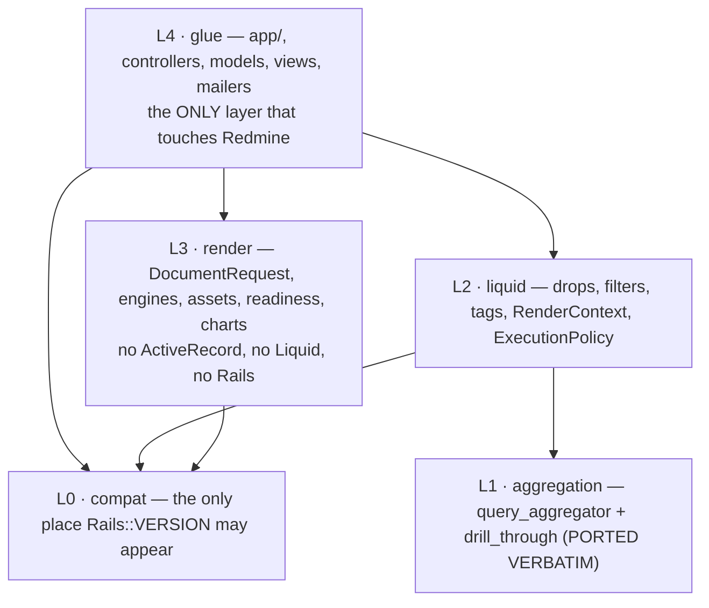

# Technical spec — standalone `redmine_reporter_dashboards`

- **Idea:** 004-redmine-reporter-modern · **Decision:** **ADR-004** ([`05-decision.md`](./05-decision.md))
- **Functional spec:** [`functional-spec.md`](./functional-spec.md) · **Sequencing:** [`07-phasing.md`](./07-phasing.md)
- **Invariants:** INV-1…INV-9 in `model.json`. §10 maps every one to a mechanism.
- Still a spec: interfaces, contracts, file trees, decisions. **No implementations.**

## 0. Coupling inventory — the dossier undercounted, and two findings are new

The analysis listed 6 coupling files. Measured in the live clone there are **18 coupling
sites**. Two were in no earlier list and both are load-bearing for step 1 — **verified
directly, not taken on report**:

| # | Site | Couples to | Note |
|---|---|---|---|
| **C3** | `app/models/reporter_project_tab.rb:7` — `up_acts_as_list scope: :project_id` | the **`redmineup` gem** | **Verified:** defined only at `redmineup-1.1.12/lib/redmineup/acts_as_list/list.rb:33`; absent from both plugins. It arrives transitively via `redmine_reporter/Gemfile` + `init.rb:1`. **Relaxing the hard `raise` alone leaves the plugin booting and then 500-ing on its own core model.** The most easily-missed item in the whole sequence. |
| **C16** | `liquid_aggregate_tag.rb:106` **and** `liquid_version_rollup_tag.rb:38` | `include SqlAggregation::ScopeResolution` | **Verified: there are two, not one.** `04-risks.md` E2 named only the aggregate tag. Both must be re-seamed. |
| C1/C2 | `init.rb:12-16`, `:33` | the hard gate + `requires_redmine_plugin` | |
| C4 | `redmine_reporter_dashboards.rb:96-118`, `liquid/issue_drop_patch.rb` | reporter's `IssueDrop` | |
| C5 | `:124-127`, `reporter_list_patch.rb` | `IssueListReportTemplate`, `Report`, a thread-local | |
| C6 | `reporter_report_content_patch.rb` | `ReportTemplatesController#report_content` | |
| C7 | `patches/report_patch.rb:31-96` | `Report`, `ReportTemplate::ORIENTATION_LANDSCAPE`, `WickedPdf` | |
| C8 | `pdf_polyfills.rb` | wkhtmltopdf (not reporter) | consumed only by C7 |
| C9–C13 | the two report-widget partials, the my-page partial, `reporter_report_for` (`:137-154`), and `report_content_report_template_path` — **reporter's route** | | |
| C14 | `_report_settings.html.erb:16-17` | *nothing* — takes locals | **reusable as-is** |
| C15 | `scope_resolution.rb` (303) | drop archaeology + `Thread.current[:rrd_issue_query]` | to be deleted |
| C17 | `ci.yml:202-228, 271-276` | `secrets.REPORTER_REPO_TOKEN` | the G1 blocker |
| C18 | `test/functional/*` | full app boot with reporter | |

**Do not rely on `rescue NameError` to find these.** `redmine_reporter_dashboards.rb:135`
already swallows `NameError` silently, which is exactly why C3 survived undetected for a
release line.

## 1. Architecture

Four layers plus a compatibility module. The layering is not decoration: it is what makes the
Redmine version span testable, because layers 1–3 never boot Redmine.



| Layer | Namespace | May reference |
|---|---|---|
| 0 | `ReporterDashboards::Compat` | `Rails::VERSION`, `Redmine::VERSION` — **exclusively** |
| 1 | `ReporterDashboards::Aggregation` | ActiveRecord, Redmine models |
| 2 | `ReporterDashboards::Liquid` | L1, the `liquid` gem, Redmine models |
| 3 | `ReporterDashboards::Render` | **nothing** Redmine / ActiveRecord / Liquid. Logger and config are injected ports |
| 4 | `ReporterDashboards` + `app/` | everything |

**Plugin id stays `redmine_reporter_dashboards`, permanently.** It keys `plugin_schema_info`;
route helpers and permission names are a public contract; and third-party widget contribution is
a *filesystem* contract — `ProjectPage.additional_blocks` globs
`#{Redmine::Plugin.directory}/*/app/views/reporter_project_pages/blocks/_*`
(`project_page.rb:55-62`), so renaming the view path breaks every other plugin's widget.

### 1.1 File tree

```
lib/reporter_dashboards/
  compat/        enum.rb serialize.rb icons.rb assets.rb query_params.rb autoload.rb
  aggregation/   query_aggregator.rb  drill_through.rb        ← BYTE-IDENTICAL, see §1.3
  liquid/        render_context.rb execution_policy.rb template_renderer.rb
                 scope_binding.rb batch.rb linter.rb
                 drops/{record,collection,named_ref,issue,issues,user,users,project,
                        projects,version,time_entry,time_entries,attachment,
                        custom_field_value}_drop.rb
                 filters/{numeric,text,colour,array,custom_field,serialisation}.rb
                 tags/{aggregate,version_rollup,chart}_tag.rb
  render/        document_request.rb page_furniture.rb result.rb failure.rb
                 capabilities.rb registry.rb renderer.rb
                 asset_resolver.rb readiness.rb preflight.rb
                 charts/{chart_spec,chart_layout,svg_renderer,chartjs_emitter}.rb
                 engines/{chromium_cdp,wkhtmltopdf}.rb
  glue/          project_page.rb row_layout.rb block_settings.rb positioned.rb
                 legacy/  ← loaded ONLY when reporter is present; deleted at 1.0
spec/            L1–L3 only. Never boots Redmine.
test/            L4 only. Boots the full app.
script/gates/    layer_purity.sh zero_reporter.sh no_html_safe.sh compat_size.sh support_matrix.rb
```

### 1.2 Boundary enforcement — five mechanisms, one CI job

| # | Mechanism |
|---|---|
| E1 | `spec/` may not `require` from `app/` or `config/` |
| E2 | `spec_helper.rb` **aborts** if `::Rails.application` or `::Redmine::Plugin` is defined at load |
| E3 | `layer_purity.sh`: `render/**` must contain zero `Rails\.`, `ActiveRecord`, `Liquid`, `Issue`, `Net::HTTP`, `Faraday`, `cookie`, `session`; `aggregation/**` and `liquid/**` zero `ReporterDashboards::Render` |
| E4 | `Rails::VERSION` / `Redmine::VERSION` only under `compat/`. The job **prints `compat/` LOC as a PR comment** — compatibility debt as a visible number is the only real defence against the "temporary adapter ossifies" fate ADR-004 names |
| E5 | L3 takes `logger:` and `config:` as constructor ports |

### 1.3 The verbatim-port rule — two phases, and why it is not fastidiousness

Re-indenting 2 774 lines into a new module changes every line, destroying the ability to diff
against v0.5.0 — the exact "corpus drift at the sequencing seam" of the month-7 failure.

- **Phase A — byte-identical.** Both files copied with **zero changes**; they still open
  `module SqlAggregation`. Namespacing is one assignment in a separate file:
  `ReporterDashboards::Aggregation = SqlAggregation`. CI job `corpus` runs
  `git diff --no-index` against each file's `v0.5.0` blob and requires **empty** output — not
  "ignoring whitespace".
- **Phase B — re-indent.** Only after `corpus` has been green for a full release cycle *and* the
  goldens are signed off. One mechanical commit; if `corpus` goes red it is **reverted, not
  fixed**.

**Which code this applies to, spelled out because it looks like the opposite of "nothing copied
as-is" and is not** *(added 2026-08-04 in answer to the curator's question)*. Exactly **two files**
are copied byte-identically, and both are the curator's own: `lib/sql_aggregation/aggregator.rb` and
the two tags in `redmine_reporter_dashboards` — code this project wrote, whose *numbers* are the
thing being preserved. Copying them is not a shortcut; it is the only way to prove with a diff that
the aggregation did not change while everything around it did, and Phase B removes even that.
**Nothing from the base plugin or the vendor gem is copied at all** — the drop layer, the filter
set, the render path, the templates, the scheduler, the import path, the mail path and the share
links are each rebuilt from the *behaviour*, which is why `technical-spec.md` carries a disposition
per drop and per filter rather than a file list. The mechanical guarantee is `zero_reporter.sh`
plus the `layer_purity` gate: at 1.0 a grep for either upstream's identifiers must return nothing.
*So the honest summary is not "fresh except two files" but "**fresh, plus a temporary, CI-enforced,
diff-provable copy of our own arithmetic**."*

## 2. The decoupling sequence

Six individually-shippable steps. Two ordering constraints are load-bearing: **the corpus is
frozen before anything is re-seamed**, and **the render path is owned before the Liquid layer**
(§2.7).

### Step 0 — the `enum` fix + freeze the oracle *(hours; no prerequisites)*

`redmine_reporter/app/models/report_template.rb:26` → the Rails-8 positional form with an
**explicit integer hash** `{ portrait: 0, landscape: 1 }`, not `%i[…]`. The column is
`integer default 0` (`db/migrate/003`), so stating the mapping makes the on-disk contract
explicit instead of positional. The misspelled `ORIENTATION_PORTAIT` stays in the fork and is
**not** carried forward.

**Freeze** (run against the `v0.5.0` **tag**, not a working tree): goldens for
`.aggregate` × period/periods/closed_statuses; `.breakdown` (legacy) × 7 core fields;
`.dimension_breakdown` × group_by/split_by/sort/limit/measure/of/user_label/age_*/date_field;
`.completeness` × field-list sizes; `.flags`; `.version_rollup` × cost fields. Plus cap
boundaries at 200 / 24 / 12 / 5 000, **plus ≥3 actors with different roles including one
role-restricted custom field** — which does not exist in the fixture today and is what makes
INV-1/INV-2 testable at value level.

Two blockers to clear first, both mechanical:

1. **Pin a reference date.** The existing adapter fixture is deliberately `Time.zone.today`-relative
   (a 400-day sweep so ISO-week turns are always exercised). Excellent for a self-consistent spec,
   **fatal for a golden corpus** — every expected value changes daily. The generator pins the date
   and the verifier **refuses to run** without it. Otherwise the differential goes red daily for
   the wrong reason and is switched off within a week, which is how this mitigation actually fails.
2. **Canonicalise.** JSON Lines; keys sorted recursively; **array order preserved** (`buckets`,
   `labels`, `rows`, `series` are ordering contracts); sentinel symbols round-tripped as literal
   strings; `nil`/`0`/`""` kept distinct; floats stored as `(value*10_000).round` **plus** a
   `%.4f` string — because PostgreSQL's `CAST(x AS numeric)` and MySQL's
   `CAST(x AS DECIMAL(20,4))` do not agree beyond the fourth decimal. **4 dp is the declared
   contract.** Cases that cannot agree at 4 dp go in a per-adapter overlay **with a written
   reason**; an empty overlay passes, a *growing* overlay is a ratchet failure. No floating
   tolerance — a tolerance hides drift, an overlay names it.

SQL strings live in a **sibling** tree, not the value corpus: SQL is *expected* to change at the
re-seam, the numbers are not, and a differential that fails for the wrong reason gets disabled.

**What is actually irrecoverable.** The kernel signature is unchanged and v0.5.0 stays in git,
so the *numbers* corpus is in principle regenerable. What cannot be reconstructed once
`scope_resolution.rb` is gone is **the scope** — "the AR relation 0.5.0's `resolve_scope`
produced for template T, query Q, actor U". So a small **scope fixture** (~40 triples recording
`to_sql` **and** the sorted issue-id set) plus the tag-level corpus are the genuinely
time-critical artefacts. Freeze everything anyway: the marginal cost is one CI run and the
recovery path depends on a private repository staying reachable *and* on reporter's `enum`
defect not blocking the generator.

### Step 1 — boot without reporter *(ships 0.6.0 — the standalone unlock, G1)*

**Prerequisites, in this order:**

1. **Replace `up_acts_as_list` (C3)** with an owned `Glue::Positioned` concern: `position`
   defaulting to `max+1` scoped to `project_id`, `move_higher`/`move_lower`, `<=>`, and a
   `before_destroy` reflow. ~35 lines. **Without this the plugin boots and then 500s on
   `ReporterProjectTab`.**
2. `ReporterDashboards.reporter_present?` — computed **once** at `after_plugins_loaded`,
   memoised, and every reporter-touching site guarded by it.

**Changes.** `init.rb:12-16` raise → soft detect; `:33` `requires_redmine_plugin` deleted;
`register_issue_target_version_drop` and `apply_reporter_patches` gated on the flag.

**The two report widgets leave the picker, they do not render a placeholder.** `ProjectPage.blocks`
is `CORE_BLOCKS.merge(additional_blocks)` and `additional_blocks` globs partial files
(`project_page.rb:55-62`), so move `blocks/_report_by_issues.erb` and `_report_by_spent_time.erb`
into `blocks/optional/` and include that directory only when `reporter_present?`. **Handle the
already-placed case explicitly:** `find_block` returns nil, so `show.html.erb` must skip unknown
blocks, log one line, and render an inline *"widget unavailable"* cell carrying
`degraded: true` (INV-4) — a dashboard that already has the widget must not 500.

**`report_pdf`** returns **404** when `reporter_present?` is false. Today the analogous path
returns 500 (`:85-91`). In a monitored install a 500 is an alert about a broken thing; a 404 is a
correct statement about a capability that is not installed. Both branches asserted.

**Proof.** A boot spec with `Redmine::Plugin.installed?` stubbed false; a **new
`minitest-standalone` CI job** — full-app, 4 Redmine branches, **no secret** (this is the G1
proof and it lands here, not later); a functional test placing a report widget with reporter
absent → 200 + degraded marker; and `zero_reporter.sh` in **warn** mode so the remaining sites
become a burn-down number.

### Step 2 — own the render path *(ships 0.7.0)*

Introduce L3 in full (§5) plus **two** adapters. `report_pdf` stops calling `Report#to_pdf` and
builds a `DocumentRequest`. `patches/report_patch.rb` (97) is **deleted**.

**Correction to ADR-004's consequence list:** `pdf_polyfills.rb` (61) is **not** deleted here —
it moves to `glue/legacy/wk_legacy_shims.rb` behind the wkhtmltopdf adapter, and is only
recoverable when that engine is dropped.

**Prerequisite:** the `render-smoke` job and the conformance fixture corpus exist *before* either
adapter is trusted, and the job runs the engine **in a different network namespace** so asset
resolution is genuinely tested rather than accidentally passing over localhost.

### Step 3 — own the Liquid layer, re-seam **both** tags *(ships 0.8.0)*

**The ordering constraint the dossier did not state:** today the *only* thing that parses and
renders a Liquid template is reporter (`issue_list_report_template.rb:25`). The tags therefore
cannot be re-seamed until something **we own** creates the render context. So step 3 must include
a **minimal own `TemplateRenderer`** — parse + render one stored body against a `RenderContext`.
Template **CRUD/UI** waits for step 4; the **renderer** cannot.

Replace `include SqlAggregation::ScopeResolution` at **both** `liquid_aggregate_tag.rb:106`
**and** `liquid_version_rollup_tag.rb:38` with `include Liquid::ScopeBinding`.
`` (144) + the addon's `VersionDrop` (108) + `issue_drop_patch.rb` (43)
**dissolve** — **295 lines of pure workaround on top of the ~600 ADR-004 counts.**

**`scope_resolution.rb` is not deleted here.** It is demoted to
`glue/legacy/reporter_scope_binding.rb`, loaded only when `reporter_present?`, so an install still
running reporter keeps its drill-through. Deleted at 1.0. Deleting it in step 3 would break every
existing install mid-sequence, violating "every increment independently shippable **and**
valuable".

**Proof.** The `corpus` job stays green across the re-seam — **the single most important assertion
in the sequence.** Gate: `Thread.current` absent from `lib/`/`app/` outside `glue/legacy/`.

### Step 4 — absorb the bounded reporting subset *(ships 1.0.0)*

Own tables and models (§7), template types, scheduler with run state, my-page widgets, CRUD +
preview + safe import/export. Deletes C4–C13, all of `glue/legacy/`, the CI secret, the
`reporter-secret` probe job and the secret-gated `minitest` job. `zero_reporter.sh` flips from
warn to **hard gate**.

### Step 5 — retire wkhtmltopdf *(post-1.0, condition-triggered)*

Removed when its `render-smoke` job can no longer be kept green on supported distro images —
INV-7 applied to an engine. Only then do the 61 shim lines disappear.

### 2.7 Why render before Liquid

1. `04-risks.md`'s failure scenario is explicit: the kill came from the **greenfield render
   path** plus one unrun query — not from distribution. Front-load the greenfield while the
   incumbent still works and the corpus is fresh.
2. Step 2 needs nothing from step 3: `DocumentRequest` takes HTML. Step 3 needs an owned render
   entry point, and step 2's `report_pdf` rework is where it lives.
3. Step 2 is where the engine measurement happens, and it gates the chart architecture (§6),
   which gates the `` tag in step 3. Reversing means designing the chart tag before
   knowing whether `:javascript` is an essential capability.

## 3. The own-drop layer (R6)

Goals in order: **template-body compatibility** (keeping field names identical is R-10's cheapest
mitigation), **fix the scalar defect**, **kill the N+1 by construction**, **shrink the privilege
surface**.

### 3.1 Classes — 13 + 3 bases (the gem has 17)

Bases: `RecordDrop` (one record + a `Batch` handle), `CollectionDrop` (a scope), `NamedRefDrop`.
Keep: `Issue`, `Issues`, `User`, `Users`, `Project`, `Projects`, `Version`, `TimeEntry`,
`TimeEntries`, `Attachment`, `CustomFieldValue`.
Drop: `IssueRelation(s)`, `Journal(s)` `[OQ-H — narrowed: not part of the six required capabilities]`, `News(s)` (the double-`s` typo is itself
disqualifying; the dashboard has a native news widget), `CustomFieldEnumeration` (folded in).

### 3.2 `IssueDrop` — explicit disposition

**Keep, identical names** (zero-cost compatibility): `id subject description start_date due_date
done_ratio estimated_hours spent_hours total_spent_hours total_estimated_hours created_on
updated_on`.

**Keep + fix:** `closed_on` — reporter converts `created_on`/`updated_on` to the user timezone
but **not `closed_on`** (`issues_drop.rb:22-28`), i.e. three date accessors in two timezones. All
three go through `RenderContext#actor`.

**Rename + alias:** `visible? closed? overdue? is_private?` → `visible closed overdue private`,
with the `?` names retained as aliases. `[OQ-B]` `{{ issue.closed? }}` is very likely not
parseable by Liquid's variable grammar, which would make these accessors **dead surface in the
gem**; one 5-line spec against 4.x and 5.x settles it.

**Keep name, fix type** → `NamedRefDrop`: `tracker status priority category`; `version` →
`VersionDrop`. Plus new `tracker_id status_id priority_id category_id fixed_version_id`.

**Keep + fix:** `url` — **always absolute**, built from `Setting.protocol`/`host_name`. This is
what makes `Report#build_content`'s Nokogiri-or-regexp URL rewriting (38 lines plus a regexp
fallback, `report.rb:59-96`) unnecessary: absolute-by-construction beats rewriting-after-the-fact.

**Keep:** `link author assignee project parent custom_field_values`; `attachments time_entries
subtasks` **batched** (§3.4).

**Drop:** `notes journals relations_from relations_to` `[OQ-H]`; and **all six**
`respond_to?`/`defined?` probes into other RedmineUP paid plugins — `tags story_points color
day_in_state checklists helpdesk_ticket` (`issues_drop.rb:131-157`). Vendor-ecosystem coupling
with no reason to be reproduced and dead weight everywhere else.

**Drop from reporter's own subclass:** `project_name` (fold into `project.name`); `images`
(returns a drop whose `file_url` mints unexpiring token URLs — an explicit non-goal; replaced by
`| inline`); `available_statuses spent_time_by_date total_spent_time_by_date watchers` (each an
unbatched N+1, superseded by the aggregator). `time_in_status`/`total_time_in_status` are the only
per-issue analytics with a plausible constituency — `[OQ-H]`.

**`IssuesDrop`:** `[]`/`before_method(id)`, `each`, `size`, `visible`, `first(n)`. **`all` is not
implemented** — the gem's `all` maps every record into a drop, which is the O(n) materialisation
`reporter_report_content_patch.rb` exists to avoid. A template calling it gets a parse-time lint
warning and a render-time `Degradation(:unbounded_collection)`.

### 3.3 `NamedRefDrop` — the scalar fix, and the 295 lines it deletes

Wraps `(id, name, url)` and implements the five methods that make it **substitutable for the
String it replaces**:

| Method | Behaviour | Protects |
|---|---|---|
| `to_s` | `name` | `{{ issue.status }}` |
| `==(other)` | `name == other` for a String | `` |
| `eql?` / `hash` | delegate to `name` | hash-keyed grouping filters |
| `include?(s)` | `name.include?(s)` | `` |
| `to_liquid` | `self` | drop protocol |

**Every one is a claim about Liquid's internals and must be proven by test, not by reasoning** —
a required spec renders each idiom under **both Liquid 4.0.x and 5.x** and asserts byte-equality
with the String behaviour. `[UNVERIFIED]` until green.

Belt and braces deliberately: the `*_id` accessors ship **as well**. Five one-line methods, and
they are the escape hatch if the Drop-vs-String semantics bite in a shape the spec did not
enumerate.

*Rejected — keep Strings, add `*_id` only.* Steelman: zero compatibility risk, satisfies R-10
perfectly. Critique: it hard-codes the vocabulary (no `status.url`) and does **not** dissolve
``, which needs `{id, effective_date, status, project}` per version name
(`liquid_version_map_tag.rb:56-60`). Two tags and 295 lines would survive for nothing.

The `` **name** is retained for one minor version as a deprecation shim that
logs once and builds its map from `Version.visible` — **never `Version.all`**, which was one of
the five 0.5.0 visibility leaks.

### 3.4 Batch registry — killing the N+1 by construction

Two mechanisms, **both required**:

**M1 — association preload.** `CollectionDrop#each` iterates
`scope.preload(:status, :tracker, :priority, :category, :fixed_version, :assigned_to, :author,
:project).find_each(batch_size: 500)`. Bounded memory *and* bounded queries — and simultaneously
the fix for the "10 000 loaded `Issue` objects" problem that C5/C6 exist to work around.

**M2 — first-touch batch resolution.** `Batch` is a per-render object on `RenderContext`, holding
the full id set. The *first* `{{ issue.custom_field_value[20] }}` inside a 500-issue loop triggers
**one** query for all 500 and memoises; the other 499 are hash lookups.

| Key | One query | Feeds |
|---|---|---|
| `:custom_field_values` | `CustomValue.where(customized_type:'Issue', customized_id: ids)` | `custom_field_value(s)`, `\| custom_field` |
| `:spent_hours` | `TimeEntry.where(issue_id: ids).group(:issue_id).sum(:hours)` | `spent_hours`, `total_spent_hours` |
| `:attachments` / `:time_entries` / `:subtasks` | one query each | the matching accessors |
| `:named_refs` | `IssueStatus/Tracker/… .where(id: ids).pluck(:id,:name)` | every `NamedRefDrop` |

**Cap** mirroring the aggregator's discipline: `MAX_MATERIALISED_RECORDS` default **5 000**; past
it `each` stops, logs one line, and sets `Degradation(:collection_truncated, seen: n)` — visible,
never silent (INV-4).

**Absolute performance criteria** (converting A11/R7 from unfalsifiable to testable, with no
target needed): **zero `Issue` instantiations** for an aggregate-only template (subscribe to
`instantiation.active_record`, require 0) and **query count identical** at 10 vs 10 000 issues.

### 3.5 `RenderContext` — the IssueQuery carried explicitly

Frozen value object: `actor` (never an ambient `User.current` read — INV-1), `scope` (always
derived from `IssueQuery#base_scope` by the glue), `issue_query`, `scopes` (named scopes `from:`
may reference), `batch`, `charts`, `assets`, `diagnostics`, `limits`, `budget`, `output`
(`:html|:pdf`), `correlation_id`.

Passed as **exactly one** Liquid register, `registers[:reporter_dashboards]` — one grep-able
surface that cannot be half-populated, and the resolution order collapses from six sources to two.

`ScopeBinding` (303 → ~60 lines): `resolve_scope` = (1) `query_id:` →
`IssueQuery.visible(actor).find_by(id:)` → `base_scope`, retaining `scope_resolution.rb:148-163`'s
exact semantics; (2) `scopes[from]`; (3) `context.scope`; (4) nil. `resolve_query` = `query_id:`,
then `context.issue_query`, then nil, through the single `#visible?` gate ported verbatim from
`:196-207`.

**Deleted with it:** the `drop.instance_variables` walk (`:256-297`), the `:container`/`:controller`
ivar archaeology (`:100-134`), the `Issue.where(id: ids)` reconstruction from a loaded Array
(`:279-282`), the thread-local `QUERY_THREAD_KEY` (`:47`) and `reporter_list_patch.rb`'s
`rrd_with_issue_query` (`:81-88`) — **and `#enforce_visibility` (`:80-90`), whose `rescue` fails
open by design** precisely because the drop path's provenance could not be vouched for. Once every
source is `base_scope`, there is nothing left for it to protect, and the fail-open rescue goes
rather than being carried forward as a hedge nobody re-audits.

### 3.6 Filters — 55 gem + 12 reporter → ~28 owned

**Reimplement:** `avg median min max sum` (property forms; **subtract whatever Liquid 5's
`StandardFilters` already provides** — `[OQ-C]`), `currency duration wiki hex_color
contrasting_text_color darken lighten group_by group_by_custom_field where where_custom_field
custom_field custom_field_by_id custom_fields sort_natural utc`, **`json`**, **`js`**, **`inline`**.

**`| json` is mandatory.** `JSON.generate` plus script-context escaping — `<` → `<`, `>` →
`>`, `&` → `&`, U+2028/U+2029 escaped. Safe inside `<script>` *and* inside
`<script type="application/json">`, which is where §6 puts chart data. `| js` is the scalar form.
Both used in **every** example and README snippet — the examples are the spec, and today the
copy-paste surface carries the defective idiom (`sample_report_template.liquid:139-141`,
`version_status_dashboard.liquid:514-524`).

**Drop for security, with the reason:**

| Filter | Why |
|---|---|
| `call_method(input, method_name)` | invokes an arbitrary named method on an arbitrary object from inside a template — the sharpest single instance of INV-9. Removal is a security requirement, not scope |
| `regex_replace` / `_once` | template-supplied regexes are a ReDoS primitive against a renderer with a wall-clock budget. Replaced by literal `replace_all`/`replace_first` |
| `md5` | exists to mint the unexpiring capability token |
| `file_url` | resolves to the anonymous unexpiring-token attachment URL (`filters.rb:151-153`). Replaced by `\| inline` |

**Drop as cleanup:** Liquid-core duplicates (`ceil floor round modulo`), cosmetics
(`dasherize underscore ljust rjust multi_line encode`), **mutating** filters (`push pop shift
unshift` — a correctness hazard over a shared object mid-render), **`random shuffle`**
(non-deterministic output defeats golden testing outright and has no place in a document that may
be an audit record), `jsonify`, the attachment plumbing, the internal helpers, `tagged_with`.

**Registration is per-render, never global.** The gem registers four filter modules globally at
require time and monkey-patches `to_number` into `Liquid::StandardFilters` unconditionally
(`patches/liquid_patch.rb:29-31`); reporter does the same (`filters.rb:184`). **Never do this** —
other plugins share the process.

## 4. Liquid execution policy

Today: `parse(content).render(...)` with **no resource limits**, output `.html_safe`, errors
returned **as the document** (`issue_list_report_template.rb:25-27`).

**Scoping.** Never `Template.register_filter`. Construct the `Liquid::Context` and call
`context.add_filters([...])` — works on 4 and 5. Where `Liquid::Environment` exists, scope **tags**
too. Tag registration on Liquid 4 is irreducibly global: accept it, keep the existing
rescue-per-registration discipline so one failure cannot take the others down, and namespace the
names. ``/`` rejected **at parse time by the linter**, because a raise
mid-render is a diagnostic problem while a lint failure is an authoring problem.

**Resource limits** (`render_length_limit`, `render_score_limit`, `assign_score_limit`) per output
class — widget 2 000 000 / 200 000 / 500 000; report 16 000 000 / 2 000 000 / 4 000 000; preview
= widget, **deliberately**, so an author feels the limit while authoring rather than in a 06:00
scheduled run. `[OQ-J]` **The mechanism is the decision; the constants are a starting
calibration** — set them at ~10× the reference corpus's measured p95.

**Wall-clock timeout, because resource limits bound *work units* not *time*** — a
`` running a 90-second query costs one render-score point. A **cooperative
deadline** on `RenderContext#budget`, checked at the top of every own tag's `render`, every
`CollectionDrop#each` batch boundary, and every `Batch#prefetch`. Defaults 5 s widget / 30 s
report / 10 s preview. **Honest limitation: cooperative means bounded only where we cooperate** —
an adversarial `` using only core filters can still burn CPU, which is what
`render_score_limit` is for. Neither mechanism alone suffices; both are required.
**`Timeout.timeout` is rejected** — interrupting ActiveRecord mid-statement trades a slow render
for a poisoned connection pool.

**Error mode.** Parse `error_mode: :strict` **per parse**, never the global setting; a parse error
is a model validation failure *and* a typed render failure. Render collecting, with
`strict_filters: true` (an unknown filter is an error) and `strict_variables: false` (every
existing template relies on an undefined variable rendering empty). **Errors never enter the
document:** `template.errors` non-empty → `degraded` + the list into the diagnostics channel with
correlation id, template id, project id, actor and duration, while the document gets a neutral
placeholder. The reason is concrete: an `ActiveRecord::StatementInvalid` from ``
puts the full SQL — role ids, member ids, project ids — into the document, which
`create_attachment` then persists.

**Output safety.** **No `html_safe` anywhere.** The renderer returns a `Render::Document` value
object; the view uses `raw` at **exactly one** call site, which is the documented trust boundary.
Gate `no_html_safe.sh` allows `html_safe|\braw\(` in ≤2 files.

**Opaque-origin sandbox.** Widget HTML is served into an iframe from a **same-origin** Redmine
route today (`_report.html.erb:28`), so template JavaScript has the viewer's session. Change: the
content endpoint sets `Content-Security-Policy: sandbox allow-scripts; default-src 'none';
img-src data:; style-src 'unsafe-inline'; script-src 'unsafe-inline'` and the element carries
`sandbox="allow-scripts"` — **without** `allow-same-origin`, putting the frame in an opaque
origin. **Named regression to handle rather than discover:** the height-fit script reads
`frame.contentWindow.document` (`:37-46`) and **breaks** under an opaque origin. Replacement: the
shell posts its height via `postMessage`; the parent listens with an
`event.source === frame.contentWindow` check and a numeric-range guard.

**INV-9 as an enforced boundary — five mechanisms + three reductions.** Permission label reads
*"Author report templates (executes server-side code)"* with an inline warning on the permissions
screen and a README section; a `template_authoring: :admins_only | :project_managers` setting
(`[OQ-F]` recommended: `:project_managers` for **upgraded** installs — a silent break is the
failure mode this project keeps naming — and `:admins_only` for **new** ones); the opaque-origin
iframe; zero renderer egress; and an **append-only `template_versions` table** — *a
code-execution privilege without an audit trail is not a boundary*, and it gives authors rollback
they want anyway. Reductions: no `call_method`, no template regexes, no token-minting filters.

**Liquid 5 deltas that matter:** `Strainer` → `StrainerFactory`/`StrainerTemplate` (which is *why*
per-render scoping is a portability decision, not only hygiene); `Drop#invokable_methods`
memoisation moved — **the addon's memo-clearing hack disappears**, a concrete R6 payoff;
`ResourceLimits` field names and the raised class; `Context.new` signature; the per-parse/render
option names; core `sum`/`where`/`sort` coverage widened. Plus a mandatory **`StandardFilters`
enumeration spec** asserting the exact public-method set, so a Liquid upgrade that adds a filter
is a **CI failure** rather than a silent capability grant — INV-7 applied to a dependency.

## 5. The PDF engine abstraction

**Not "HTML in, bytes out."** A document request.

**`DocumentRequest`** (frozen): `body` (a complete, already-asset-resolved HTML document);
`assets` (for upload-model engines); `page` (`size`, `orientation`, `margins`, `scale`);
`header`/`footer` as **`PageFurniture`, not HTML**; `media` (`:print` default);
**`print_backgrounds` default `true`**; `page_breaks`; `readiness`; `timeout_ms`; `pdf_metadata`
incl. the mandatory engine/version/plugin/duration stamp; `tagged`/`outline`; `correlation_id`.

`print_backgrounds` defaults **true, not to the engine's default**, because Chromium's
`printToPDF` defaults it to `false` and a naive swap silently loses every badge and progress-bar
colour in the existing templates. **Overriding engine defaults that differ across engines is part
of the abstraction's job**, not the caller's.

**`PageFurniture`** — `{left, center, right, font_size_pt, height_mm, separator}`, each slot
literal text plus tokens from a **closed set**: `{{page}} {{pages}} {{title}} {{date}} {{time}}
{{datetime}} {{project}} {{template}} {{plugin_version}} {{engine}} {{render_duration_ms}}`.
Compiled per engine: Chromium → `<span class="pageNumber">` in a standalone document;
wkhtmltopdf → `[page]`/`[topage]`; WeasyPrint → `@page { @bottom-right { content: counter(page) }}`.
The last four tokens exist so a PDF someone e-mails you six months later says which engine drew
it. **Templates may never emit engine-native footer markup** — the linter rejects `[page]`,
`[topage]`, `class="pageNumber"`, `class="totalPages"`, `@bottom-`, `@top-`.

**Engine interface — four methods.** `.id`; `.version` **probed from the binary/container, never
a constant**; `.capabilities → Set<Symbol>` from a closed vocabulary (`:javascript
:readiness_expression :print_backgrounds :header :footer :page_furniture_tokens
:custom_page_size :landscape :margins :scale :page_break_css :media_print :outline :tagged_pdf
:pdf_metadata :asset_inline :asset_upload :asset_http :timeout`); `#preflight` — a **round trip**,
never `File.exist?`; `#render(request) → Result`.

`Result = Success{bytes, page_count, duration_ms, engine, engine_version, degradations}` |
`Failure{code, message, engine, engine_version, duration_ms, detail, correlation_id}` with a
closed code set (`:engine_unavailable :engine_version_unsupported :timeout :readiness_timeout
:resource_limit :asset_unresolved :capability_unsupported :engine_crashed :output_not_pdf
:output_empty :internal`). **Never raises. Never returns HTML.**

**INV-5 becomes mechanical** via two post-conditions enforced by `Render::Renderer`, the wrapper
**above** every adapter: bytes must start `%PDF-` and contain `%%EOF`, else rewritten to
`Failure(:output_not_pdf)`; bytes must exceed `MIN_PDF_BYTES`, else `Failure(:output_empty)`. **No
adapter can violate INV-5 even by accident**, and `create_attachment` accepts only a `Success` —
type-driven, not nil-driven as today. **Falsification stated up front: the byte check kills
"exception as document" and does nothing about a *valid* PDF whose content is wrong** — a blank
canvas, a lost background. That class is addressed only by the preflight pixel/text probes and the
degradation list. Never let the byte check stand in for the whole invariant.

**Capability negotiation.** `missing = request.required - engine.capabilities`; missing
**essential** → `Failure(:capability_unsupported)` naming it; missing **degradable** → proceed,
append a `Degradation`, log it, surface it in diagnostics, **and stamp it into the PDF metadata**.
`:javascript`/`:readiness_expression` are essential **iff** `ChartCollector` recorded a JS-path
chart — generalising `PdfPolyfills.charts?`'s `<canvas>` regexp (`pdf_polyfills.rb:45-47`) into a
fact the renderer knows.

### Two adapters

**`:chromium_cdp` — reference, CI-verified, default.** Headless Chromium over CDP in a **separate
process, never inside a Puma worker.** Asset model **inline-only, zero egress**: `data:` URIs for
images and fonts, bundled Chart.js and CSS inlined; launch flags deny name resolution
(`--host-resolver-rules=MAP * 0.0.0.0`), downloads denied, non-root, and `--no-sandbox` **not**
set (run in a sandbox-capable container instead). Preflight reports the Redmine-hosted ``
check as an **expected failure**, so the operator learns at install time that HTTP assets are
unsupported in this mode. Readiness by `Runtime.evaluate` polled at 50 ms.
**Concurrency: a process pool of size 1 by default**, a bounded queue, a global cap; no slot
within `queue_timeout_ms` → `Failure(:engine_unavailable)`. *A refusal is operable; a timeout is
not.* **Install cost, stated honestly: Chromium is not installed by `bundle install`, so G7 must
be restated as "≈3 commands plus one documented package install."** The clean-image CI job will
find this immediately; do not pretend otherwise.

**`:wkhtmltopdf` — compatibility, CI-verified, not the default.** Its existence is what makes the
migration survivable: every existing install and template keeps rendering, and it is the **only**
engine `bundle install` provisions (republished 2025-08-20, 70M+ downloads, zero configuration, no
services, no egress, works on shared hosting and air-gapped). Same inline-first resolver;
absolute HTTP only on explicit opt-in — and because our drops emit absolute URLs by construction,
`Report#build_content`'s rewriting is **not** reimplemented. Capabilities: `:javascript`
yes-but-2011; readiness → `--window-status`; no `:tagged_pdf`. Carries the relocated legacy shims,
gated on a chart having been recorded, plus a `Degradation(:legacy_engine)` stamped into metadata.
**`no_stop_slow_scripts` goes back to `false`** — today it is `true`, i.e. the engine's own
runaway-script guard is off with nothing replacing it; with a real readiness signal there is no
reason to keep it off. **Declared deprecated on arrival**, removal condition INV-7-shaped.

*Documented-unverified:* **Gotenberg** — `/forms/chromium/convert/url` is a **forbidden code
path** (SSRF); only `convert/html` upload; docs must require network isolation and an
authenticating proxy given its 2026 unauthenticated-critical cluster and no-auth default.
**WeasyPrint** — the slot stays open and becomes attractive **only** under §6's SVG split, which
is the strongest single argument for that split. *Rejected:* **ferrum-in-Puma** — a resident,
self-updating browser in every worker, where a Chrome major bump between two `apt upgrade` runs
changes rendering with no plugin release involved.

### 5.1 Asset resolution — three models, one policy *(OQ-4 closed 2026-08-04 by curator decision)*

**Curator decision:** *"externe entities zou ik laten downloaden en andere assets eventueel mee
sturen"* — external references may be fetched; local assets travel with the request.

**There is no standard for this, and the assumption that one exists must be corrected before it
becomes a design premise.** `[CITE: HTML has no packaging format in general use for this purpose —
MHTML (RFC 2557) is not accepted by any of the four candidate engines, and each engine exposes its
own mechanism]`. What *is* standard is the **shape**: every HTML-to-PDF engine offers some subset
of exactly three asset models, and nothing else. So the abstraction is not "adopt the standard", it
is **the capability triple already declared in §5** — now given a policy, a default, and a test:

| Model | Capability | Mechanism per engine | Egress |
|---|---|---|---|
| **inline** | `:asset_inline` | `data:` URIs for images and fonts; CSS, JS and SVG inlined into the single document body | none |
| **upload** | `:asset_upload` | the request carries named asset bytes: Gotenberg `multipart/form-data` (`index.html` + sibling files); Chromium/CDP `Fetch.enable` request interception serving `request.assets` from memory; WeasyPrint the `url_fetcher` callback | none |
| **fetch** | `:asset_http` | the engine resolves absolute URLs itself over the network | **yes** |

**`DocumentRequest#assets`** is therefore not a Gotenberg accommodation — it is the portable middle
model, and the CDP interceptor makes the reference engine implement it too. `AssetResolver` walks
the document once and, per reference, chooses the **most restrictive model the engine declares**:
inline if it can, upload if the bytes are local but too large to inline (default threshold
`inline_max_bytes` 512 KiB, above which base64 growth costs more than a second round trip), fetch
only if the reference is remote **and** policy permits.

**Policy — `asset_policy`, three values, `:bundled` the default.**

| Value | Local files | Same-origin Redmine URLs | Third-party URLs |
|---|---|---|---|
| `:bundled` (default) | inline / upload | **rewritten to the on-disk file** and inlined; never fetched | **refused** → `Failure(:asset_unresolved)` naming the URL |
| `:redmine` | inline / upload | fetched from an **allowlisted** internal base URL over `:asset_http` | refused |
| `:external` | inline / upload | as `:redmine` | fetched, **allowlist-only** |

`:bundled` is what R9 depends on: the default install renders correctly with the renderer's
name resolution denied, which is also §9's cheapest SSRF control. **The two upgraded modes are
opt-in per install, never per template** — an author must not be able to widen egress by editing a
document, or template authoring (already a code-execution privilege, INV-9) would additionally
become a network privilege.

**Conditions on `:external`, all mechanical, none advisory.** `asset_allowlist` is a list of
**hosts, not patterns**, empty by default, and an empty allowlist makes `:external` behave exactly
as `:bundled` — misconfiguration fails closed. Resolution happens **in the plugin, never in the
engine**: the plugin fetches, validates and hands over bytes via `:asset_upload`, so
`:asset_http` stays off even in `:external` mode wherever the engine supports upload. That single
inversion is what keeps INV-8 true — *the renderer is never the thing holding the network* — and
it is also why "let it download" does not mean "give Chromium the internet". Fetches are
`https` only, size-capped (`asset_max_bytes` 8 MiB), time-capped (2 s connect, 5 s total), redirect
count 0, content-type-checked against the reference's use, resolved-IP-checked against private and
link-local ranges **after** DNS resolution (the rebinding case), and never carry a cookie, session,
API key or `Authorization` header — **assets are fetched anonymously or not at all**. A reference
that needs the viewer's credentials to resolve is a reference the report may not contain; it is
refused with the URL named, which is FR-30 restated as a mechanism.

**Vendored libraries are not affected by any of this.** Chart.js, Mermaid and fonts ship in the
plugin (§6) and are always inline. No asset policy value can make a chart depend on egress. That
separation is deliberate: the thing that must never break offline is not the thing an author points
at.

### 5.2 Gotenberg becomes a shipped adapter *(OQ-3 closed 2026-08-04 by curator decision)*

**Curator decision:** *"zeker, als een van de opties, goed gedocumenteerd en veilig"* — an
external container is acceptable **as one option among several**, documented and safe.

Gotenberg therefore moves from *documented-unverified* to a **third first-class adapter,
`:gotenberg`, CI-verified against a pinned container, and not the default.** "One of the options"
is the whole content of the decision: the default stays `:chromium_cdp` because G7 (≈3 commands)
cannot be met by a design that requires an operator to run a service, and INV-7 forbids claiming
a configuration CI does not exercise — so the *only* way "as an option" can be honoured honestly
is by testing it.

Consequences, each a task-level obligation rather than a sentence in a README:

1. **`/forms/chromium/convert/url` stays a forbidden code path** and is asserted absent by the
   boundary grep. Only `convert/html` with the `:asset_upload` model — which §5.1 now makes the
   normal path rather than a special case.
2. **"Safe" is a configuration, so the plugin must be able to refuse an unsafe one.** Gotenberg
   defaults to no authentication `[CITE: 2026 unauthenticated-critical CVE cluster, 02-analysis.md
   §Security]`. `#preflight` therefore additionally asserts: the endpoint is **not** reachable
   without the configured credential (if a credential is configured), the container version is
   within a supported floor, and `chromium.disableJavaScript`/route restrictions match what the
   adapter assumes. A Gotenberg reachable **unauthenticated** produces a preflight **failure with a
   named remediation**, not a warning — an SSRF-capable PDF service on an internal network is the
   finding, and diagnostics is where an operator will actually see it.
3. **The plugin never ships a container.** `docker-compose.gotenberg.yml` is a documented example
   carrying the network isolation (`internal: true`), the non-root user, the read-only root
   filesystem and the pinned digest. It is documentation with a CI job attached, not a dependency.
4. **The engine-selection UI states the trade in one line per engine** (§10): what it needs
   installed, whether it needs a service, whether it can render offline, and which capabilities it
   lacks — generated from `capabilities.yml`, per FR-50, never hand-written.

`:ferrum_pdf` remains **rejected as an in-Puma engine** for the reason already given (a resident
self-updating browser inside a worker), but the curator's R8 named it, so the honest disposition
is recorded rather than silently dropped: ferrum is the *library* our `:chromium_cdp` adapter's
role is filled by. If a fourth adapter is ever wanted, `:ferrum_pdf` as a **separate process**
driven by ferrum is a 100-line adapter over the same interface — `[OQ-K]` whether that is worth
maintaining alongside a raw-CDP adapter that already works, which is a duplication question, not a
capability one.

### Readiness protocol

Today's `window.status` handshake in every template is **dead code** — nothing reads it, and the
PDF path uses a flat `javascript_delay: 3000` with the runaway guard off.

Engine-independent DOM contract, emitted once per document by the plugin's own bundled chart
shell: `window.__rd = { pending, ready, degraded, begin(), end(), fail(reason) }`. `end()`
decrements; at zero it sets `ready`, sets `document.documentElement.dataset.rdReady = '1'`, and
sets `window.status = 'rd-ready'`. An in-page watchdog forces `ready` after `client_timeout_ms`
and records `degraded: ['client_watchdog']`. Three signals for one contract because the mapping
targets differ: Chromium reads the JS expression, wkhtmltopdf `--window-status` plus a 250 ms
floor, Gotenberg `waitForExpression`, WeasyPrint nothing → `Degradation(:no_javascript)` unless
the document is chart-free, any DOM-only engine the `data-rd-ready` attribute.

**`begin`/`end` are never the author's job** — every chart goes through ``. That is
what deletes the hand-rolled `geoChartBegin`/`geoChartEnd`/`__geoChartsPending` handshake from all
three example templates.

**On timeout** (default 10 000 ms) the engine **still renders** and returns `Success` with
`Degradation(:readiness_timeout, pending: n)` — a chart-less-but-otherwise-correct document beats
no document — **unless** `readiness.strict`. Either way, one log line with correlation id, pending
count and duration.

## 6. Assets and charts

**Bundled, never CDN.** Today Chart.js **2.8.0 (2019)** loads from `cdnjs.cloudflare.com` **from
inside the template body**, with no SRI. Vendor Chart.js **4.x** into
`assets/javascripts/vendor/` with upstream version + sha256 in `THIRD_PARTY.md`. **No network
fetch, ever** — simultaneously the SRI fix, the reproducibility fix, and the prerequisite for
INV-8's zero-egress posture. *Rejected: CDN with SRI* — SRI does not remove the **egress
requirement**, and denying egress is the single control that most cheaply kills SSRF value. You
cannot have both.

**Sprockets ↔ Propshaft, made irrelevant.** Ship **pre-built, non-digested** files; rely on
Redmine's plugin-asset mirror; reference with `javascript_include_tag …, plugin: '…'`. **No
Sprockets directives, no ERB in assets, no SCSS** — then neither pipeline is involved. One shim
for the mirror behaviour. This matters twice: the **PDF path reads the same files off disk and
inlines them**, and a digested asset would have no stable on-disk path. `[OQ-E]` Redmine 7.0's
pipeline is unconfirmed; this design does not depend on the answer.

**The hybrid split — one aggregator, two renderers, one authoring act.** The author writes
`` once. The tag
**emits no markup**: it appends a `ChartSpec` to `RenderContext#charts` and a placeholder
`<div data-rd-chart="v1">`. At the end of the render the **output binding** decides:

| `output` | Emitter | Properties |
|---|---|---|
| `:html` | `ChartjsEmitter` | `<canvas>` + a `<script type="application/json">` data block — **never** a string-concatenated JS array literal, which is the entire class of the escaping defect — plus the shell's `begin`/`end` |
| `:pdf` | `SvgRenderer` | inline `<svg>` computed server-side: **vector, selectable, deterministic, no JS, no readiness handshake, no polyfills**, with `<a xlink:href>` per element for drill-through |

Consequence: **`:javascript` stops being an essential capability for the common case**, which puts
WeasyPrint back on the table and substantially de-risks the engine decision.

**Six chart types** from measured use: `bar` (v/h), `stacked_bar`, `diverging_stacked_bar` (the
LL-01 widget), `line`, `pie`/`doughnut`, `progress`. Anything else →
`Degradation(:chart_type_unsupported)` and the Chart.js path, which re-adds `:javascript` as
essential.

**The mechanism that makes "identical in HTML and PDF" a construction:** one shared
`ChartLayout` computed **server-side in Ruby for both paths** — scales, tick arrays, palette,
label truncation. Chart.js is handed explicit bounds and ticks and is **not** allowed to
auto-scale. Testing: SVG goldens are **deterministic diffable text**; the Chart.js visual diff is
**advisory only, never a hard gate**.

**Chart.js 2→4 is a work package, not a free win.** Present in the shipped examples:
`scales.xAxes[]`→`scales.x`; `options.legend`→`options.plugins.legend`;
`type:'horizontalBar'`→`type:'bar'` + `indexAxis:'y'` (**all three** charts);
`getElementAtEvent`→`getElementsAtEventForMode` (the drill-through handler);
`ticks.fontSize`→`ticks.font.size`; `ticks.max`/`beginAtZero` → the scale object.
`responsive: false` + a fixed canvas is still needed **on the wkhtmltopdf path**, so ``
emits it from the **engine's capabilities**, not the author's choice — that is the concrete
mechanism for G3.

### 6.1 Mermaid — R10's third library, previously analysed but never specified

**Gap acknowledged:** R10 named Chart.js, **Mermaid** and SVG. Chart.js and SVG have a design; until
now Mermaid had a security *posture* (`02-analysis.md` §245-249: render server-side to a static
image) and no requirement, no FR and no task — an unbuilt requirement hiding as a paragraph. It is
specified here.

**The posture in §245-249 was right about the risk and wrong about the mechanism.** "Render
server-side to a static image" reads as *rasterise it in Ruby*, which for Mermaid means a Node
toolchain (`mermaid-cli` → Puppeteer → a second browser) or an external service (Kroki). Both
violate G7 far worse than Gotenberg does, and neither is needed, because **the plugin already runs
a headless browser for the PDF path**. So:

` … ` — a **block tag**, not a filter, and the body is **not**
Liquid-interpolated by default (`` opts in, and the linter then
requires `| json`-free plain-text values only). Emission mirrors ``: the tag records a
`MermaidSpec` and emits `<div data-rd-mermaid="id">`; the output binding decides.

| `output` | Path | Result |
|---|---|---|
| `:html` | bundled Mermaid 11.x, `startOnLoad: false`, rendered by the chart shell, `begin()`/`end()` around it so **readiness already covers it** | live SVG in the DOM |
| `:pdf`, engine has `:javascript` | same code path inside the engine; the readiness contract holds the render open until Mermaid resolves | vector SVG in the PDF |
| `:pdf`, engine lacks `:javascript` (WeasyPrint) | `Degradation(:mermaid_unsupported)` + the diagram **source** in a `<pre>`, clearly labelled | honest, readable, not blank |

**Security, three settings and one rule.** `securityLevel: 'strict'`, `htmlLabels: false`,
`flowchart.htmlLabels: false` — Mermaid's own advisory record is overwhelmingly *labels containing
markup* `[CITE: 2025–26 advisories, 02-analysis.md §245]`. The rule that matters more than the
settings: **the rendered SVG is sanitised by the plugin after Mermaid produces it, not trusted
because Mermaid was configured**, using the same SVG allowlist `SvgRenderer` output passes through
(elements and attributes on a closed list, no `<script>`, no `<foreignObject>`, no `xlink:href`
except the drill-through form, no `on*`). One sanitiser, two producers — a defence that does not
depend on a third-party library's configuration being honoured.

**Diagram types are not enumerated and deliberately so** — unlike charts, where six types are
enumerated because *we* compute the layout. Mermaid computes its own; the allowlist is on the
*output*, so a new diagram type in Mermaid 12 needs no plugin change. `mermaid_max_bytes` (default
16 KiB of source) and the render timeout bound the cost.

**`[OQ-L]`** Does Mermaid 11.x render correctly under wkhtmltopdf's 2011-era WebKit? Almost
certainly not (it is ES2020+). Expected disposition: wkhtmltopdf declares `:mermaid` **absent**
despite declaring `:javascript`, which is exactly why the capability vocabulary is per-feature
rather than per-technology. Settled by T-12's conformance corpus, not by argument.

**Migration aid, shipped before the engine default changes:**
`rake reporter_dashboards:lint_templates` scans **stored** bodies for every row above plus
`window.status`, `geoChartBegin`, `GEO_CHARTJS_SRC`, `setLineDash`, `[page]`, and un-`json`-ed
`{{ }}` inside `<script>`. Non-writing. The operator sees the blast radius before it lands.

## 7. Data model and migrations

| Table | Status |
|---|---|
| `reporter_project_tabs` | **exists**; keep as-is, unprefixed name included |
| `reporter_dashboards_templates` | new. STI `type`, `name description content project_id author_id orientation page_size margins engine_hint enabled lock_version` |
| `reporter_dashboards_template_versions` | new, **append-only**: `template_id author_id content content_digest created_at`. INV-9 audit + author rollback |
| `reporter_dashboards_schedules` | new. `project_id template_id query_id query_type repeat start_date(**date**) end_date(**date**) email_subject email_template render_as timezone enabled` **+ run state** `last_run_on last_attempted_at last_status last_error last_duration_ms consecutive_failures next_run_on`. Reporter stores these dates as `datetime` while every comparison is date-based — fixed |
| `reporter_dashboards_schedule_runs` | new. `schedule_id occurrence_date started_at finished_at status error duration_ms recipients_count document_count bytes_total correlation_id`, **`add_index [:schedule_id, :occurrence_date], unique: true`** |
| `reporter_dashboards_schedule_recipients` | replaces `report_schedules_users` (which is `id: false`, so a join row is unaddressable). Gains `id`; **`user_id` only** — no free-text `to`/`cc`/`bcc`/`from`, which is the exfiltration-and-spoofing-relay finding. A security-motivated schema decision |
| `reporter_dashboards_documents` | **required** — it is the snapshot store the share links serve from (§7b.1), no longer optional |

**The unique index is the whole scheduler fix.** The runner **claims the occurrence first** by
inserting the run row; a duplicate insert is caught and skipped. That makes three findings
structurally impossible: running twice sends twice; a missed day is unknowable (enumerate
occurrences between `last_run_on` and today, bounded by `max_catchup_days` default 7 — a schedule
dormant for a year must not emit 365 e-mails); and the first failing template aborting the rest (a
per-schedule rescue writes `last_status = failed` and continues; `consecutive_failures` drives an
operator-visible warning rather than silence).

`reporter_dashboards_documents` exists only to bound the generated-PDF retention gap.
**Recommendation: do not persist by default** — scheduled reports attach to the mail, ad-hoc
export streams. Persistence is opt-in with a mandatory TTL and a purge task. That converts an
unmanaged indefinite store into "off by default, bounded when on", which is the most a plugin
author can honestly offer.

### Reversibility — every migration goes down as well as up

**Gap acknowledged:** the dossier treated migrations only as a hazard *coming from the other
plugin* (reporter's `VERSION=0` dropping tables we live on). It never stated a requirement for
**our own** migrations. Stated now, because "it installed fine" and "it uninstalls without
wrecking the database" are different claims and only the first was being tested.

**Rules.**

1. **No `up`/`down` pairs and no `execute` in a `change` block.** Every migration is a reversible
   `change`, or it declares `reversible do |dir|` explicitly. `irreversible` is not permitted for
   any migration in the 0.x line — there is nothing in this schema that justifies it.
2. **Down means down to zero.** `rake redmine:plugins:migrate NAME=redmine_reporter_dashboards
   VERSION=0` must leave a database with **no plugin table, no plugin index, no plugin row in
   `plugin_schema_info`**, and must leave `reporter_project_tabs` — which **pre-exists this work** —
   in the state its own migration created, not dropped. That last clause is the one a naive
   down-migration gets wrong, and it is the mirror image of the hazard we criticised reporter for.
3. **Data-bearing migrations are `up`-only in effect but reversible in form.** The importer is a
   rake task, never a migration `[INV]`, precisely so that "roll the schema back" never means "lose
   imported templates". A schema migration may not read or write template content.
4. **The down path is tested, not asserted.** New CI job **`migrate-updown`**, one per Rails branch:
   migrate up from empty → assert the full schema → migrate `VERSION=0` → **assert the schema is
   byte-comparable to the pre-install dump** (`plugin_schema_info` included) → migrate up again →
   assert idempotent. A plugin that cannot be uninstalled cleanly cannot honestly be recommended
   for a trial install, and a trial install is the whole A/B argument below.
5. **Forward-compatibility of a rolled-back column.** Between 0.6 and 1.0 the schema grows. A user
   who rolls **the plugin** back one minor version while keeping the schema must not crash: models
   never `SELECT *`-depend on a column's presence, and `compat/` carries a
   `column_present?(:table, :col)` guard for the three columns added after 0.6
   (`engine_hint`, `next_run_on`, `consecutive_failures`). Cheap, and it converts a support incident
   into a degraded feature.
6. **`lock_version` and the unique index are created in the same migration as their table**, never
   added later — an index added in a later migration is an index a partially-migrated install does
   not have, and the scheduler's at-most-once guarantee is only as strong as that index.

**Not claimed:** reversibility does **not** mean a downgrade path *between plugin minor versions
with data already written in the newer shape*. That is a data-migration question, and the honest
answer is a documented export-then-reimport, not a `down` block. Saying so is the difference
between a supported path and a hoped-for one.

### Adopt vs copy — **COPY. Forward-only. Never adopt.**

1. **The footgun is mechanical and undefendable.** If the new plugin adopts `report_templates`, an
   operator following Redmine's documented uninstall —
   `rake redmine:plugins:migrate NAME=redmine_reporter VERSION=0` — runs reporter's own
   down-migrations and **drops the tables the new plugin is live on**. Nothing inside the new
   plugin can prevent that.
2. **Adopt forecloses A/B; copy enables it.** Both plugins define `Report`, `ReportTemplate`,
   `ReportSchedule` at **top level**, so there is no "install alongside and compare" path today.
   Namespaced classes + new tables mean **both plugins can be installed simultaneously**, which
   turns the riskiest single event in the project from a leap of faith into a comparison.
   Decisive.

*Steelman for adopt, honestly:* zero import step, no double storage, no drift, and existing
template ids keep working in bookmarks. The drift objection is real — a user editing the old
template after import gets a silently stale copy. *Counter-mitigation:* the importer records
`source_template_id` + `source_digest`, and `rake reporter_dashboards:import_status` reports
divergence. Drift becomes **visible** rather than silent, which is the standard applied everywhere
else in this dossier.

**Three rake tasks, strict order.** `import:plan` — **read-only dry run**, reporting counts by
type, per-template lint findings, active schedules, and which templates need rework. **This task
is also the vehicle for the four R-15 production queries**: shipping them as a repeatable tool
rather than a one-off SQL session is the cheapest way to guarantee they actually run.
`import:run [--only] [--rewrite]` — one transaction per template, idempotent, stamping source id
and digest, **never writing to reporter's tables**, and **never** `YAML.load_file` +
`constantize` (a closed Hash type map instead) nor `rescue Exception`. `import:verify` — renders
each imported template under both stacks and diffs the **aggregation result hashes**, not the
HTML: the corpus discipline applied to user data.

**INV-6 as a gate:** a Minitest helper `assert_no_writes { get … }` subscribing to
`sql.active_record`, applied to **every** read action — far broader than today's single
`assert_no_difference 'ReporterProjectTab.count'`. Deliberate exception: the schedule-run claim
row *is* a write, but it lives in the rake path, not a page view.


## 7b. The six carried-forward capabilities — improved, not dropped

**Curator decision, 2026-08-04.** All six items the earlier specs excluded are **required**, in
improved form. The exclusions are withdrawn. This section is the design for each; §7c states what
the scope change costs, because it is not free.

Nothing here is "reproduce the old behaviour". Each item is redesigned so the *capability* survives
and the *defect* does not — and in four of the six the result is strictly more useful than the
original, not merely safer.

### 7b.1 Share links — replaces unexpiring MD5 tokens

Today: `Digest::MD5.hexdigest("Object#1…ReportTemplate#3:#{secret_key_base}")`. No expiry, no
revocation short of rotating the app secret, and — the real defect — **the token bypasses the
visibility check entirely** rather than authorising a specific thing.

**The design inverts that: a link authorises one pre-computed document, not a live query.**

New table `reporter_dashboards_share_links`:

| Column | Purpose |
|---|---|
| `token_digest` | **only the digest is stored**, never the token — a database leak yields no working links |
| `report_template_id`, `scope_kind` (`snapshot`\|`query`\|`issue_ids`), `scope_payload` | what it points at |
| `rendered_document_id` | for `snapshot` — the frozen artefact |
| `render_as_user_id` | **the identity the content was rendered as, stored explicitly** |
| `created_by_id`, `purpose` | provenance |
| `expires_at` | **mandatory**, default from a setting (proposal: 30 days) |
| `max_uses`, `use_count` | optional single-use or N-use links |
| `revoked_at` | individually revocable |
| `last_used_at` | so a stale link is visible |

Plus `reporter_dashboards_share_link_accesses` — one row per access: timestamp, IP, user agent.

Mechanics: token is 32 random urlsafe bytes; lookup by digest with a **constant-time** comparison;
`snapshot` mode serves frozen bytes so **no visibility decision is made at request time at all**;
`query` mode re-renders as `render_as_user_id` and is opt-in per template. Attachment URLs are
scoped to the share link that produced them, expire with it and are revoked with it — and `| inline`
means most reports need no external asset URL in the first place.

UI: the template owner and admins see active links with created-by, expiry, use count, last use, and
a one-click revoke; plus "revoke all for this template".

**Better than the original, not just safer:** you can see what you have shared, to whom it is
reaching, and take it back. Today none of that exists.

### 7b.2 Template exchange — replaces the unsafe YAML import

Today: `YAML.load_file(file)` then `attributes['type'].constantize`, wrapped in `rescue Exception`.

**Canonical format is JSON**, which has no class-instantiation surface at all. YAML is still
*accepted for reading* so existing exports keep working, via
`YAML.safe_load(permitted_classes: [Date, Time], aliases: false)`.

A **versioned bundle**: `{format_version, exported_at, plugin_version, templates: [...]}`, optionally
zipped with referenced assets. Template type resolves through a **closed map**
(`{'issue' => …, 'issue_list' => …, 'time_entries' => …}`) — `constantize` never appears.

Import is **two steps**: `import:plan` reports per template whether it is new, updated or skipped,
plus lint findings and unknown drop paths, **writing nothing**; then `import:run` applies it, one
transaction per template, so **one bad template does not abort the bundle** — each failure is
reported with a reason (`rescue StandardError`, never `Exception`). Conflicts are explicit:
`--on-conflict skip|rename|overwrite`.

Round-trip test: export → import → export produces **identical bytes**.

**Better than the original:** the old import was all-or-nothing and silent on failure. This one
tells you what it will do before it does it, and what went wrong when something does.

### 7b.3 Failure reports — replaces errors-as-document

Today the exception message *is* the PDF bytes, and `create_attachment` persists it. The problem was
never that the user got information — it is that they got a **lie**: a file named `.pdf` that is not
a PDF, and which leaks SQL, role ids and project ids to whoever the report reaches.

Three levels, and the user keeps getting information at every one:

1. **Interactive:** a diagnostics panel — what failed, which template, the Liquid line number where
   applicable, engine and version, duration, and a **correlation id** to quote in a bug report.
2. **Optional failure document** (per template/schedule, default off): a **real, valid PDF** titled
   *"Report could not be generated"*, containing the correlation id, timestamp, template name,
   requester, and a **safe** summary — never the raw exception, never SQL. Filename
   `report-FAILED-<correlation-id>.pdf` so it can never be mistaken for the report.
3. **Scheduled runs:** the schedule owner gets a failure notice carrying the correlation id;
   recipients get nothing by default, or a configurable *"this report is unavailable"* notice.

Never persisted as an attachment unless explicitly requested.

**Better than the original:** today an operator gets an e-mail that looks successful and has to open
the attachment to discover it is broken, with no way to correlate it to a log line. Now the failure
is loud, traceable and safe.

### 7b.4 Time-entry reporting — generalised instead of a third branch

Today `TimeEntriesReportTemplate` is a parallel world: its own controller, drop, permissions and
views, disjoint from issue reporting.

**Do not reproduce the branch. Make the data source a field.** `source` ∈
`issues | time_entries` (extensible), so one controller, one CRUD, one preview and one template model
serve both. Time entries get a `TimeEntryQuery`-backed scope, and the aggregation core already takes
a scope — so `` works with every dimension that applies, and
`spent_hours` measures stop being a special case.

**Better than the original, materially:** today you cannot put issue data and time data in one
template or on one dashboard. Once the source is a field, you can — and the whole aggregation
vocabulary (crosstabs, drill-through, completeness, caps) applies to time entries for free instead of
being reimplemented.

### 7b.5 Ad-hoc report mail — same capability, controlled

Today `find_issues` is `Issue.where(id: params[:issue_ids])` with **no visibility check**, and
`to`/`cc`/`bcc`/**`from`** are free text. That is a report over any issue in the instance, mailed
anywhere, with a forged sender.

Redesign:

- Issues resolve through **`Issue.visible(User.current)`** — you can only mail what you can see.
- **`From` is server-controlled** (Redmine's own sender). The requester's address goes in `Reply-To`,
  which is what people actually wanted from the field.
- Recipients are **Redmine users** by default. External addresses require an admin to enable them
  *and* pass a **domain allowlist**.
- Every send is **audited**: who, when, which template, which issues, which recipients — visible to
  admins.
- Rate-limited per user.
- It goes through the same render path, so a failure is a failure (7b.3) rather than a mail with a
  broken attachment.

**Better than the original:** today nothing records what left the building. Now there is a log you
can answer questions from.

### 7b.6 Public report links — the capability, on 7b.1's mechanism

Kept as a feature, built entirely on 7b.1. Off by default, enabled per template, mandatory expiry,
revocable, audited, and — the important part — a public link serves a **snapshot** rather than
running a live query as nobody. So "public link" stops meaning "visibility check skipped".

## 7c. What the scope change costs — stated, not buried

Adding these back is the right call given they are needed, and it is not free. Three honest
consequences:

1. **Phase 4 grows** by roughly the share-link subsystem (two tables, a UI, an access log), the
   bundle importer, the failure-report path, the mail controls and the audit log. The `source`-field
   generalisation is *cheaper* than the third template type would have been, so it partly offsets.
2. **Two claims are settled by decision rather than by evidence.** C-002's Tier-3 exclusion rested on
   inference from absence; the curator has answered directly for these six items. The four production
   queries are still worth running — they now inform *sizing and defaults*, not keep-or-drop.
3. **The security surface returns, deliberately.** Share links and outbound mail are the two paths
   that reach outside Redmine's permission model. They are the reason 7b.1 stores only digests, keeps
   snapshots instead of live queries, and audits every access — those controls are load-bearing, not
   decoration, and cutting them later would restore the original defects.

## 8. Compatibility span

Redmine 5.1 (Rails 6.1) / 6.0 (7.2) / 6.1 (7.2) / 7.0 (8.1) — **three** Rails majors.

**Redmine 5.1: keep through the 0.x standalone line; drop at 1.0.** Dropping now would land a
second breaking change in the same release as the standalone unlock; 5.1 costs almost nothing
while the code is unchanged; and 1.0 already breaks templates, so the breakage concentrates into
one migration event. 5.1 has been EOL since 2026-06-30, so this is a schedule, not a defence.

**Ruby floor 3.1 now; delete `check_ruby_floor.sh` (69 lines).** Measured justification: **CI
already runs Redmine 5.1 on Ruby 3.2**, because 5.1's Gemfile allows `>= 2.7.0, < 3.3.0`.
*"Support 5.1" has never meant "write Ruby 2.7" in any environment this project tests* — and per
INV-7 an untested configuration is not supported. Declaring 3.1 makes the declared floor match the
tested floor, removes three of the checker's four rules' reason to exist (endless methods,
`Hash#except`, hash-value omission), and clears Liquid 5's ≥3.0 requirement with margin. README
honesty: a deployer on 5.1 + Ruby 2.7 becomes unsupported — which is **already** true, and the
grep script has been implying otherwise. If 5.1 is dropped at 1.0, raise to **3.2** (matches the
6.1/7.0 floor; enables `Regexp.timeout`).

**`compat/`: one module, one method per divergence, a comment naming the versions. Never scattered
`if Rails::VERSION`.** Shims: `enum` (~6 lines, always an explicit integer hash);
`serialize` — **`[OQ-A]`, and possibly an existing defect**: `serialize :layout, coder: YAML`
(`reporter_project_tab.rb:9-10`) is the Rails 7.1+ keyword form, which Rails 6.1 does not accept.
**Verify whether Redmine 5.1 support is already broken here before anything else in this
section**; `icons` (`sprite_icon` R6+); `assets` (the plugin-asset mirror); **`query_params`** —
`Query#as_params` has undocumented semantics and is the sharpest single core-API dependency
(`drill_through.rb`), so wrap it and add a per-branch spec asserting the shape; `autoload` (the
Zeitwerk ignore dance). New migrations target `ActiveRecord::Migration[6.1]`.

### CI matrix — additive, **17 jobs** (today 13)

| Job | Count | Proves |
|---|---|---|
| `rspec` (L1–L3, no boot) | 4 | library code passes on every branch |
| `adapter` | 3 | the aggregator's real SQL on PG16/MySQL8/MariaDB11 |
| **`corpus`** | 1 | the frozen goldens still reproduce **and the ported bodies are byte-identical** — the R-04 gate |
| **`minitest-standalone`** | 4 | full-app, **no secret**, fork-runnable — **G1** |
| `minitest-with-reporter` | 1 | the legacy shim; **deleted at 1.0** |
| **`render-smoke`** | **3** | one per engine — `:chromium_cdp`, `:wkhtmltopdf`, **`:gotenberg`** (pinned container) — **engine in a separate network namespace**: preflight round trip, conformance corpus, INV-5's forced failures, the readiness triple, **the three asset models incl. an allowlist-refusal case**, and Mermaid's per-engine disposition |
| **`migrate-updown`** | 3 | one per Rails branch: up from empty → `VERSION=0` → schema equals the pre-install dump → up again idempotently (§7 Reversibility) |
| `gates` | 1 | `layer_purity` + `zero_reporter` + `no_html_safe` + `compat_size` + `support_matrix` + **`drop_reference_parity`** (§9b.1) |
| ~~`ruby-floor`~~ | **0** | deleted with the floor decision |

**Additive, not multiplicative:** `render-smoke` is per **engine on one branch**, never engine ×
branch — 4 × 3 × 3 = 36 must be refused. `migrate-updown` is the one place a **per-branch** count is
unavoidable, because the reversibility of `ActiveRecord::Migration[6.1]` under Rails 8.1 is exactly
what is in doubt. Net **+4 jobs** (was +2 before OQ-3's answer and the reversibility requirement),
−1 deleted, −1 secret — **17 jobs**, and the "~16" figure above is superseded.

**PDF comparison never byte-diffs** (timestamps, object ids). Page count, extracted text, and the
**SVG chart source** (deterministic text). A coarse pixel histogram is **advisory only**.
`support_matrix.rb` cross-checks `requires_redmine`, the Ruby floor and the README table against
the matrix, so widening a claim without adding a cell fails CI — INV-7 mechanised.

## 9. Security and operations, made concrete

Covered above at their point of use; collected here for review:

| Concern | Mechanism |
|---|---|
| Template authorship = code execution | §4 INV-9: label + docs, `template_authoring` setting, opaque-origin sandbox, zero egress, append-only version audit, three filter reductions |
| Renderer credential exposure | **`DocumentRequest` has no field a credential could travel in** — no `cookies:`, `headers:`, `auth:`. Cookie-passing is not discouraged, it is *unrepresentable* |
| SSRF / egress | inline-only asset default; Chromium name resolution denied; Gotenberg's URL-conversion endpoint a forbidden code path; a `render-smoke` variant in a route-less namespace that must still produce a correct PDF |
| Supply chain | vendored Chart.js with a recorded sha256; no CDN; `StandardFilters` enumeration spec catching dependency capability drift |
| Wrong-number disclosure | errors never enter the document; SQL never reaches a rendered artefact |
| Render-path containment | request cap with a **refusal before any render**, per-render + batch timeouts, process pool of 1 with a bounded queue, streamed archives |
| Scheduler | the unique occurrence index; per-schedule rescue; bounded catch-up; explicit stored render identity so the "scheduled as anonymous vs test-send as current user" split cannot recur |
| Diagnosability | correlation id on every log line; engine id + version + duration stamped into **the artefact**; the preflight round trip |
| Retention | documents not persisted by default; opt-in with a mandatory TTL and a purge task |

## 9b. The authoring and viewing experience (R7, R9)

**Gap acknowledged, and it was the largest one in this dossier.** R9 ("easy for new users") had
exactly one mechanised criterion — *install in ≈3 commands* — and `functional-spec.md:284` admitted
it in a parenthesis: *"'easy for new users' beyond install is a usability question."* R7's
"beautiful" had two absolute criteria about *rendering*. Between them, nothing described what a
person actually does with this plugin. An install-only reading of R9 would let us ship something
easy to install and unusable, and pass every gate. Specified now.

**One design rule above the details: look native, not branded.** The plugin adopts Redmine's own
markup, classes and icon set per version (`compat/icons.rb`, `sprite_icon` on R6+) and ships **no
design language of its own** for chrome. *Rejected: a bespoke UI skin* — it would look current on
one Redmine version and wrong on the other three, and it is the reliable way to make a plugin feel
bolted on. "Beautiful" is spent entirely on the **report output**, where it is ours to control, and
"native" is spent on the **admin and authoring chrome**, where it is not. `[ASSUMPTION]` that
Redmine 7.0 does not change host markup enough to break this; `[OQ-E]`-adjacent, and cheap to fix
in one shim if wrong.

### 9b.1 Four authoring surfaces

**1. The editor — a lint panel, not a blank box.** A vendored, pre-built **CodeMirror 6** bundle
(`assets/javascripts/vendor/`, upstream version + sha256 in `THIRD_PARTY.md`, same rule as Chart.js
— pre-built and non-digested, so §6's "neither asset pipeline is involved" still holds). Liquid
syntax highlighting, bracket matching, and a **findings panel below the editor fed by the same
linter that runs in `rake reporter_dashboards:lint_templates`** — one implementation, two surfaces.
Findings are `{line, column, severity, code, message}`; the editor gutter marks them. Degrades to a
plain `<textarea>` if JS is unavailable, and the lint panel still works because linting is
server-side.

**2. The drop reference — generated from the declarations, so it cannot drift.** FR-20 already
requires every drop to expose *only its declared surface*. That declaration is therefore a
machine-readable API description, and the reference sidebar is **rendered from it at runtime**: every
drop, every accessor, its type, whether it is a batch accessor, and a copyable
`{{ … }}` snippet. Consequence worth stating plainly: **documentation drift for the drop layer
becomes structurally impossible**, and the alternative — a hand-written wiki page — is exactly the
artefact that is stale in every Redmine plugin. Same generator emits the Markdown reference in
`doc/`, per FR-50's "generated, not hand-maintained".

**3. Start from an example, never from empty.** *New template* offers a **starter gallery**: the
three existing example templates (cleaned, Chart.js 4, no handshake, `| json` throughout) plus a
minimal issue document and a minimal aggregate report — each with a one-line description and a
thumbnail rendered by the plugin itself in CI, so the thumbnail cannot show something the code no
longer produces. This is the single largest onboarding lever available and it costs almost nothing,
because the examples must exist as fixtures anyway. `[CITE: the two templates the curator supplied
in 00-idea.md are 747 lines of Liquid; nobody writes that from a blank textarea]`.

**4. A chart form that writes the tag.** `` has ~8 parameters. A small dialogue — type,
source variable, x, y, series, drill on/off — that **inserts the tag** rather than storing hidden
state. The author keeps a text template they can read, diff, export and paste into an issue; the
beginner never types the syntax. *Rejected: a GUI report builder storing structured JSON* — it
would fork the model (R1's "one plugin" applies to the authoring path too), break `git`-style
review of templates, and make FR-57's byte-identical export round trip meaningless.

### 9b.2 Preview, and the failure a preview must show

Preview renders in **both** bindings — HTML inline, and a **PDF preview through the configured
engine** — because "it looked fine in the browser and broke in the PDF" is the defect class this
whole dossier exists to remove; a preview that only proves the easy path is a false signal. Preview
is bounded (`preview_max_issues`, default 50, shown in the UI as *"preview of 50 of 1 284"* — never
silently truncated, per INV-4's spirit) and carries the `degraded` reasons and the render duration.
On failure it shows FR-58's diagnostics view: what failed, the Liquid line, engine and version, and
the correlation id — **in the editor, next to the code**, which is the only place it is actionable.

### 9b.3 The setup surface — R9's real content

Diagnostics (FR-33) already exists as a page and a rake task. Two additions turn it from a debugging
tool into the onboarding path: an **engine comparison table generated from `capabilities.yml`** (what
each engine needs installed, whether it needs a service, whether it renders offline, what it cannot
do — per §5.2.4), and a **"fix this" line per failing check** naming the command or setting. An
operator who lands on a red check must never have to search the source to learn what to type.

### 9b.4 The viewing surface — where "beautiful" is actually spent

One **print-first stylesheet with a single shared type scale**, used by the HTML view and the PDF
body alike, so the two are the same document at two sizes rather than two designs. Concretely:
`@page` geometry from `DocumentRequest#page`; `thead { display: table-header-group }` so long tables
repeat headers across pages; `break-inside: avoid` on cards, chart blocks and table rows;
`orphans`/`widows` 3; tabular figures for numbers; the chart palette shared with `ChartLayout`
(§6) so an HTML chart and its SVG twin are the same colours. Responsive down to a phone for the HTML
view; the dashboard widgets keep Redmine's own grid. Accessibility as a hard property of the SVG
path, not an aspiration: every `SvgRenderer` output carries `<title>`/`<desc>`, chart colour is never
the sole carrier of meaning (pattern or label as well), and the drill-through `<a>` elements are
real links — which also happens to make the PDF's charts clickable and its text selectable, the two
things a rasterised chart loses.

### 9b.5 How this is judged — falsifiably, and advisory where it must be

| Criterion | Mechanised? |
|---|---|
| A new template can be created, previewed and rendered to PDF **without opening documentation** | **advisory — non-deterministic — not a correctness guarantee**: a 3-participant walkthrough, recorded, on a clean install |
| Every drop accessor in the reference exists at runtime, and every runtime accessor appears in the reference | **yes** — the reference is generated from the declaration; a diff test asserts both directions |
| Every starter template lints clean and renders on **every** engine in the matrix | **yes** — CI |
| Every diagnostics failure state has a remediation string | **yes** — a test enumerates the closed check list and asserts a non-empty remediation for each |
| Time-to-first-report on a clean install | **advisory**, recorded as a number in the release notes so it can get worse visibly |
| HTML and PDF of the same template agree on layout | partially — SVG goldens are deterministic; the visual diff stays **advisory, never a hard gate** (§6) |

**Stated risk of this section:** it is the newest and least-reviewed part of the dossier, written
after the red-team pass rather than before it, so it has not been attacked. The two claims most
likely to be wrong are that a vendored CodeMirror bundle stays inside §6's no-build-step rule
(`[OQ-M]` — verify against a real Redmine 7.0 install before T-34 commits to it) and that the
generated drop reference is genuinely sufficient documentation rather than an API dump wearing a
sidebar. Neither is load-bearing for phases 0–2.

## 10. Invariant traceability

| Inv | Mechanism | Gate |
|---|---|---|
| **INV-1** | `ScopeBinding` has exactly **two** sources, both visibility-scoped by construction. The drop-archaeology path — the only one whose provenance could not be vouched for — is deleted, **and with it the fail-open `enforce_visibility` rescue**. `RenderContext#actor` is explicit, so `User.current` is never ambiently assumed | `corpus` multi-actor cases |
| **INV-2** | unchanged verbatim kernel + a role-restricted-CF case per actor in the corpus (does not exist today) | `corpus` |
| **INV-3** | verbatim kernel, protected by the **byte-identity rule** | `corpus` + `adapter` |
| **INV-4** | every tag and drop writes to `RenderContext#diagnostics`; `empty_result` gains `degraded` + reasons; the widget shows a "reduced" marker and the PDF stamps it into metadata. Also covers unknown placed blocks and truncated collections | one spec per refusal path |
| **INV-5** | `Result` sum type + the `%PDF-`/`%%EOF` post-condition **in the wrapper above every adapter** + `create_attachment` accepting only `Success`. Limit stated in §5 | `render-smoke`, forced failures per engine |
| **INV-6** | unsaved-default-tab pattern retained + `assert_no_writes` on every read action | `minitest` |
| **INV-7** | the matrix + `support_matrix.rb` + the `StandardFilters` spec + the wkhtmltopdf removal being a *CI* condition | `gates` |
| **INV-8** | `AssetResolver` reaches the network in **no** code path under the default `asset_policy: :bundled`; Chromium denies name resolution; `DocumentRequest` cannot carry a credential. **Amended 2026-08-04 (§5.1):** an HTTP client now exists for `:redmine`/`:external`, so the gate is no longer "no client in the tree" — it is that the client is unreachable under `:bundled`, that it is anonymous by construction (the request builder has no parameter for a credential), and that `:asset_http` stays off wherever the engine supports `:asset_upload`. **A weaker gate than before, and named as such** | `layer_purity` grep + the route-less-namespace render + T-33's negative tests (empty allowlist ≡ `:bundled`; post-DNS private-range refusal; no credential header) |
| **INV-9** | §4's five mechanisms + three privilege reductions | `no_html_safe`; a functional test asserting the CSP `sandbox` header **without** `allow-same-origin` |

## 11. Risks carried from `04-risks.md`

| Risk | Technical mitigation here |
|---|---|
| R-04 silent numerical drift (15) | Phase-A byte-identity + the `corpus` job + the pinned reference date + the per-adapter overlay instead of a tolerance |
| R-03 visibility invariants lost (15) | two-source `ScopeBinding`; the fail-open rescue deleted rather than carried; multi-actor corpus cases; the five 0.5.0 fixes as named tests |
| R-02 stall (20) | every step ships; `glue/legacy/` keeps existing installs working mid-sequence |
| R-05 PDF fidelity vs 747 lines of templates | wkhtmltopdf retained as a CI-verified compatibility engine; `lint_templates` shows the blast radius before the default changes |
| R-08 external service vs R9 | in-process Chromium as default, Gotenberg documented-unverified; **G7 restated honestly as "≈3 commands plus one package install"** |
| R-12 R7 unfalsifiable | the two absolute criteria (§3.4) plus a p95 baseline measured **before** step 2 |
| R-16 R5 unexamined | `[OQ-12]`/C-011 stays open; §4 makes INV-9 enforced rather than implicit, which is the mitigation available *without* re-opening R5 |

## 12. Open questions

| # | Question | Blocks |
|---|---|---|
| **OQ-A** | Does `serialize :layout, coder: YAML` already break on Redmine 5.1 / Rails 6.1? A possible **existing defect**, not a design question | §8; possibly the 5.1 support claim itself |
| **OQ-B** | Is `{{ issue.closed? }}` parseable by Liquid's variable grammar (4.x, 5.x)? Decides whether five delegated accessors were ever reachable | §3.2 |
| **OQ-C** | The exact `Liquid::StandardFilters` set in the pinned version — subtract before reimplementing | §3.6 |
| **OQ-D** | Liquid floor `>= 5.5` or `>= 5.6` (`Liquid::Environment` for scoped **tag** registration) | §4 |
| **OQ-E** | Redmine 7.0's asset pipeline | §6 (design does not depend on it) |
| **OQ-F** | `template_authoring` default — `:project_managers` upgraded, `:admins_only` new? | §4 |
| **OQ-G** | The 19-vs-17 delegated-accessor count in `reference/redmineup-gem-drop-surface.md` | §3.2 |
| ~~**OQ-H**~~ | **CLOSED 2026-08-04 by curator decision.** The third template type is built — as a `source` field, not a branch (§7b.4). Still `[OQ]` and *scoped narrowly*: whether `JournalDrop` and `time_in_status` are built. Those two were never part of the six required capabilities, and `import:plan`'s usage counts now inform that one remaining call | §3.1 |
| ~~**OQ-I**~~ | **CLOSED 2026-08-04 by OQ-4's answer.** Yes — `asset_policy: :redmine` / `:external`, allowlist-only, empty allowlist fails closed, and **the plugin fetches, not the engine** (§5.1). Now a supported, CI-tested mode rather than a documented-unverified one | §5.1 |
| **OQ-J** | The concrete `resource_limits` constants — calibration, not design | §4 |
| **OQ-K** | Is a separate-process `:ferrum_pdf` adapter worth maintaining beside a raw-CDP adapter that already works? A duplication question, not a capability one | §5.2 |
| **OQ-L** | Does Mermaid 11.x render under wkhtmltopdf's 2011 WebKit? Expected: no → `:mermaid` declared absent. Settled by T-12's corpus | §6.1 |
| **OQ-M** | Does a pre-built CodeMirror 6 bundle stay inside §6's no-build-step / non-digested asset rule on Redmine 7.0? | §9b.1 |
| ~~OQ-3~~ | **CLOSED 2026-08-04 by curator decision**: external container acceptable *as one option*, documented and safe → Gotenberg becomes a **third CI-verified adapter**, default unchanged (§5.2) | §5.2 |
| ~~OQ-4~~ | **CLOSED 2026-08-04 by curator decision**: fetch external references, ship local assets with the request → the three-model resolver + `asset_policy` (§5.1). The premise *"there will be a standard for this"* is **corrected**: there is no packaging standard, only three recurring mechanisms | §5.1 |
| OQ-6/OQ-8 | carried from `04-risks.md`: Redmine 5.1 + Ruby floor; the performance baseline | §8 |
