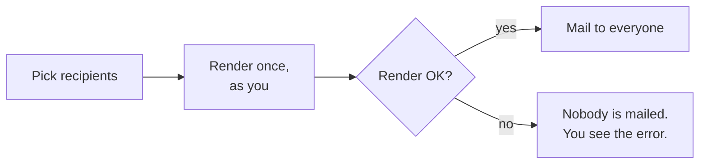
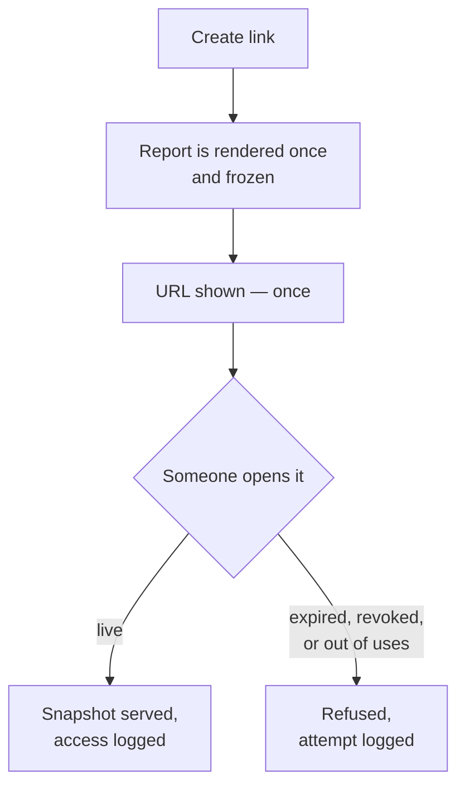

# User guide

For people who use dashboards and reports. If you write templates, read
[Template authoring](template-authoring.md) next. If you install and configure the plugin,
read the [Administrator guide](admin-guide.md).

- [Where everything lives](#where-everything-lives)
- [Project dashboards](#project-dashboards)
- [Report templates](#report-templates)
- [Reading a report](#reading-a-report)
- [Mailing a report once](#mailing-a-report-once)
- [Scheduled reports](#scheduled-reports)
- [Share links](#share-links)
- [Import and export](#import-and-export)
- [When something goes wrong](#when-something-goes-wrong)

## Where everything lives

**Project → Settings → Reports and dashboards** is the one place that lists all of it: how
many dashboard tabs this project has, how many report templates you can see, whether the
scheduler is running, and links to each of those pages. It appears as soon as you hold any
one of the four permissions it covers, so a role that may only watch schedules run still
gets it.

The dashboard itself stays where it is — **Project → Project dashboard** in the project
menu — because it is something you read rather than something you configure.

## Project dashboards

**Project → Project dashboard.** If you do not see the link, the module is off for that
project or your role lacks the permission — ask an administrator.

A dashboard has tabs, and each tab holds widgets arranged in rows.

### Adding and arranging widgets

Press the settings icon to open the configuration panel.

- **Add** a widget from the picker. Each widget has its own settings — an issue query, a
  report template, a row limit, a column list.
- **Up / down** moves a widget to the row above or below. If that row is empty it splits
  onto a new line of its own; if not, it joins the widgets already there.
- **Left / right** reorders a widget inside its row.

There is no drag-and-drop. The buttons work the same on every supported Redmine version.

### Available widgets

| Widget | Shows |
|---|---|
| Issues | A filtered issue list from a saved query |
| Report | One of your report templates, rendered in place |
| Activity, Calendar, News, Documents, Time log | The Redmine pages you already know |

A **Report** widget needs a template you are allowed to see. If the picker is empty, either
the project has no templates yet, the **Reports** module is off, or every template there is
private to someone else. The settings form says which.

The report widget has an **Export as PDF** link that renders the same report as a document.

### Tabs

Create, rename and reorder tabs from the same settings panel. Tabs are per project — they
are not shared between projects, and moving one does not affect anybody else's project.

## Report templates

**Project → Settings → Reports and dashboards → Report templates**, or
**Project → Report templates.**

A report template is a Liquid document that the plugin renders against the project's issues
or time entries. The list shows the templates in this project that you can see.

### Visibility

Every template has one of three visibilities:

| Visibility | Who can open it |
|---|---|
| **Private** | Only you |
| **Visible to roles** | Members of the project holding one of the roles you pick |
| **Public** | Anyone who can see the project's reports |

Choosing anything wider than private needs the **Manage public report templates**
permission. Without it, the field is fixed at private.

### Writing one

**New** opens the editor. It offers starters — pick one rather than starting from a blank
page; each is short and demonstrates one thing.

Three things sit under the editor:

- **Preview** renders what is in the box right now, without saving. Use it constantly.
- **The lint panel** flags problems as you go — a tag that will not resolve, an
  interpolation inside a `<script>` that is not escaped, a deprecated tag.
- **The chart form** builds a `` line and inserts it into the editor. It stores
  nothing; the template you save is the template you can read.

### Version history

Every save keeps the previous body. The template's page lists its versions with who saved
each one and when, and you can look at any of them.

## Reading a report

Opening a template renders it. Two things above the report are worth knowing:

**Rendered as.** A report says whose access rights produced its numbers. Normally that is
you. A scheduled report says the identity its schedule was configured with, which may be
someone else.

**The query.** Most templates report on a saved issue query. If the template names one that
has been deleted, you get a message saying so rather than an empty report.

### Two people, two sets of numbers

The same report shows different numbers to different people, and that is intended.

The *filters* — which issues the report is about — are fixed by whoever built it. The *rows*
those filters match are resolved against the person looking. A private issue you cannot see
is not counted for you and is counted for someone who can. The same applies to hidden
trackers, restricted projects, and custom fields limited to certain roles: their values land
in the no-value bucket for anyone not entitled to them, and the issues are still counted.

This is why a report never says "42 issues" as a fact about the instance. It says "42 issues
you can see".

### PDF

**Export as PDF** on any report. Charts become inline SVG and diagrams become vector
graphics, so both stay sharp at any zoom and remain selectable and searchable. Drill-through
links stay clickable in the PDF.

## Mailing a report once

**Send report by e-mail** on a report's page. This mails the report now; it does not create
a schedule.

Five rules, and each is there to stop a specific accident:

- **You can only mail what you can see.** The report is produced with your access rights,
  and the mail says so. If you name issue IDs and one of them is an issue you cannot see,
  nothing is sent at all — the whole request is refused rather than quietly reporting on
  the rest.
- **The sender is this Redmine, and you are in `Reply-To`.** There is no sender field.
- **Recipients must be able to open reports in that project.** You can mail a colleague who
  could open the report themselves, and yourself. If one person in the list is not
  permitted, is locked, or no longer exists, nothing is sent.
- **External addresses are off unless an administrator enabled them** and listed the
  permitted domains.
- **Every send is recorded** — who, when, which template, which issues, which recipients.
  You see your own sends; administrators see all of them for the project.

There is a rate limit, twelve sends an hour per person by default.

If the render fails, nobody is mailed. You get the error and a correlation ID on screen.

## Scheduled reports

**Project → Settings → Reports and dashboards → Report schedules**, or
**Project → Report schedules.**

A schedule mails a report template to a list of Redmine users on a repeating day: daily,
weekly, monthly, quarterly or yearly, counted from its start date.

> **Schedules only run if an administrator has added a cron entry.** Nothing inside Redmine
> wakes the scheduler. If your schedules never arrive, that is the first thing to check —
> see [the administrator guide](admin-guide.md#the-scheduler-needs-cron).

### Rendered as

A schedule has no person pressing a button, so it names the identity it renders as. By
default that is you, the author. Setting it to somebody else needs the **Render reports as
other users** permission, because it means the report is produced with their access rights
rather than yours.

The mail says whose report it is, so a recipient always knows.

### Runs

A schedule's page lists its recent runs: when it fired, how long it took, how many people
received it and how many documents were attached. A failed run records why.

If a run fails, **the schedule's owner is mailed** with the reason and a correlation ID. The
recipients are told nothing — they can do nothing about it, and twenty "your report is
unavailable" notices help nobody.

### Test send

**Test send** on the schedule's page renders and mails the report to you, now, exactly as
the schedule would. It does not count as a run and does not affect the next scheduled date.

## Share links

A share link is a URL that serves one report to whoever holds it.

What it serves is a **snapshot**: a PDF rendered once, as a named person, inside exactly what
that person could see, and then frozen. When somebody opens the link nothing is queried and
no permission is resolved, because there is nothing left to decide.

Every link has:

| | |
|---|---|
| **An expiry** | Mandatory. There is no such thing as a link that never expires |
| **Revocation** | One click, effective on the next request. Deleting the template revokes every link to it |
| **An optional use limit** | "This works three times." Two people opening a single-use link at the same moment get one download and one refusal — never two downloads |
| **An access log** | One row per attempt, including refusals, with the time, address and browser |

**The URL is shown once, when you create it.** Only a digest of the token is stored, so
nobody — not an administrator, not someone with a copy of the database — can read an
existing link's URL back out. If you lose it, make a new one and revoke the old one.

### Private and public links

A link is **private** by default: the holder still has to be signed in to Redmine. Forwarding
the mail one more time does not turn it into a public URL.

A **public** link is a separate decision and a separate permission. It is reachable by anyone
at all, with no account — including on an installation that otherwise requires login.

Both kinds serve a snapshot, so "public" never comes to mean "visibility check skipped".

### Who can do what

| Permission | Allows |
|---|---|
| **Create report share links** | Make a link to a report you can already open |
| **Make report share links public** | Additionally tick "public" |

Revoking is not a permission: a link can be revoked by whoever created it, by the template's
author, and by administrators.

> **One practical warning.** A use limit counts opens, and mail security gateways commonly
> fetch links before the recipient sees them. If you mail a `max_uses: 1` link, the scanner
> may consume it. Use a limit of 2 or more when a link goes through e-mail.

## Import and export

**Export** on a template downloads it as a file. The templates list can export all of them
as one bundle.

**Import** reads such a file back, into this project or another one. It reports what it would
create or overwrite before it does anything.

This is how you move a report between a test and a production Redmine, and how you keep one
in version control alongside your own code.

## When something goes wrong

A failed report is **always** a visible failure, never a report with holes in it. You get a
diagnostics panel naming what happened and a **correlation ID**.

Quote that ID when you ask for help — it appears in the server log, in the audit row for a
mail send, and in the run row for a schedule, so it ties the three together.

Common cases:

| What you see | Usually means |
|---|---|
| "The query this report uses no longer exists" | The saved query was deleted. Edit the template to point at another |
| A report with zeros in it | You cannot see the issues it covers, or the filters match nothing |
| "Refused: … is not on this server" | The template references an image or stylesheet from another host, and the asset policy forbids fetching it. See [assets](admin-guide.md#where-a-reports-images-and-stylesheets-come-from) |
| A diagram shown as text, marked undrawn | The PDF engine cannot run modern JavaScript. An administrator needs to switch engines |
| A report that is too large | The template exceeded a limit — issue count, output size or execution time. The message names which |
